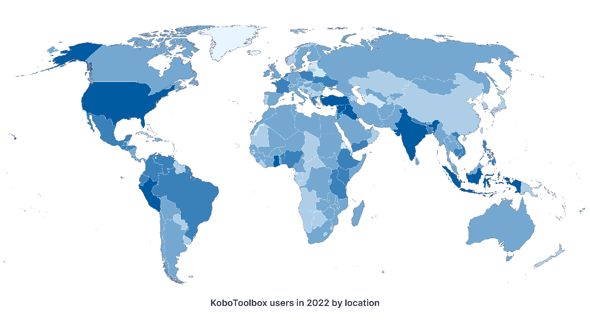

# About KoboToolbox: Accessible data collection for everyone
**Last updated:** <a href="https://github.com/kobotoolbox/docs/blob/20d7a5266c63a76770ff020a62ac5517ca0e7274/source/about_kobotoolbox.md" class="reference">3 May 2024</a>

[Lire en français](#a-propos-de-kobotoolbox-collecte-de-donnees-accessible-a-toutes-et-tous) | [Leer en español](#acerca-de-kobotoolbox-recoleccion-de-datos-accesible-para-todas-las-personas)

KoboToolbox makes high quality data accessible to social impact organizations worldwide. Designed by data collection practitioners specifically for challenging settings, KoboToolbox is easy to use, adaptable, and resource efficient. 

## Why KoboToolbox is unique 

KoboToolbox is hosted and maintained by the international nonprofit organization [Kobo](https://www.kobotoolbox.org/about-us/the-organization/). Our mission is to empower individuals and organizations around the world with high quality data collection tools for creating data-driven social impact. 

Read more about [our mission](https://www.kobotoolbox.org/about-us/our-mission/).

## Supporting global impact

KoboToolbox is the most widely used data collection tool for humanitarian action, development, peacebuilding, human rights, environmental protection, and other social impact initiatives. To support our nonprofit users, we provide our tools for free under the [Community Plan](https://www.kobotoolbox.org/pricing/#free). We also offer [advanced services](https://www.kobotoolbox.org/services/) and [upgrades](https://www.kobotoolbox.org/pricing/) for large organizations with high volume and complex data collection needs.

To learn more about how organizations around the world are using KoboToolbox, visit [our blog](https://www.kobotoolbox.org/blog/).

## More resources

In addition to the [Help Center](https://support.kobotoolbox.org/), users can visit the [Community Forum](https://community.kobotoolbox.org/) to ask questions and share ideas. For a comprehensive introduction to data collection with KoboToolbox, users can enroll in our online [KoboToolbox Essentials Course](https://academy.kobotoolbox.org/courses/essentials). Online and in-person training sessions are also available for teams. 

Learn more about [our training services](https://www.kobotoolbox.org/services/training/).

### À propos de KoboToolbox : Collecte de données accessible à toutes et tous

KoboToolbox permet aux organisations à impact social du monde entier d’avoir accès aux données de grande qualité. Conçu par des spécialistes de la collecte de données, en particulier pour des environnements difficiles, KoboToolbox est facile à utiliser, adaptable et permet une utilisation efficace des ressources. 

### Pourquoi KoboToolbox est unique 

KoboToolbox est hébergé et administré par l'organisation internationale à but non lucratif [Kobo](https://www.kobotoolbox.org/about-us/the-organization/). Notre mission est de fournir aux personnes et aux organisations du monde entier des outils de collecte de données de grande qualité pour créer un impact social axé sur les données. 

En savoir plus sur [notre mission](https://www.kobotoolbox.org/about-us/our-mission/).

### Soutenir l'impact à échelle mondiale

KoboToolbox est l'outil de collecte de données le plus utilisé pour l'action humanitaire, le développement, la consolidation de la paix, les droits de l'homme, la protection de l'environnement et d'autres initiatives à impact social. Pour soutenir nos utilisateurs sans but lucratif, nous fournissons nos outils gratuitement dans le cadre du [Plan communautaire (Community Plan)](https://www.kobotoolbox.org/pricing/#free). Nous proposons également des [services plus performants](https://www.kobotoolbox.org/services/) et des [extensions](https://www.kobotoolbox.org/pricing/) pour les grandes organisations ayant des besoins de collecte de données volumineux et complexes.

Pour en savoir plus sur la façon dont les organisations du monde entier utilisent KoboToolbox, visitez [notre blog](https://www.kobotoolbox.org/blog/).

### Plus de ressources

Outre le [centre d'aide](https://support.kobotoolbox.org/), les utilisateurs peuvent visiter le [forum communautaire](https://community.kobotoolbox.org/) pour poser des questions et partager des idées. Pour une introduction complète à la collecte de données avec KoboToolbox, les utilisateurs peuvent s'inscrire à notre [formation en ligne](https://academy.kobotoolbox.org/courses/initiation). Des séances de formation en ligne et en présentiel sont également proposées aux équipes.

En savoir plus sur [nos services de formation](https://www.kobotoolbox.org/services/training/).

### Acerca de KoboToolbox: Recolección de datos accesible para todas las personas

KoboToolbox permite que los datos de alta calidad sean accesibles para organizaciones de impacto social a nivel mundial. Fue diseñado por personas profesionales de la recolección de datos específicamente para entornos desafiantes; KoboToolbox es fácil de usar, adaptable y eficiente en cuanto a recursos. 

### Por qué KoboToolbox es único 
[Kobo](https://www.kobotoolbox.org/about-us/the-organization/), es una organización internacional sin fines de lucro, que aloja y hace mantenimiento a KoboToolbox. Nuestra misión es empoderar a personas y organizaciones alrededor del mundo con herramientas de recolección de datos de alta calidad para crear un impacto social basado en datos. 

Conocer más sobre [nuestra misión](https://www.kobotoolbox.org/about-us/our-mission/).

### Apoyamos el impacto global

KoboToolbox es la herramienta de recolección de datos más utilizada en la acción humanitaria, el desarrollo, la construcción de paz, los derechos humanos, la protección ambiental y otras iniciativas de impacto social. Para apoyar a nuestros usuarios sin fines de lucro, proporcionamos nuestras herramientas de forma gratuita bajo el [Plan comunitario (Community Plan)](https://www.kobotoolbox.org/pricing/#free). También ofrecemos [servicios avanzados](https://www.kobotoolbox.org/services/) y [actualizaciones](https://www.kobotoolbox.org/pricing/) para las grandes organizaciones con necesidades de recolección de datos complejas y de gran volumen.

Para obtener más información sobre cómo las organizaciones alrededor del mundo utilizan KoboToolbox, visite [nuestro blog](https://www.kobotoolbox.org/blog/).

### Más recursos

Además del [Centro de ayuda](https://support.kobotoolbox.org/), las personas usuarias pueden visitar el [Foro comunitario](https://community.kobotoolbox.org/) para hacer preguntas y compartir ideas. Para obtener una introducción completa a la recolección de datos con KoboToolbox, las personas usuarias pueden inscribirse en nuestro [Curso de formación en línea](https://academy.kobotoolbox.org/courses/essentials). También se ofrecen sesiones de formación en línea y presenciales para equipos. 

Obtenga más información sobre [nuestros servicios de formación](https://www.kobotoolbox.org/services/training/).
