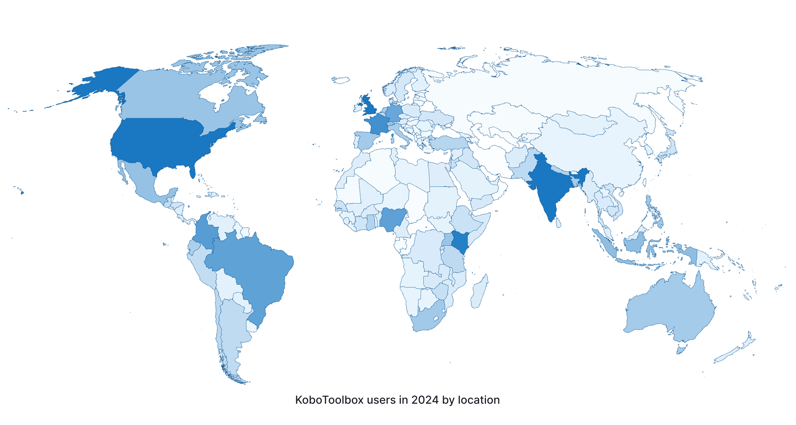

# À propos de KoboToolbox : Collecte de données accessible à toutes et tous
**Last updated:** <a href="https://github.com/kobotoolbox/docs/blob/e6b9269a200884103b65dd081fc9375c8d1b380c/source/about_kobotoolbox_fr.md" class="reference">5 Sep 2025</a>

[Read in English](about_kobotoolbox.md) | [Leer en español](about_kobotoolbox_es.md) | [اقرأ باللغة العربية](about_kobotoolbox_ar.md)

<iframe src="https://www.youtube.com/embed/oKtMmBAlHho?si=OqS7-rewYMf-Rrw2" style="width: 100%; aspect-ratio: 16 / 9; height: auto; border: 0;" title="YouTube video player" frameborder="0" allow="accelerometer; autoplay; clipboard-write; encrypted-media; gyroscope; picture-in-picture; web-share" allowfullscreen></iframe>

KoboToolbox permet aux organisations à impact social du monde entier d’avoir accès aux données de grande qualité. Conçu par des spécialistes de la collecte de données, en particulier pour des environnements difficiles, KoboToolbox est facile à utiliser, adaptable et permet une utilisation efficace des ressources.

## Pourquoi KoboToolbox est unique

KoboToolbox est hébergé et administré par l'organisation internationale à but non lucratif [Kobo](https://www.kobotoolbox.org/about-us/the-organization/). Notre mission est de fournir aux personnes et aux organisations du monde entier des outils de collecte de données de grande qualité pour créer un impact social axé sur les données.

En savoir plus sur [notre mission](https://www.kobotoolbox.org/about-us/our-mission/).

## Soutenir l'impact à échelle mondiale

KoboToolbox est l'outil de collecte de données le plus utilisé pour l'action humanitaire, le développement, la consolidation de la paix, les droits de l'homme, la protection de l'environnement et d'autres initiatives à impact social. Pour soutenir nos utilisateurs sans but lucratif, nous fournissons nos outils gratuitement dans le cadre du [Community Plan (Plan communautaire)](https://www.kobotoolbox.org/pricing/#free). Nous proposons également des [services plus performants](https://www.kobotoolbox.org/services/) et des [extensions](https://www.kobotoolbox.org/pricing/) pour les grandes organisations ayant des besoins de collecte de données volumineux et complexes.

Pour en savoir plus sur la façon dont les organisations du monde entier utilisent KoboToolbox, visitez [notre blog](https://www.kobotoolbox.org/blog/).

## Plus de ressources

Outre le [Centre d'aide](https://support.kobotoolbox.org/), les utilisateurs peuvent visiter le [Forum communautaire](https://community.kobotoolbox.org/) pour poser des questions et partager des idées. Pour une introduction complète à la collecte de données avec KoboToolbox, les utilisateurs peuvent s'inscrire à notre [formation en ligne](https://academy.kobotoolbox.org/courses/initiation). Des séances de formation en ligne et en présentiel sont également proposées aux équipes.

En savoir plus sur [nos services de formation](https://www.kobotoolbox.org/services/training/).
