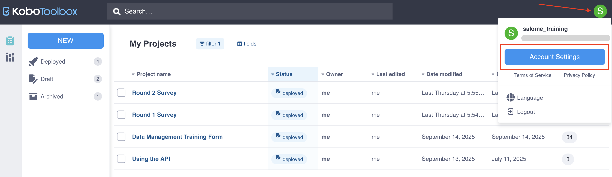
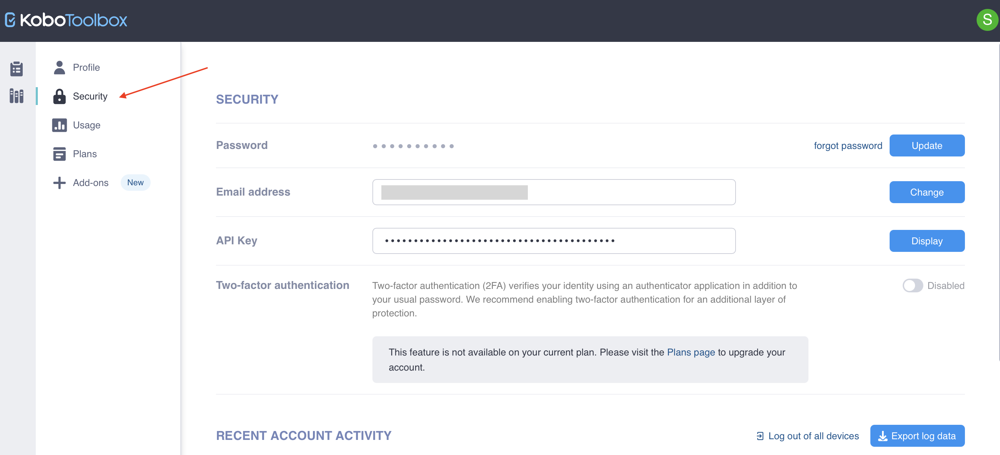
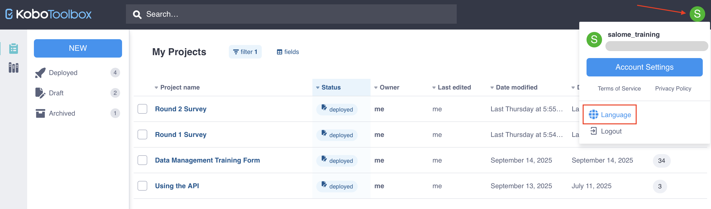

# Account settings
**Last updated:** <a href="https://github.com/kobotoolbox/docs/blob/0e5a784bc21dd79ac926f958b3cbb238d64ecc53/source/activation_link.md" class="reference">23 Sep 2025</a>

<iframe src="https://www.youtube.com/embed/QC6eTm7gh-I?si=L0kvHzvY_kFocSZd" style="width: 100%; aspect-ratio: 16 / 9; height: auto; border: 0;" title="YouTube video player" frameborder="0" allow="accelerometer; autoplay; clipboard-write; encrypted-media; gyroscope; picture-in-picture; web-share" allowfullscreen></iframe>

Your KoboToolbox account settings allow you to manage your profile information, access security features, and monitor usage. You can also upgrade your plan or purchase add-ons for additional storage and automatic transcription or translations.

To access your account settings:
1. [Sign in](https://www.kobotoolbox.org/sign-up/) to your KoboToolbox account.
2. Click on the profile icon in the top right corner. 
3. Click on **Account Settings.**

## Profile

The <i class="k-icon-user"></i> **Profile** page is the default view when you open your account settings. 

In the **Profile** page, you can edit the following information:
- Full name
- Country and city
- Sector and organization type
- Organization name and website
- Short bio and LinkedIn profile

You can also sign up for the KoboToolbox newsletter to receive occasional updates about KoboToolbox.

In the **Profile** page, you can also **delete your KoboToolbox account.** To delete your account:
1. [Delete](https://support.kobotoolbox.org/delete_project.html) or [transfer ownership](https://support.kobotoolbox.org/project_sharing_settings.html#transferring-ownership-of-a-project) of all projects owned by your account.
2. In **Account Settings > Profile**, click **Delete account.** This button will be disabled if you have not deleted all projects owned by your account.
3. Type in your username to confirm your account deletion. This action cannot be undone once completed.

  <strong>Note:</strong> You do not need to delete projects that have been shared with you in order to delete your account.

## Security

To access your security features, select the <i class="k-icon-lock-alt"></i> **Security** page in the account settings menu. 

On the **Security** page, you can: 
- Change your password. 
    - If you know your current password, click **Update.** 
    - If you have forgotten your current password, click **forgot password** to [reset it](https://support.kobotoolbox.org/reset_password.html).
- Update your email address by clicking **Change** next to **Email address.**
- Display your **API Key**, which is required for certain types of authentication with the [KoboToolbox API](https://support.kobotoolbox.org/api.html).
- Enable [two-factor authentication](https://support.kobotoolbox.org/two_factor_authentication.html) (2FA) to protect your account.
- View [recent account activity](https://support.kobotoolbox.org/activity_logs.html#access-logs) and export log data.
- Log out of all devices connected to your account.

## Usage

To monitor your account usage, select the <i class="k-icon-reports"></i> **Usage** page in the account settings menu. Monitoring account usage can help ensure compliance with your [plan’s limits](https://www.kobotoolbox.org/pricing/).

The Usage page has two tabs:
- The **Account Total** tab displays your plan limits and total account usage.
- The **Per Project Total** tab displays usage for each of your projects.

You can monitor the following usage types:
| Usage type | Description |
| :--- | :--- |
| Submissions | The total number of survey submissions that have been collected by projects owned by your account in the current billing cycle. |
| File storage | The total size of photos, audio, videos, and files collected with your surveys or imported in project **Settings > Media.** |
| Transcription minutes | The number of transcription minutes that have been used by your account for [automatic audio file transcription](https://support.kobotoolbox.org/transcription-translation.html). |
| Translation characters | The number of translation characters that have been used by your account for [automatic translation of audio transcripts](https://support.kobotoolbox.org/transcription-translation.html). |

  To learn more about account limits, upgrading your plan, and managing file storage, see <a href="https://support.kobotoolbox.org/account_usage_limits.html">Managing account usage limits</a>.

## Plans

KoboToolbox offers various plans to suit different data collection needs. To view a summary of different plans and upgrade your current plan, select the <i class="k-icon-editor"></i> Plans page in the account settings menu. 

On the **Plans** page, you can:
- View your current plan, including quotas and feature usage.
- Upgrade to a **Professional** or **Teams** Plan.
- Toggle between **Monthly** and **Annual** views to see different prices and plan limits based on billing cycle.

  To learn more about KoboToolbox plans and limits, see <a href="https://www.kobotoolbox.org/pricing/">Pricing</a>.

## Add-ons

Account add-ons are packages that you can add to your current plan to increase your usage limits. If you are approaching or have reached the usage limits included with your plan, you can purchase add-ons for additional usage. 

  <strong>Note:</strong> Add-ons can be added to your plan at any time. To avoid any interruptions in data collection, we recommend that add-ons be purchased before you reach your limit.

To purchase add-ons for your account, select the <i class="k-icon-plus"></i> **Add-ons** page in the account settings menu. 

On the **Add-ons** page, you can:
- Purchase a **File Storage** add-on to add up to 50GB of file storage to your KoboToolbox account, if you are on the free Community Plan.
- Purchase an **NLP Package** add-on to increase your transcription minutes and translations characters.

  <strong>Note:</strong> If you need to increase your submission limits, <a href="https://www.kobotoolbox.org/contact">contact</a> our support team to purchase an <strong>unlimited submissions add-on</strong>.

## Language

To change the language of your KoboToolbox interface: 
1. Go to the **Projects** home page.
2. Click on the profile icon in the top right corner. 
3. Click on <i class="k-icon-language"></i> **Language** and select your preferred language.

