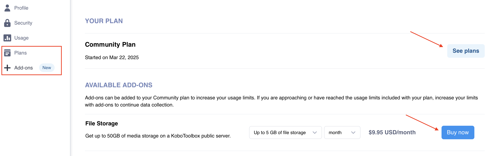
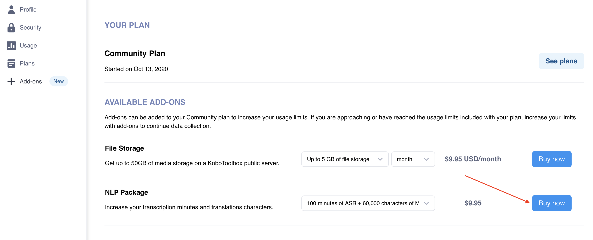

# Managing account usage limits
**Last updated:** <a href="https://github.com/kobotoolbox/docs/blob/deb4dee7804661e8219ceb760ff1923cbf105bde/source/about_kobotoolbox.md" class="reference">9 Sep 2025</a>

[KoboToolbox Community, Professional, and Teams Plans](https://www.kobotoolbox.org/pricing/) have specific usage limits for survey submissions, file storage, and automatic transcription and translation.

- **Submission limit:** The number of survey submissions that can be collected by projects owned by your account per billing cycle.
- **Storage limit:** The total size of photos, audio, videos, and files collected with your surveys or imported in project **Settings > Media.**
- **Transcription and translation limit:** The number of [transcription minutes and translation characters](https://support.kobotoolbox.org/transcription-translation.html) available for audio recordings.

If your account exceeds its usage limits, certain features will be temporarily unavailable until you reduce your usage or upgrade your plan. This article explains what happens when you reach account limits and how to resume normal activity.

  To learn more about KoboToolbox plans and limits, see <a href="https://www.kobotoolbox.org/pricing/">Pricing</a>.

## Account restrictions

When your account exceeds its storage or submission limit, you cannot **receive new submissions, modify submissions,** or **transfer projects** to other users. 

If you attempt to submit data to one of your projects or another user attempts to submit data to one of your projects while your account is over its limits, an error message will be displayed.

These restrictions apply **only to projects you own**. Restrictions on your account will not affect projects that are shared with you by other users.

If using [KoboCollect](https://support.kobotoolbox.org/kobocollect_on_android_latest.html) or [Enketo web forms](https://support.kobotoolbox.org/enketo.html) to collect data **in offline mode**, the submissions will be stored locally and can be uploaded when the account is back within limits.

If your account is over its limits, you will still be able to:
- Sign in to your account.
- Access all existing projects and submissions.
- View, download, and export previously collected data.
- Submit or modify data in projects other users have shared with you.

<strong>Note:</strong> You can monitor submissions and storage for your account in <strong>Account Settings > Usage</strong>, where you can view the total usage for your account and usage by project. For more information, see <a href="https://support.kobotoolbox.org/account_settings.html">Account settings</a>.

## Restoring full account access

### Managing storage limits

If you exceed the storage limit, you need to reduce your file storage or increase your storage quota to resume receiving submissions and transferring projects.

To manage your storage usage, you can:
- [Upgrade](https://www.kobotoolbox.org/pricing/) to a plan with unlimited storage.
- Purchase a **File Storage** add-on in **Account Settings > Add-ons.**
- Delete [media attachments](https://support.kobotoolbox.org/deleting_media.html) from projects you own until your usage is within your plan's limits, starting with larger attachments such as videos.

  <strong>Note:</strong> If your account stays over the storage limit for <strong>more than 28 days</strong>, KoboToolbox will begin deleting media attachments (not submissions), starting with the oldest files. To avoid losing files, download any important media or upgrade your plan before this deadline.

### Managing submission limits

When you reach your monthly submission quota, new submissions will pause until the next billing cycle or until you increase your submission quota.

To manage your submission quota, you can:
- [Upgrade](https://www.kobotoolbox.org/pricing/) to a plan with a higher or unlimited submission quota.
- [Contact](https://www.kobotoolbox.org/contact/) our support team to purchase an **unlimited submissions add-on.**
- Delay data collection until your submission quota renews at the start of the next billing cycle.

### Managing transcription and translation limits

If you reach your monthly quota for automatic transcription or translation, these features will be temporarily disabled.

To manage your transcription and translation quota, you can:
- [Upgrade](https://www.kobotoolbox.org/pricing/) to a plan with a higher transcription and translation quota.
- Purchase an **NLP Package** add-on in **Account Settings > Add-ons.**
- Delay transcription and translation until your quota renews at the start of the next billing cycle.

 

