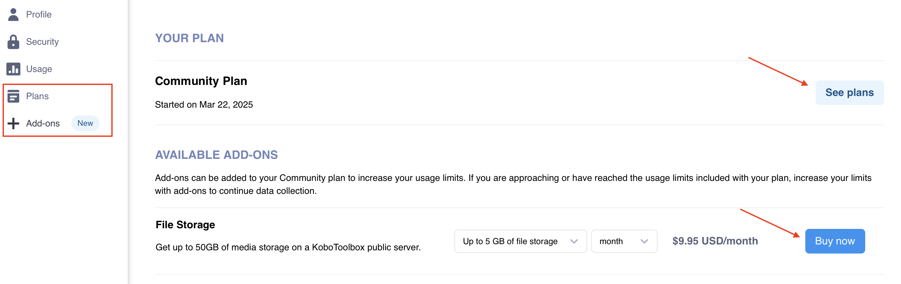
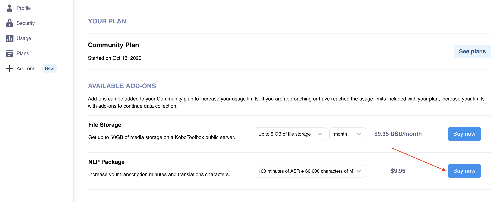
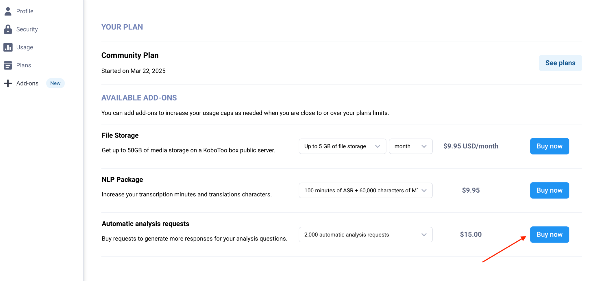

# Managing account usage limits
**Last updated:** <a href="https://github.com/kobotoolbox/docs/blob/c3df850c3ac6d38697810851fbfe01d11f6fb8d6/source/account_usage_limits.md" class="reference">23 Jul 2026</a>

KoboToolbox [Community, Professional, and Teams Plans](https://www.kobotoolbox.org/pricing/) have specific usage limits for survey submissions, file storage, and automatic transcription, translation, and analysis.

- **Submission limit:** The number of survey submissions that can be collected by projects owned by your account per [billing cycle](https://support.kobotoolbox.org/glossary.html#billing-cycle).
- **Storage limit:** The total size of photos, audio, videos, and files collected with your surveys or imported in project **Settings > Media.**
- **Transcription and translation limit:** The number of [transcription minutes and translation characters](https://support.kobotoolbox.org/transcription-translation.html) available for audio recordings.
- **Automatic analysis limit:** The number of AI-generated [analysis requests](https://support.kobotoolbox.org/qualitative_analysis.html) available for open-ended audio question responses.

If your account exceeds its usage limits, certain features will be temporarily unavailable until you reduce your usage or upgrade your plan. This article explains what happens when you reach account limits and how to resume normal activity.

<strong>Note:</strong> You can monitor submissions and storage for your account in <strong>Account Settings > Usage</strong>, where you can view the total usage for your account and usage by project. For more information, see <a href="https://support.kobotoolbox.org/account_settings.html#usage">Account settings</a>.

## Account restrictions

When your account exceeds its storage or submission limit, you cannot **receive new submissions, edit submissions,** or **transfer projects** to other users.

<strong>Note:</strong>
These restrictions do not apply if you exceed your <strong>transcription, translation, or analysis limits.</strong> In those cases, only the affected feature will be unavailable until your quota resets or is increased.   

If you or another user tries to submit data to one of your projects while your account is over its storage or submission limits, an error message will be displayed.

If users are **collecting data offline** with [KoboCollect](https://support.kobotoolbox.org/data_collection_kobocollect.html) or [web forms](https://support.kobotoolbox.org/data_through_webforms.html), they will see an error message when they reconnect to the internet and try to submit. Their submissions will stay saved locally on the device and can be uploaded once the account is back within its limits.

  <strong>Note:</strong> These restrictions apply <strong>only to projects you own</strong>. Restrictions on your account will not affect projects that are shared with you by other users.
  

If your account is over its storage or submission limits, you will still be able to:
- Sign in to your account.
- Access all existing projects and submissions.
- View, download, and export previously collected data.
- Submit or edit data in projects other users have shared with you.

## Restoring full account access

If your account is restricted because you have reached a usage limit, you still have several options. The table below summarizes what each limit affects and the main ways to restore full access or continue work.

| Limit reached | What happens | How to restore access |
| :--- | :--- | :--- |
| **Storage** | Your account cannot receive new submissions or transfer projects until storage usage is reduced or storage quota is increased. | Delete media attachments, purchase a **File Storage** add-on, or upgrade to a plan with more storage. |
| **Submissions** | Your projects cannot accept new submissions until the quota resets or is increased. | Wait until the next billing cycle or upgrade to a plan with a higher submission quota. |
| **Transcription and translation** | Automatic transcription and translation are temporarily disabled until the quota resets or is increased. | Wait until the next billing cycle, purchase an **NLP Package** add-on, upgrade to a plan with a higher quota, or use manual transcription and translation feature. | 
| **Automated analysis** | AI-generated analysis is temporarily disabled until the quota resets or is increased. | Wait until the next billing cycle, purchase an **Automatic analysis requests** add-on, upgrade to a plan with a higher quota, or use manual analysis feature. |

### Managing storage limits

If you exceed the storage limit, you need to reduce your file storage or increase your storage quota to resume receiving submissions and transferring projects.

To manage your storage usage, you can:
- [Upgrade](https://www.kobotoolbox.org/pricing/) to a plan with unlimited storage.
- Purchase a **File Storage** add-on in **Account Settings > Add-ons.**
- Delete [media attachments](https://support.kobotoolbox.org/managing_media_responses.html#deleting-media-files) from projects you own until your usage is within your plan's limits, starting with larger attachments such as videos.

You can also help prevent account restrictions by reducing the size of files submitted through your forms, for example by setting [upload size limits](https://support.kobotoolbox.org/photo_audio_video_file.html#lowering-image-sizes), lowering [audio recording quality](https://support.kobotoolbox.org/photo_audio_video_file.html#configuring-audio-quality), or configuring KoboCollect [image and video capture settings](https://support.kobotoolbox.org/kobocollect_settings.html#form-management-settings).

  <strong>Note:</strong> If your account stays over the storage limit for <strong>more than 90 days</strong>, KoboToolbox will begin deleting media attachments (not submissions), starting with the oldest files. To avoid losing files, download any important media or upgrade your plan before this deadline.

### Managing submission limits

When you reach your monthly submission quota, your projects cannot accept new submissions until the next billing cycle begins or your submission quota is increased.

To manage your submission quota, you can:
- [Upgrade](https://www.kobotoolbox.org/pricing/) to a plan with a higher or unlimited submission quota.
- Delay data collection until your submission quota renews at the start of the next billing cycle.

  <strong>Note:</strong> If you choose to delay data collection until your submission quota renews, consider <a href="https://support.kobotoolbox.org/managing_projects.html#archiving-projects">archiving</a> the project until then. This can help prevent users from entering data and encountering submission errors before the quota resets.
  

### Managing transcription and translation limits

If you reach your monthly quota for automatic transcription or translation, these features will be temporarily disabled.

To manage your transcription and translation quota, you can:
- [Upgrade](https://www.kobotoolbox.org/pricing/) to a plan with a higher transcription and translation quota.
- Purchase an **NLP Package** add-on in **Account Settings > Add-ons.**
- Delay transcription and translation until your quota renews at the start of the next billing cycle.
- Continue using manual transcription and translation features, which remain available without a quota limit.

 

### Managing automatic analysis limits

If you reach your monthly quota for automatic analysis, this feature will be temporarily disabled.

To manage your automatic analysis quota, you can:

- [Upgrade](https://www.kobotoolbox.org/pricing/) to a plan with a higher automatic analysis quota.
- Purchase an **Automatic analysis requests** add-on in **Account Settings > Add-ons.**
- Delay analysis until your quota renews at the start of the next billing cycle.
- Continue using manual analysis features, which remain available without a quota limit.

 
