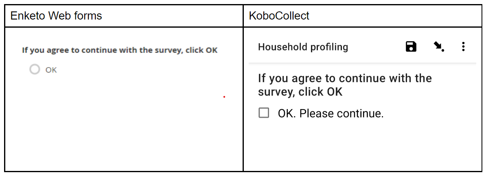

# Acknowledge question type

The “Acknowledge” question type displays a single option, to select “OK” on the form.

You can use the “Acknowledge” type for questions that require only 2 states of response: answered and not answered, or accepted and not accepted (much like a single checkbox). A classic example of this would be a question asking for consent to use the data collected. You could use this question type with an informed consent in your survey form, or as a way of ensuring the interviewee has read through and agrees to the terms usually outlined using a ‘Note’ question type.

## How to set up “Acknowledge” questions

1. In the KoboToolbox form builder, click the + button to add a new question.
2. Type the question text. For example, “If you agree to continue with the survey, click OK to begin”. 
3. Click Add Question (or press the Enter key on the keyboard).
4. Choose the acknowledge question type.

  
## How “Acknowledge” questions are displayed in web forms and KoboCollect

The “acknowledge” question displays a single radio button with the value “OK” as shown below:

## “Acknowledge questions” in skip logic and validations

An acknowledge question has only 2 states of response: one where the question is answered, and one where the question is blank. In the formbuilder, when adding skip logic to a question where the question controlling the skip is an “acknowledge” type, you can choose either of the 2 states.

  
In the above example, the group “Survey” will only be displayed if the “acknowledge” question was answered (the user clicked OK).