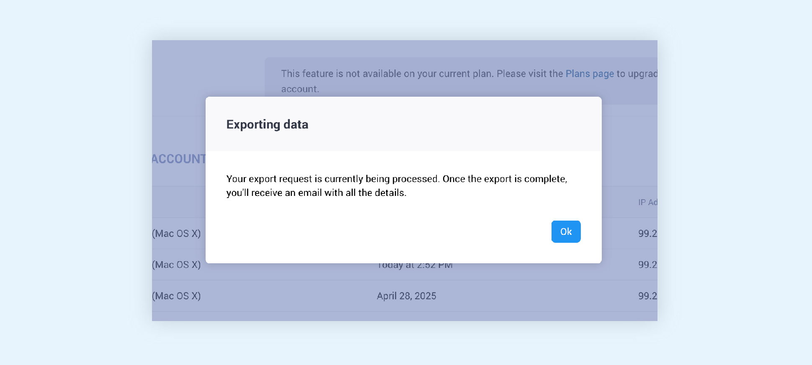

# Activity Logs
**Last updated:** <a href="https://github.com/kobotoolbox/docs/blob/d6f09be2d6f022db661e2a4d9da0b962db44633e/source/activity_logs.md" class="reference">15 May 2025</a>

Activity logs are digital records that capture important actions and events in your KoboToolbox account. Activity logs give you a detailed history of account access and project activity.
These logs can be helpful for:

-   Security monitoring: See who accessed your account and from where
-   Tracking changes: Know when project elements were modified
-   Accountability: Identify which team members made specific changes
-   Troubleshooting: Understand when and how issues may have occurred

KoboToolbox provides two types of activity logs to help you monitor different aspects of your work:

-   **Access Logs:** Support account security by displaying all sign-ins.
-   **Project History Logs:** Track all actions and changes made by any user within a specific project and its data.

  <b>Note:</b> Activity logs are a relatively recent addition to KoboToolbox. We are actively working to expand these features in the following months and provide an even more detailed account of actions in your accounts and projects.

## Access logs

Access logs record all authentication events (sign-ins) for your KoboToolbox account. They help you monitor account security by showing you when and where your account was accessed.

They can be found under the title ‘Recent Account Activity’, which you can reach easily by opening your Account Settings under the section Security.

Access logs display:

-   Date and time of each sign-in
-   IP address (location information)
-   Source (device information and browser)

Note that similar events (authentications) occurring within 60 minutes of each other will be grouped together.

### Exporting access logs

This section also allows you to export all your access records by clicking on the ‘Export log data’ button on the top right corner of the table. Clicking this button will trigger the data export process:
1. The processing of the records into a .csv export file will begin
2. A modal window will be displayed informing you that the process has started and what the next steps are.
3. You will receive an email with a link to download the file once it's ready. The amount of data included in your logs will determine how long it may take to receive the email.
4. Clicking on the URL in the email should immediately start the download of the .csv file, depending on your browser settings.

The export file will include more detailed information of all the authentication events, including authentication type and exact timing.

### Log out of all devices

You can force all devices currently logged into your account to immediately log out by clicking on the ‘Log out of all devices’ link to the left of the data export button.

This action will also log you out of your current session.

## Project History Logs

Project History Logs provide a detailed record of all activities within a specific project. They show every action performed, whether by users or automated processes, giving you complete visibility into your project's history.

To see the logs of a specific project, go to your project’s SETTINGS tab and go to the Activity section.

In this page you will find a table view with all the project activity, sorted by date. Each unique action is listed along with the user who performed it and the datestamp associated with that activity.

Project History Logs capture almost every possible action that can be performed in a project.

| Category                | Included actions                                                                                                            |
| :-----------------------| :---------------------------------------------------------------------------------------------------------------------------|
| Project changes         | Project name updates, Deployments and redeployments, Archiving and unarchiving, Project connections                         |
| Form changes            | XLSForm uploads, Form edits, Creation of qualitative analysis questions                                                     |
| Data Management Changes | Data exports, Media attachment modifications, Data sharing settings changes, REST service modifications                     |
| Permissions             | User access updates, Public access settings, Ownership transfers                                                            |
| Submissions             | User modifies or deletes submissions. Adding submissions is displayed in the logs export, but not the KoboToolbox interface |

### Finding & investigating specific activities

You can filter the history log by activity type (e.g. deployments, form edits, permissions changes, etc.) using the toggle functionality on the top right corner. This will also allow project owners and managers to track changes/updates on specific aspects of the project quickly.

You can also export all your project history data using the export button on the top right corner of your table.
If you need more information about a specific activity, simply click ‘See Details’ for an expanded view of that entry. This will display all the information on that event, revealing what occurred in the backend and any associated metadata.

## Common Issues with Activity Logs

**"I don't see recent activities"**
-   Check that you're looking at the correct project
-   Make sure you have the right permissions to view logs. Only project owners and users with ‘manage project’ permissions can see the logs.
-   Note that logs are only available for a period of 60 days. Older logs are deleted and not retrievable. This period can be configured at the admin level for organizations with a private server.

**"I need older log data"**
-   Data beyond the retention period is automatically deleted and not retrievable. If you need to have access to log data older than 60 days and you are using a private server, you can contact your administrator to increase the retention period.

**"I can’t download the log data export file"**
-   When you click the link you received by email to download the log data export file, it might open a web page with text instead of downloading the csv file.
-   To download the .csv file from the web page, right click on the page, and select Save Page As…. Keep the format as “Page Source”
-   If you click on the link and get an error message, such as 403 Forbidden, try opening the link with another browser (e.g., Safari).

