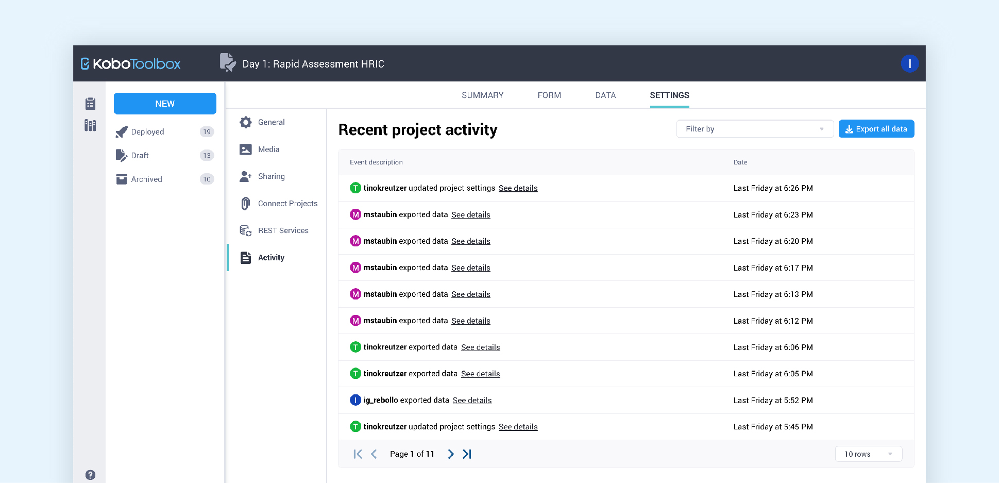

# Monitoring project and account activity
**Last updated:** <a href="https://github.com/kobotoolbox/docs/blob/f169f989b5936274b3cfa2ab95720fba0b94e2fb/source/activity_logs.md" class="reference">16 Dec 2025</a>

In KoboToolbox, you can monitor project and account activity using **activity logs.** These logs record key actions and events in your account or projects, providing a detailed history of access and activity.

Activity logs can be helpful for:

-   **Security monitoring:** See who accessed your account and from where.
-   **Tracking changes:** Know when project elements were modified.
-   **Accountability:** Identifying which team members made specific changes.
-   **Troubleshooting:** Understand when and how issues may have occurred.

KoboToolbox provides two types of activity logs to help you monitor different aspects of your work:

-   **Account access logs:** Display all sign-ins to your account.
-   **Project history logs:** Track all actions and changes made by any user within a project and its data.

## Account access logs

Account access logs record all authentication events (sign-ins) for your KoboToolbox account. They help you monitor account security by showing you when and where your account was accessed.

To access your account access logs:

1. [Sign in](https://www.kobotoolbox.org/sign-up/) to your KoboToolbox account.
2. Click your profile icon in the top right corner. 
3. Click on **Account Settings** and navigate to the **Security** tab.
4. Find your account access logs under **RECENT ACCOUNT ACTIVITY.**

Access logs display the following information:

-   Date and time of each sign-in
-   IP address (location information)
-   Source (device information and browser)

    <strong>Note:</strong> Similar authentications occurring within 60 minutes of each other will be grouped together.

### Exporting account access logs

From the **RECENT ACCOUNT ACTIVITY** section in **Account Settings > Security**, you can also export all access records. To do so:

1. Click on <i class="k-icon-download"></i> **Export log data** in the top right corner of the table. This will trigger the data export process.
2. Once the process is complete, you will receive an email with a link to download the file. 
    - How long it takes to receive the email depends on the size of the log data.
3. Clicking the URL in the email starts the download of the CSV file or [opens a new webpage](https://support.kobotoolbox.org/activity_logs.html#troubleshooting), depending on your browser settings. 

    <strong>Note:</strong> The exported file includes more detailed information about the authentication events, including authentication type and exact timing.

### Logging out of all devices

Finally, from the **RECENT ACCOUNT ACTIVITY** section in **Account Settings > Security**, you can force all devices currently logged into your account to immediately log out. To do so:

1. Click on <i class="k-icon-logout"></i> **Log out of all devices** in the top right corner of the table.
2. You will be logged out of your current session immediately. Any other devices signed in to your account will also be logged out.

## Project history logs

Project history logs provide a detailed record of all actions within a project. They show every change made by users or automated processes, giving you full visibility into the project’s activity.

    <strong>Note:</strong> Only project owners and users with <strong>Manage project</strong> <a href="https://support.kobotoolbox.org/managing_permissions.html">permissions</a> can view project history logs.

To access your project’s history logs:

1. Open a project and go to the **SETTINGS** page.
2. Go to the **Activity** tab.
3. A table will be displayed with all project activity, sorted by date. Each action is listed with the username of the person who performed it and the timestamp for when it occurred.

If you need more information about an activity, click **See details** for an expanded view. This displays all available information about the event, including backend actions and associated metadata.

The following actions are captured in project history logs: 

| Category                | Actions                                                                                                           |
| :-----------------------| :---------------------------------------------------------------------------------------------------------------------------|
| Project         | Project name changes, deployment and redeployment, archiving and unarchiving, REST service updates, and project connections.                        |
| Form            | Form edits, XLSForm uploads, creation of <a href="https://support.kobotoolbox.org/qualitative_analysis.html">qualitative analysis questions</a>.                                                     |
| Data | Data exports, media file changes, deletion or modification of submissions.                     |
| Permissions           | Changes to user access or public access settings, ownership transfers.           |

    <strong>Note:</strong> Adding submissions appears in exported logs, but not in the KoboToolbox interface. 

### Filtering project history logs

You can filter the project history log by action to quickly see updates to specific parts of the project.

To filter your project history logs:

1. In the project **SETTINGS > Activity** page, click on **Filter by** above the project history logs table.
2. From the dropdown menu, select an action to filter the table.

### Exporting project history logs

From the project **SETTINGS > Activity** page, you can also export all project history logs. To do so:

1. Click on <i class="k-icon-download"></i> **Export all data** in the top right corner of the table. Clicking this button will trigger the data export process.
2. Once the process is complete, you will receive an email with a link to download the file. 
    - How long it takes to receive the email depends on the size of the log data.
3. Clicking the URL in the email starts the download of the CSV file or [opens a new webpage](https://support.kobotoolbox.org/activity_logs.html#troubleshooting), depending on your browser settings. 

## Troubleshooting

  
<strong>Recent activities not displayed</strong>

  If recent activities are not displayed, check the following:
      
    <ul>
        <li>You are looking at the correct project.</li>
        <li>You have the right permissions to view project history logs (i.e., project owner or <strong>Manage project</strong> permissions).</li>
    </ul>

 

  
<strong>Older activity logs not available</strong>

  Logs are retained for a limited period before they are automatically deleted and cannot be recovered.
      
The retention period can be adjusted at the admin level for organizations using a private server. If you need access to older log data on a <a href="https://www.kobotoolbox.org/enterprise/#comparison-table">private server</a>, contact your administrator to request a longer retention period.

 

  
<strong>Log data export file opens as a web page</strong>

  When you click the link received by email to download a log data export file, it might open a web page with text instead of downloading the csv file. 
      
    To download the .csv file from the web page: 
      
    <ol>
<li>Right click on the page and select <strong>Save Page As…</strong>.</li>
<li>Keep the format as <strong>Page Source</strong> and save the file in the location of your choice.</li>

 

  
<strong>Error message when clicking on export link</strong>

  If you click the link and see an error message such as 403 Forbidden or 404 Page not found, try opening the link in a different browser (e.g., Safari). The export link may also have expired. If so, restart the export process to generate a new link.

