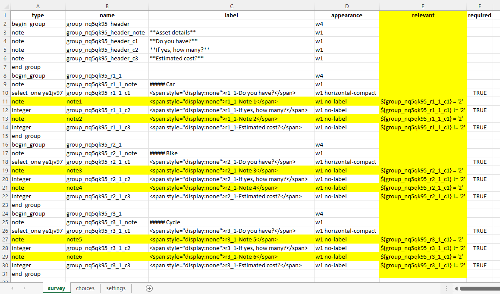
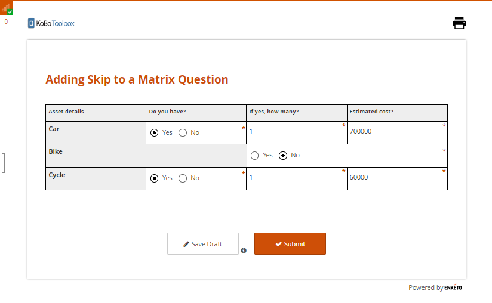
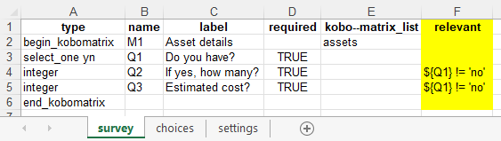
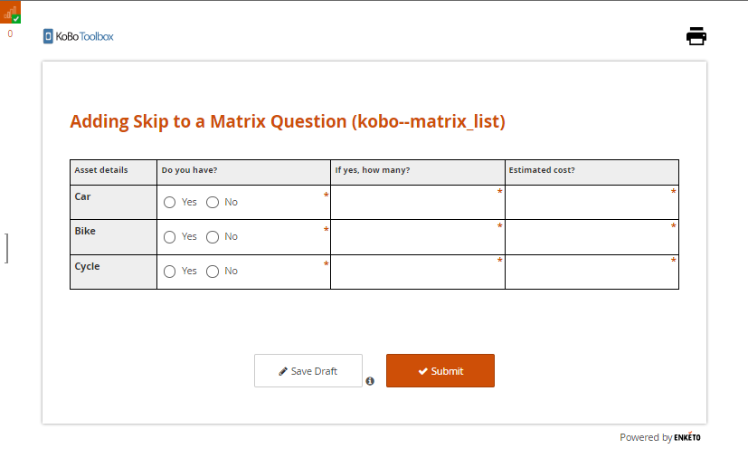
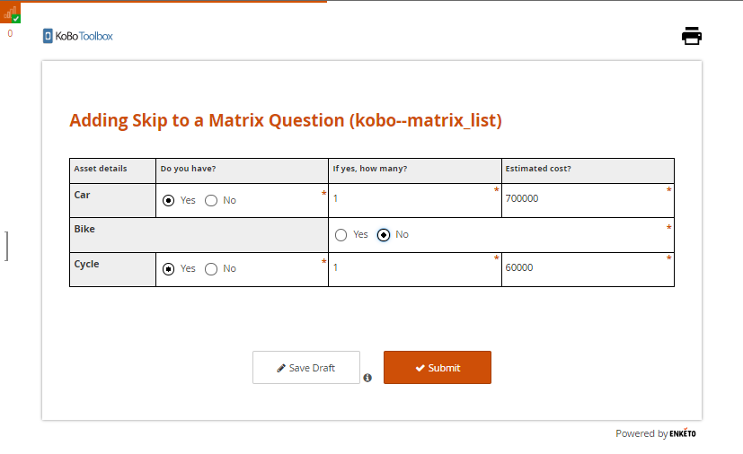

# Adding Skip Logic to a Matrix Question

In most situations, you can add skip logic to any question type as outlined in
the support article **[Adding Skip Logic](skip_logic.md)**. However, when
working within the Formbuilder, adding skip logic to a matrix question is not
yet possible. Instead, an XLSForm can be used to implement skip logic for this
question type. This support article illustrates how you can add skip logic to a
matrix question using XLSForm.

If you have gone through the support article
**[Question Matrix Response Type](matrix_response.md)**, you will already know
that there are 2 approaches to create a matrix question in KoboToolbox: the
_Formbuilder approach_ and the _kobo--matrix_list approach_. This support
article provides an overview of the necessary steps to add skip logic to a
matrix question when using either of these approaches.

## The Formbuilder Approach:

The approach works with **Enketo**, also known as **web forms**, utilizing the
**Grid-theme layout**. It may not function as expected if you ignore the
**Grid-theme layout** settings as outlined in the support article
**[Using Alternative Enketo Web Form Styles](alternative_enketo.md)**.

Follow the steps outlined below to add skip logic to a matrix question with an
XLSForm using the Formbuilder approach.

**Step 1:** Create a matrix question in the Formbuilder:

The first step is to create a matrix question in the Formbuilder as outlined in
the support article **[Question Matrix Response Type](matrix_response.md)**.
Simply add rows and columns with the variables you intend to collect data for.

**Step 2:** Download form as XLSForm:

Once the matrix question is ready, **SAVE** the form and then download it as an
XLSForm.

**Step 3:** Add relevant column header and skip logic to your XLSForm:

Now open the XLSForm and then add the **relevant** column header to the XLSForm.
Once you have the **relevant** column header, you will be able to add skip logic
to all the questions as needed.

To improve the way in which the matrix questions are displayed when responding,
it is advised to add a note question type (highlighted in yellow, as shown in
the image below) and then include skip logic to it as appropriate. This is
entirely optional, as it will simply affect the formatting of the matrix
question. The difference of _using_ and _not using_ the note question type is
illustrated below in **Step 6: Collect Data**.

**Step 4:** Replace XLSForm:

Upload and replace your XLSForm into the existing project, or create a new
project (if needed).

**Step 5:** Deploy Form:

Once you have replaced the XLSForm (or uploaded the XLSForm as a new project),
you will need to deploy your form.

**Step 6:** Collect Data:

After deploying the form, you can go to **FORM>Collect Data>OPEN** to start
collecting data with the web form.

**Data entry screen as seen in Enketo (web form): _when nothing is entered_**

**Data entry screen as seen in Enketo (web form) with note question type added:
_when the matrix question is filled up_**

As you can see in the image above, the format of the matrix question has not
been distorted. This is how the matrix table will be displayed when you use the
**note** question type that was highlighted in the image shared earlier.

**Data entry screen as seen in Enketo (web form) with note question type not
added: _when the matrix question is filled up_**

In this case, the format of the matrix question has been distorted. This is the
matrix table that will be displayed when the **note** question type is not used.

  You can access the XLSForm
  <a
    download
    class="reference"
    href="./_static/files/adding_skip_to_matrix/adding_skip_to_a_matrix_question.xls"
    >here</a
  >
  that was used for this approach <em>(adding skip logic to a matrix question using the Formbuilder approach)</em>.

## kobo--matrix_list Approach:

Just like with the Formbuilder approach, this method of adding skip logic with
an XLSForm works with **Enketo** _also known as **web forms**_ using the
**Grid-theme layout**.

Follow the steps below to add skip logic to a matrix question with an XLSForm
using the kobo--matrix_list approach.

**Step 1:** Create a matrix question in the XLSForm:

Create a matrix question in the XLSForm, as outlined in the support article
**[Question Matrix Response Type](matrix_response.md)**.

**Step 2:** Add relevant column header and skip logic to your XLSForm:

Once the matrix question is ready, you must add the **relevant** column header.
You can now add skip logic to all the questions under the **relevant** column
header.

**Step 3:** Upload the XLSForm:

If your XLSForm is ready, upload it as a new project.

**Step 4:** Deploy Form:

Once you have uploaded the XLSForm, you will need to deploy your form.

**Step 5:** Collect Data:

You can now go to **FORM>Collect Data>OPEN** to start collecting data. Matrix
question types only work with **Enketo**, also known as **web forms**, utilizing
the **Grid-theme layout**.

**Data entry screen as seen in Enketo (web form): _when nothing is entered_**

**Data entry screen as seen in Enketo (web form): _when the matrix question is
filled up_**

As you can see in the second image, the format of the matrix question has been
distorted. In the kobo–matrix_list approach you do not have the space to fix the
matrix table like you had with the Formbuilder approach.

  You can access the XLSForm
  <a
    download
    class="reference"
    href="./_static/files/adding_skip_to_matrix/adding_skip_to_a_matrix_question_kobo_matrix.xls"
    >here</a
  >
  that was used for this approach <em>(adding skip logic to a matrix question using the kobo--matrix_list approach)</em>.

