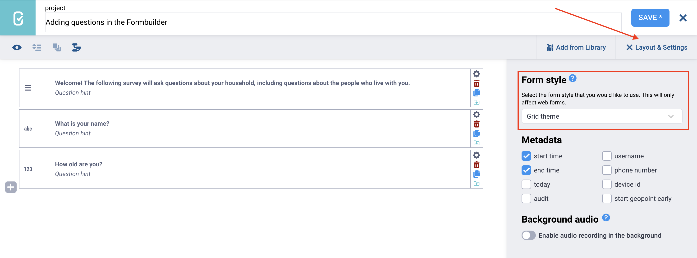
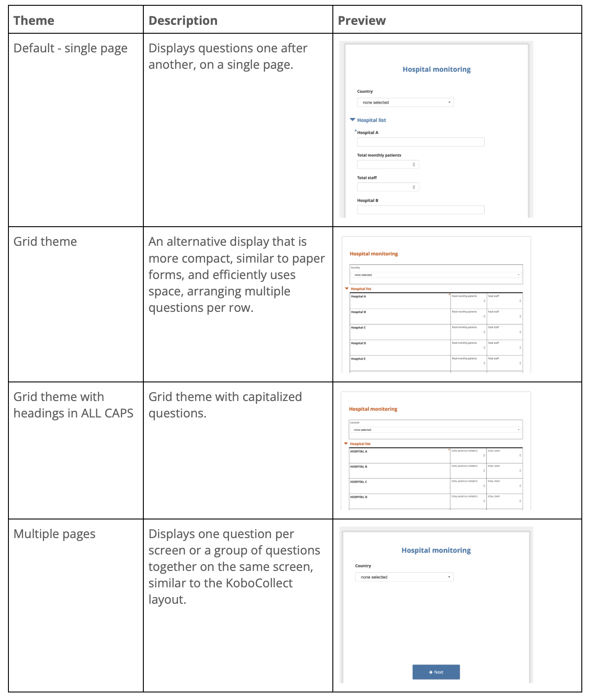

# Styling Enketo web forms in the Formbuilder
**Last updated:** <a href="https://github.com/kobotoolbox/docs/blob/f3ac4f05b15482eefe3a5bca9c2c18dc6f42dc3f/source/alternative_enketo.md" class="reference">21 Mar 2026</a>

<iframe src="https://www.youtube.com/embed/wLWiw473YSQ?si=tJbKl-VzjZkDPivR" style="width: 100%; aspect-ratio: 16 / 9; height: auto; border: 0;" title="YouTube video player" frameborder="0" allow="accelerometer; autoplay; clipboard-write; encrypted-media; gyroscope; picture-in-picture; web-share" allowfullscreen></iframe>

You can customize the layout and visual appearance of your [Enketo web forms](https://support.kobotoolbox.org/enketo.html) using built-in themes. These themes allow you to control how questions are displayed, whether on a single page, across multiple pages, or arranged in a compact grid layout.

Form themes apply only to Enketo web forms and are not supported in KoboCollect. This article explains how to apply an Enketo theme in the Formbuilder and how to configure question widths when using the Grid theme.

## Adding an Enketo theme in the Formbuilder

To add an Enketo theme to your form in the Formbuilder:

1. Click <i class="k-icon-settings"></i> **Layout & Settings** in the top right corner of the screen.
2. In the **Form style** section, select the theme you want to apply to your form.

The following themes are available to customize your forms:

<strong>Note:</strong> You can also combine <strong>Multiple pages</strong> and <strong>Grid theme</strong> styles.

## Setting up question widths for the Grid theme

In Enketo web forms, the Grid theme allows you to display questions in multiple columns, making your form more compact and visually organized. The setup of these columns, including how many there are and how wide each one should be, is controlled by assigning `w-values` to each question in its **Appearance (Advanced)** settings. 

 For a comprehensive overview of using the Grid theme, see this <a href="https://ee.kobotoolbox.org/n41GqUkf">Grid Theme</a> Tutorial and <a href="https://docs.google.com/spreadsheets/d/1qKmxPTA4B0vihU6GsKgi1CJE2Db2FfE7KZpOig4nTEI/edit?gid=0#gid=0">sample XLSForm</a>.   

To specify the relative width of each question within a row:

1. Open the question settings by clicking <i class="k-icon-settings"></i> **Settings** to the right of the question. This will take you to the **Question Options** tab.
2. In **Appearance (Advanced)**, assign appearance values (e.g., `w1`, `w2`, `w3`) to specify the question’s relative width within a row.

Rows will always automatically expand to the full width of the page. For example, a row containing one question with an appearance value of `w2` and another with `w1` will divide the row into two-thirds and one-third, respectively. 

<strong>Note:</strong> The default width for a group or repeat group is four columns (<code>w4</code>), so a group with <code>w4</code> can hold a maximum of four <code>w1</code> questions in a single row. A question's <code>w-value</code> is relative to its group's <code>w-value</code>. Apply <code>w-values</code> only to top-level groups or repeats: although applying them to nested groups or repeats is supported, it may not display well.

