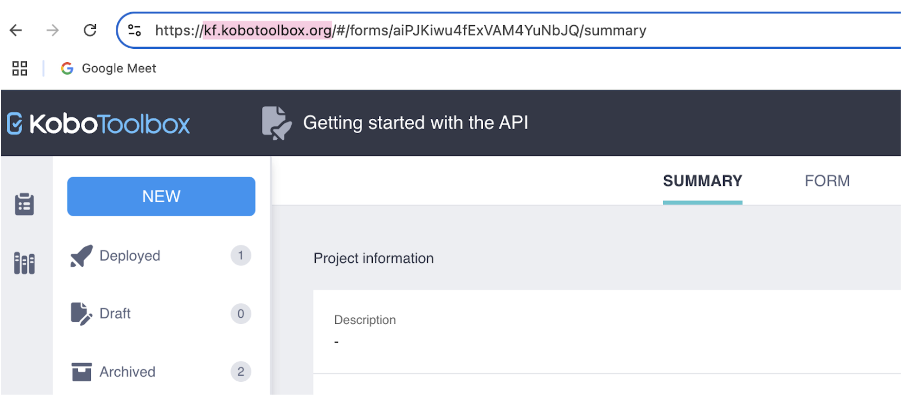
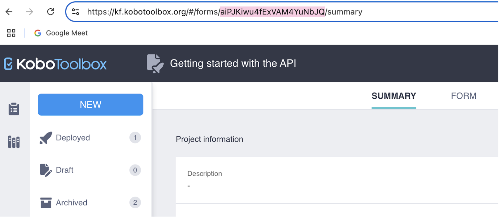

# Getting started with the API
**Last updated:** <a href="https://github.com/kobotoolbox/docs/blob/24c740499cf305ed0e9bece1dde237b9b23a05c0/source/api.md" class="reference">15 Sep 2025</a>

An **Application Programming Interface (API)** allows two software components to communicate using a set of definitions and protocols. With an API, a script or application can work with KoboToolbox without using the web interface. For example, you can automatically generate data exports that link to external sources like dashboards or backup folders.

With the KoboToolbox **API**, you can:

- **Download data** automatically in JSON, CSV, or XLSX.
- **Generate exports on demand** for dashboards, backups, or analytics.
- **Submit or edit records** from other data collection tools.
- **Create or deploy projects** and clone existing ones through code.
- **Manage users**, permissions, and project activity at scale.

Using the KoboToolbox API allows you to automate routine tasks, keep dashboards current, and integrate KoboToolbox with other systems, while reducing manual steps and errors. This article provides an introduction to the KoboToolbox API and covers the following steps:

- Retrieving your **server URL**
- Retrieving your **API Key**
- Retrieving the project asset UID
- Exporting your data using the API

    <strong>Note:</strong> V1 endpoints are now deprecated and scheduled for decommissioning in January 2026, in favor of the more robust and fully supported KPI v2 API. For more information on migrating to KPI v2, see <a href="https://support.kobotoolbox.org/migrating_api.html">Migrating from v1 to v2 API</a>.

## Retrieving your server URL
The **server URL** is the base web address of your KoboToolbox server. It is placed at the start of every API request.

For most users, the server URL is [kf.kobotoolbox.org](https://kf.kobotoolbox.org/) (if you are using the Global server) or [eu.kobotoolbox.org](https://eu.kobotoolbox.org/) (if you are using the European Union server). 

 

## Retrieving your API Key
Your **API Key** is a personal token that acts like a password, allowing software to access your account through the API. It may be required when a script, dashboard, or external application needs authentication in order to retrieve or send project data through the API. 

There are different ways to get your **API Key**.

**Method 1:**

1. Click your profile icon in the top right corner.
2. Select **ACCOUNT SETTINGS**.
3. Go to the **Security** tab.
4. Your API Key is hidden by default. Click **Display** to view it.
   
**Method 2:**

In your web browser, navigate to `https://[server-url]/token/?format=json`. Make sure to replace `[server-url]` with your server URL.

**Method 3:**

In the terminal, use the following curl command:

`curl -u username:password "https:/[server-url]/token/?format=json"`

Make sure to replace `[server-url]` with your server URL.

## Retrieving your project asset UID

The **project asset UID** is a unique code that identifies a specific KoboToolbox project and must be included in API calls to target that project. 

You can find the **project asset UID** in the URL of your project summary page. It is the string of letters and numbers that appears after “forms/” in the URL, as such: `https://[server-url]/#/forms/[project asset UID]/summary`.

## Exporting your data using the API

There are two main approaches to connecting your data using the API with KoboToolbox:

- **Synchronous exports:** Returns a ready-made CSV or XLSX file, based on predefined export settings, that external applications (e.g., Power BI or Excel) can load directly.
- **JSON endpoint:** Sends each record as a raw JSON file. This is best for code-based pipelines, not for direct use in spreadsheet or dashboard tools.
  
Each approach requires knowing the server URL and project asset UID to build a custom export URL. Depending on the application, your API Key may be needed for authentication. 

    For more information about synchronous exports, see <a href="https://support.kobotoolbox.org/synchronous_exports.html">Using the API for synchronous exports</a>. 
  
To learn more about connecting your data to Power BI to create custom dashboards, see <a href="https://support.kobotoolbox.org/pulling_data_into_powerbi.html">Connecting KoboToolbox to Power BI</a>. 
  
To learn more about connecting your data to Microsoft Excel, see <a href="https://support.kobotoolbox.org/pulling_data_into_excelquery.html">Connecting KoboToolbox to Microsoft Excel</a>.

