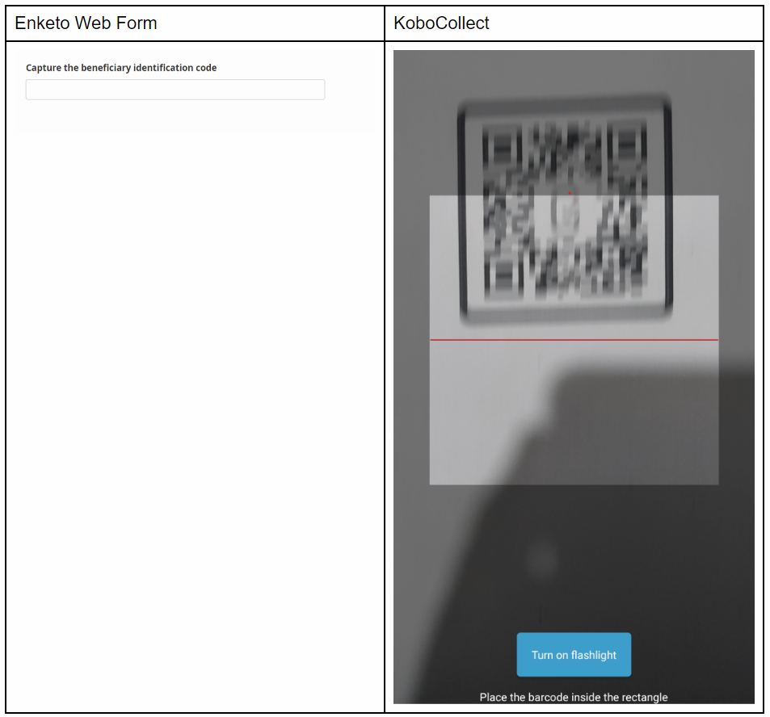

# Barcode/QR code question type

The Barcode/QR Code question type is used for scanning, decoding and capturing
barcodes and QR codes using the device camera. When a Barcode/QR code is scanned
with the camera, the value (whether numbers or text) that the pattern stands for
is captured. Please note that Barcode/QR code scanning only works when using
KoboCollect on mobile devices.

A wide range of Barcode and QR code formats are supported, including the
following:

- UPC-A
- UPC-E
- EAN-8
- EAN-13
- Code 39
- Code 93
- Code 128
- Codabar
- ITF
- RSS-14
- RSS-Expanded
- QR Code
- Data Matrix
- Aztec
- PDF 417
- MaxiCode

Barcode/QR code questions can be used in different scenarios including asset
management or item distribution. For example, you can use the `pulldata()`
function to
[automatically populate fields from a csv attached to your project, or a different form project](https://community.kobotoolbox.org/t/trying-to-build-a-form-that-will-use-pulldata-function-to-verify-barcode-id/4724).

## How to set up the “Barcode/QR code” question type

### Setting up in FormBuilder

To add a barcode/QR code question:

- In the KoboToolbox Formbuilder, click the <i class="k-icon k-icon-plus"></i>
  button to add a new question
- Type the question text, for example “Collect the beneficiary identification
  code”, then click **ADD QUESTION** or press ENTER on your keyboard
- Choose the question type

### Setting up in xlsform

To add a barcode question in XLSform, add a question with type `barcode` as
follows:

| type    | name           | label                           |
| :------ | :------------- | :------------------------------ |
| barcode | beneficiary_id | Capture the beneficiary ID code |
| survey  |

## How barcode/qr code questions are displayed on web forms and KoboCollect

## Default appearance

## Advanced appearance

When adding the “Barcode/QR code” question type, you can change the appearance
settings to switch from using the default (back) camera of the device to using
the front camera.

### Changing advanced Appearance in FormBuilder

To do this, go to the question settings of the “Barcode/QR code” question, and
type “front” in the Appearance(Advanced) box

### Changing advanced Appearance in XLSForm

In XLSForm, you can set the default camera for capturing the QR/Barcode to be
the front (selfie) camera by typing ‘front’ in the appearance column as follows:

| type    | name             | label                           | appearance |
| :------ | :--------------- | :------------------------------ | :--------- |
| barcode | beneficiary_id_2 | Capture the beneficiary ID code | front      |
| survey  |

  Download an XLSForm with examples from this article
  <a
    download
    class="reference"
    href="./_static/files/barcode_qrcode_questions/barcode_qrcode_questions.xlsx"
    >here</a
  >.

