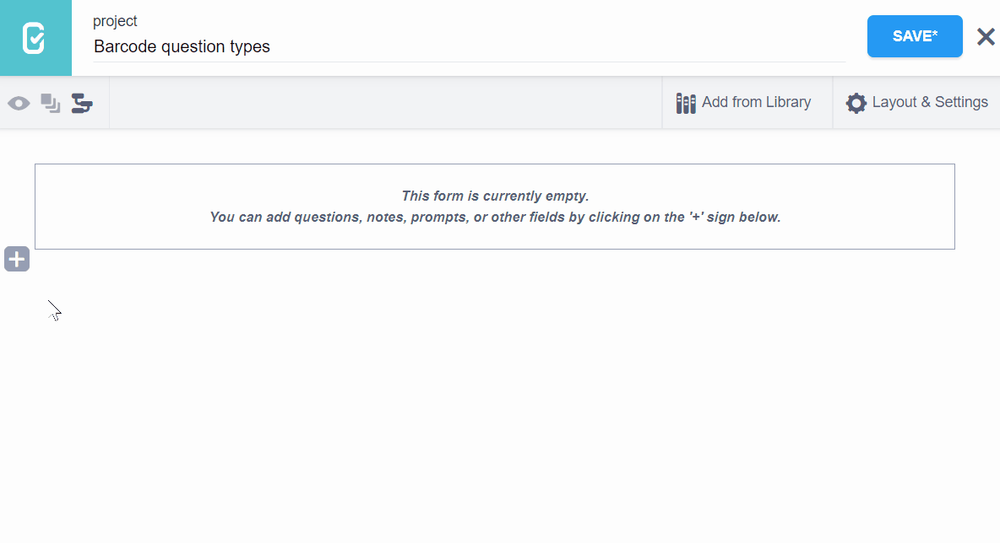
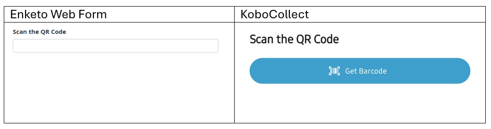
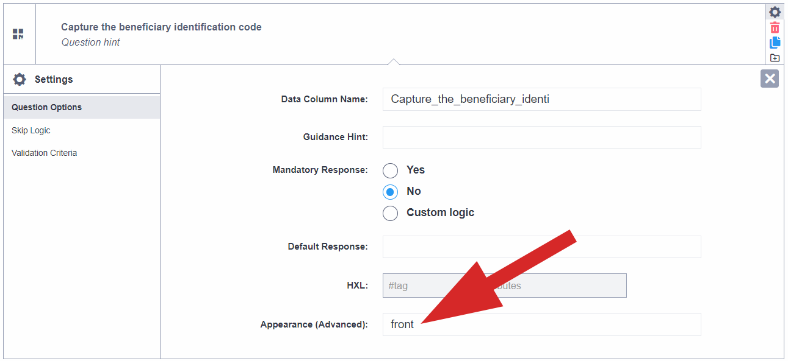

# Barcode/QR code question type
<a href="fr/barcode_qrcode_questions.html">Lire en français</a> | <a href="es/barcode_qrcode_questions.html">Leer en español</a> | <a href="ar/barcode_qrcode_questions.html">اقرأ باللغة العربية</a>
**Last updated:** <a href="https://github.com/kobotoolbox/docs/blob/c5889af525a55f27747f919a026f9b7103f5c180/source/barcode_qrcode_questions.md" class="reference">24 Sep 2025</a>

The "Barcode/QR code" question type is used for scanning, decoding and capturing
barcodes and QR codes using the device camera. When a code is scanned with the
camera the value (whether numbers or text) stored in the code is captured.

  Barcode/QR code scanning only works when <a href="https://support.kobotoolbox.org/kobocollect_on_android_latest.html">using KoboCollect</a> on mobile devices.

A wide range of Barcode and QR code formats are supported, including the
following:

- UPC-A
- UPC-E
- EAN-8
- EAN-13
- Code 39
- Code 93
- Code 128
- Codabar
- ITF
- RSS-14
- RSS-Expanded
- QR Code
- Data Matrix
- Aztec
- PDF 417
- MaxiCode

"Barcode/QR code" questions can be used in different scenarios including asset
management or item distribution. For example, you can scan a QR code on a
beneficiary identity card to capture their ID number. You can then use use the
`pulldata()` function to automatically populate fields from a CSV attached to
your project or from a [linked project](dynamic_data_attachment.md) with
information about the beneficiary. You can learn more about the `pulldata()`
function [here](https://xlsform.org/en/#how-to-pull-data-from-csv).

## How to set up the "Barcode/QR code" question type

### Setting up in formbuilder

To add a "Barcode/QR code" question:

- Click the <i class="k-icon k-icon-plus"></i> button to add a new question
- Type the question text, for example "Collect the beneficiary identification
  code", then click **ADD QUESTION** or press ENTER on your keyboard
- Choose the question type

### Setting up in XLSForm

To add a "Barcode/QR code" question in XLSForm, add a question with type
`barcode` as follows:

| type    | name           | label                           |
| :------ | :------------- | :------------------------------ |
| barcode | beneficiary_id | Capture the beneficiary ID code |
| survey  |

## How "Barcode/QR code" questions are displayed on web forms and KoboCollect

### Default appearance

### Advanced appearance

When adding the "Barcode/QR code" question type, you can change the appearance
settings to switch from using the default (back) camera of the device to using
the front camera.

### Changing advanced Appearance in formbuilder

Go to the question settings of the "Barcode/QR code" question, and type "front"
in the "Appearance (Advanced)" box

### Changing advanced Appearance in XLSForm

In XLSForm, you can set the default camera for capturing the "Barcode/QR code"
to be the front camera by typing 'front' in the `appearance` column as follows:

| type    | name             | label                           | appearance |
| :------ | :--------------- | :------------------------------ | :--------- |
| barcode | beneficiary_id_2 | Capture the beneficiary ID code | front      |
| survey  |

  You can download an XLSForm with examples from this article
  <a
    download
    class="reference"
    href="./_static/files/barcode_qrcode_questions/barcode_qrcode_questions.xlsx"
    >here</a
  >.

