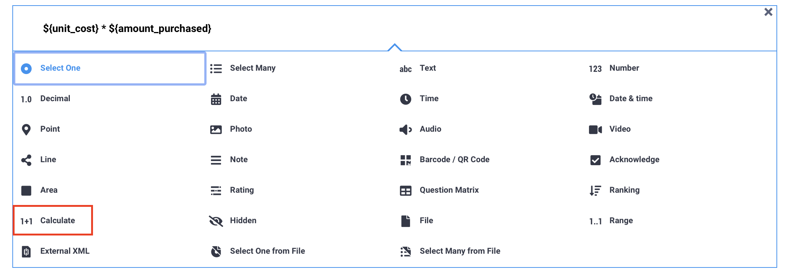
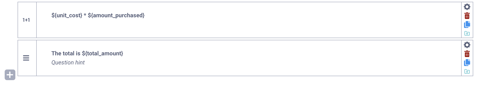

# Adding calculations in the Formbuilder
**Last updated:** <a href="https://github.com/kobotoolbox/docs/blob/511ea4cb3c698a4b45e7c2b4efd1af4e356e811f/source/calculate_questions.md" class="reference">15 Feb 2022</a>

Calculations allow users to derive new variables, build advanced form logic, and display results to respondents during data collection. The **Calculate** question type performs mathematical operations using values entered in previous questions. By default, the result is hidden, but it can be displayed in the form if needed.

Calculations are processed within the form, which can reduce the need for post-collection data manipulation. The results are stored as new variables in the dataset and can be used throughout the form to apply [skip logic](https://support.kobotoolbox.org/skip_logic.html), define [validation criteria](https://support.kobotoolbox.org/validation_criteria.html), or display [dynamic content](https://support.kobotoolbox.org/form_logic.html#question-referencing) in question labels and notes.

This article explains how to add calculations in the Formbuilder, covering basic arithmetic and introducing more advanced expressions.

## Adding calculations in the Formbuilder

To add a calculation to your form:

1. Click the <i class="k-icon-plus"></i> button. 
2. Enter the calculation expression instead of the question label.
3. Click **+ ADD QUESTION**. 
4. Choose the <i class="k-icon-qt-calculate"></i> **Calculate** question type.

Calculation expressions are constructed using a combination of question references, mathematical operators, functions, and constants. For example:
* `${usd_cost} * 0.87` converts the value entered in the `usd_cost` question to another currency using a fixed exchange rate.
* `${total_cost} div ${units_purchased}` divides the total cost by the number of units purchased to calculate the unit cost.

To learn more about each of these components, see <a href="https://support.kobotoolbox.org/form_logic.html">Introduction to form logic in the Formbuilder</a>.

To display the result of the calculation in a note, use the [question referencing](https://support.kobotoolbox.org/form_logic.html#question-referencing) format `${data_column_name}`, replacing `data_column_name` with the [data column name](https://support.kobotoolbox.org/question_options.html#data-column-name) of the Calculate question. You can also use this format to reference the result of the calculation in a question label or in your form’s logic. 

## Arithmetic calculations

Calculations can range from simple arithmetic calculations to advanced derivation of variables.

Arithmetic calculations allow you to perform basic calculations using the following **operators**:

| Operator | Description |
|:---------:|:------------|
| <strong>+</strong>        | addition |
| <strong>-</strong>        | subtraction |
| <strong>*</strong>        | multiplication |
| <strong>div</strong>      | division |
| <strong>mod</strong>      | modulo (calculates the remainder of a division) |

Calculations in XLSForm follow the **BODMAS** rule for the order of mathematical operations: **B**rackets, **O**rder of powers, **D**ivision, **M**ultiplication, **A**ddition, and **S**ubtraction. This means that calculations within brackets (or parentheses) are performed first, followed by powers, then divisions, multiplications, and so on. Using brackets correctly ensures that your calculations function as expected. 

## Advanced calculations

Advanced calculations in KoboToolbox often rely on **functions** and **regular expressions** to make calculations more efficient. 

- **Functions** are [predefined operations](https://support.kobotoolbox.org/functions_xls.html) used to automatically perform complex tasks like rounding values, calculating powers, or extracting the current date. 
- **Regular expressions (regex)** are [search patterns](https://support.kobotoolbox.org/restrict_responses.html) used to match specific characters within a string of text.

  For examples of advanced calculations you can use in your forms and troubleshooting suggestions, see <a href="https://support.kobotoolbox.org/calculations_xls.html#advanced-calculations">Adding calculations in XLSForm</a>.  

