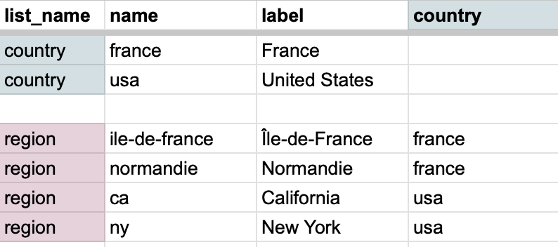
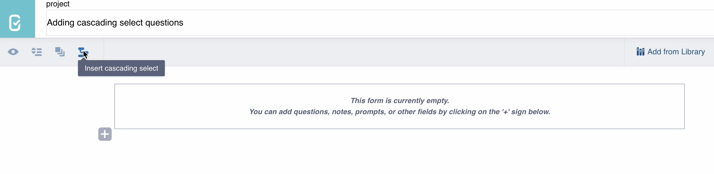

# Adding cascading select questions in the Formbuilder
**Last updated:** <a href="https://github.com/kobotoolbox/docs/blob/050dcc9c8bfb4c528208bbe886979999037f1554/source/cascading_select.md" class="reference">28 Oct 2025</a>

<a href="es/cascading_select.html">Leer en español</a> | <a href="fr/cascading_select.html">Lire en français</a> | <a href="ar/cascading_select.html">اقرأ باللغة العربية</a>

Cascading select questions allow you to create dynamic forms where the options in one question depend on the answer to a previous question. This feature helps streamline data collection by presenting only relevant choices, improving the efficiency and accuracy of your surveys.

  <strong>Note:</strong> This article focuses on basic cascading select questions using the Formbuilder. To learn more about using XLSForm to create advanced cascading select questions and add choice filters, see <a href="https://xlsform.org/en/#cascading-selects">XLSForm documentation</a>.

## Preparing a cascading choice table

To import cascading select questions into the Formbuilder, you first need to prepare your choice list in Excel or another spreadsheet program. You can use this <a href="https://docs.google.com/spreadsheets/d/1C_uDOkjjbv5Kx3lyOY7ORwM-muW6BKVzdaPMB1X8-2A/edit?gid=0#gid=0">Cascade Import Template</a> to get started.

The choice table must include the following columns:
- **list_name:** Unique identifier for a question’s list of choices. This will also be the Data Column Name for the created question.
- **name:** Unique identifier for each choice within a list.
- **label:** Text that appears on the form for each choice.

  <strong>Note:</strong> When defining a <strong>list_name</strong> or a <strong>name</strong>, do not use symbols such as the em-dash or question mark. Only alphabet letters, underscores, and numbers can be used.

Next, you must add a column for each **parent list**, which is a list that includes a sublist within it. For example, a **parent list** of continents could include a **child list** of countries.

For each item in the **child list**, indicate in the **parent list** column which parent item the child item belongs to. For example, if the country in the child list is Malawi, then in the continent column, indicate Africa. To refer to an item from the parent list, use the **choice name**, not the choice label.

## Importing the table into the Formbuilder

Once your choice list is ready, you can import it in the Formbuilder by following these steps:
1. Copy the entire choice table from your spreadsheet.
2. In the Formbuilder, click <i class="k-icon-cascading"></i> **Insert cascading select**.
3. Paste the copied table into the text box and click **Done** to import. This process will automatically create new questions in your form.
    - If there are formatting errors, the import will fail. Correct any mistakes and ensure you followed the template instructions.
4. Once imported, you can move the questions within your form, change the question and choice labels, and even delete option choices.
5. To add more choices to the cascading list, delete the existing imported questions and import a new list from your updated spreadsheet, following the same process as above.

  <strong>Note:</strong> If you change the question label in the Formbuilder, ensure the Data Column Name in its settings still matches the <strong>list_name</strong> from your choice list table.

## Advanced cascading select management using XLSForm

For greater flexibility in managing and updating your cascading select questions, especially if you anticipate frequent changes to your choice lists, using XLSForm is recommended. This method allows you to directly modify your choice lists, without losing any changes made to the question labels and settings.

To update your cascading select questions using XLSForm:
1. Download your XLSForm by exiting the Formbuilder, clicking on <i class="k-icon-more"></i><strong>More actions</strong> in the <strong>FORM</strong> tab, and selecting <strong>Download XLS</strong>.
2. Navigate to the `choices` worksheet in the downloaded file and modify your choice list. Maintain the same approach and format as described above for preparing a cascading choice table.
3. Re-upload the updated XLSForm to KoboToolbox by clicking on <strong>Replace form</strong> and uploading your modified file.

    To learn more about adding cascading select questions and using choice filters in XLSForm, see <a href="https://xlsform.org/en/#cascading-selects">XLSForm Documentation</a>. For more information about using XLSForm with KoboToolbox, see <a href="https://support.kobotoolbox.org/getting_started_xlsform.html">Getting started with XLSForm</a>. 

## Troubleshooting

<strong>Cascading choice list is blank</strong>

If the choice list for the child question is empty, the child list is not seeing a match in the parent list. Check that the choice names do not contain any symbols (letters, numbers, or underscores only) and that every parent option has at least one child linked to it.

 

<strong>Cascades break after you edit the form</strong>

Renaming a question or editing choice lists can change the backend code the cascade relies on. When renaming a question, ensure the <strong>Data Column Name</strong> remains the same as the corresponding <strong>list_name</strong>. For large choice list edits, either rebuild the cascade from scratch or download the XLSForm, make your changes there, and upload it back.

 

<strong>Cascading select from a Select Many question</strong>

The cascading select feature in the Formbuilder is designed for <strong>Select One</strong> questions only. Building a cascade that starts from a <strong>Select Many</strong> question requires using XLSForm. 
To learn more about advanced cascading select using XLSForm, see <a href="https://xlsform.org/en/#cascading-selects">XLSForm documentation</a>.

 

<strong>Survey element cannot be found</strong>

An error indicating a survey element cannot be found typically means the internal code does not match the cascade's expectations. To fix this, open the question's settings, locate the <strong>Data Column Name</strong>, and revert it to the original value (which should match the corresponding <strong>list_name</strong>) before redeploying your form.

