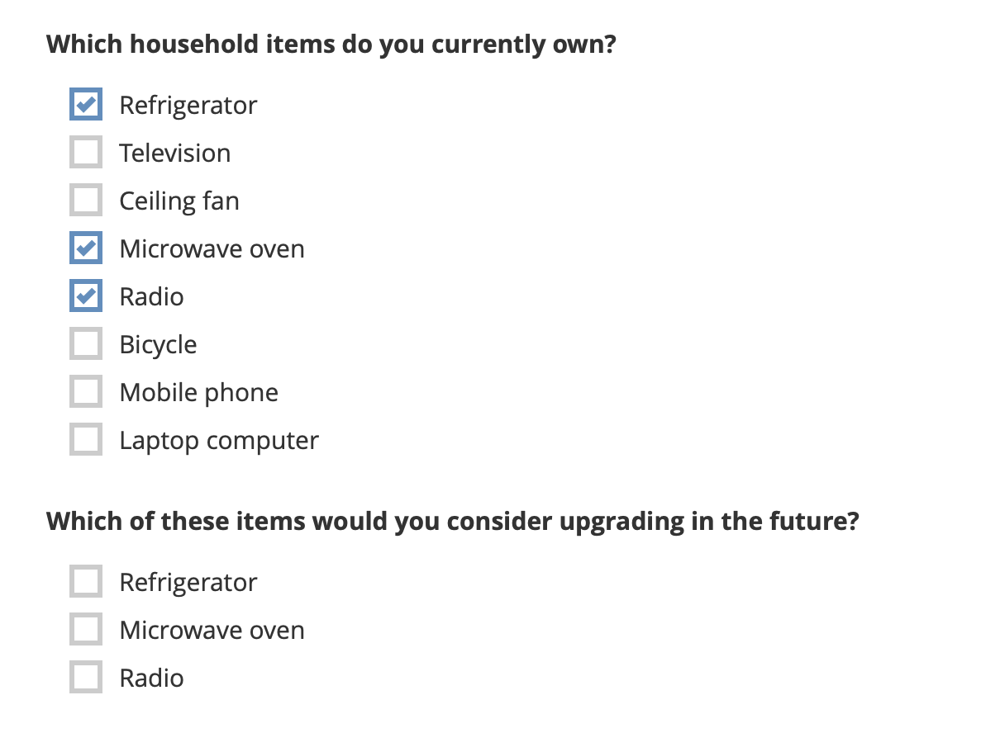

# Adding choice filters in XLSForm
**Last updated:** <a href="https://github.com/kobotoolbox/docs/blob/485fe4fed42cbb765b4838cb7f8c9665a561d091/source/choice_filters_xls.md" class="reference">25 Nov 2025</a>

Choice filters create dynamic forms where options in one question depend on the answer to a previous question. This streamlines data collection by presenting only relevant choices, improving survey efficiency and accuracy. 

Choice filters can be used for various applications, including:
- **Hierarchical lists**, such as continents and countries, where the list of countries depends on the selected continent (also known as **cascading selects**).
- **Removing one or multiple options from a list** if they are irrelevant for a respondent based on their previous answers.
- **Reusing a list of options** in XLSForm for multiple questions, where the list varies slightly from one question to the next.
- Reusing a list of options from a previous question, including **only options that were selected by the respondent.**

This article explains how to add choice filters in XLSForm and includes examples for different use cases. Choice filters are defined in the `choice_filter` column of the `survey` worksheet, and operationalized in the `choices` worksheet. 

<strong>Note:</strong> This article focuses on adding choice filters in <a href="https://support.kobotoolbox.org/getting_started_xlsform.html">XLSForm</a>. To learn about adding cascading select questions in the KoboToolbox Formbuilder, see <a href="https://support.kobotoolbox.org/cascading_select.html">Adding cascading select questions in the Formbuilder</a>.
  
For hands-on practice with choice filters in XLSForm, see KoboToolbox Academy’s <a href="https://academy.kobotoolbox.org/courses/xlsform-fundamentals">XLSForm Fundamentals Course</a>.

## Adding static choice filters

**Static choice filters** apply the same filtering conditions for all respondents. When using static choice filters, a list of options is filtered, but it does not vary based on previous responses. This can be useful when you want to reuse a list of options across multiple questions in your form with minor variations, without duplicating the choice list multiple times in your `choices` worksheet.

To add static choice filters in XLSForm:
1. Add a `select_one` or `select_multiple` question to your XLSForm and [define your option choices](https://support.kobotoolbox.org/option_choices_xls.html) in the `choices` worksheet.
2. In the `choices` worksheet, add a filter column. 
    - You can name this column anything you choose (e.g., `q2`). 
3. In the filter column, write any value (e.g., `yes`) next to the choice(s) you want to include in the choice list for your question. 
    - This value will act as the filter. It can be any word or number.
4. In the `survey` worksheet, add a `choice_filter` column. This column will contain the **choice filter expression** used to filter the option choices.
    - The choice filter expression in its most basic form will take the format: `filter = ‘value’`.
    - For example, `q2 = ‘yes’` will retain all choices with **yes** in the `q2` column.

### Example

In the example below, the same list of choices (`activities`) is used for two different questions. For the second question, the list is filtered to show only outdoor activities.

**survey worksheet**

| type             | name               | label                                                   | choice_filter   |
|:-----------------|:------------------|:--------------------------------------------------------|:----------------|
| select_one activities | activities        | What activities do you enjoy doing in your free time?  |                 |
| select_one activities | outdoors_activities | Which of these outdoor activities are available in your city? | <strong>filter = 'outdoors'</strong> |
| survey | 

**choices worksheet**

| list_name  | name       | label                 | filter   |
|:-----------|:-----------|:--------------------|:---------|
| activities | reading    | Reading              |          |
| activities | swimming   | Swimming             | outdoors |
| activities | running    | Running              | outdoors |
| activities | television | Watching television  |          |
| activities | hiking     | Hiking               | outdoors |
| choices | 

## Adding dynamic choice filters

Choice filters can also be used to filter a choice list based on a previous response. In this case, you will have a **parent question** with a corresponding **parent list** of choices, and a **child question** with a corresponding **child list** of choices. The choice list for the child question is filtered based on the response to the parent question.

For an example of an XLSForm using dynamic choice filters, see this <a href="https://docs.google.com/spreadsheets/d/10gpBV6YaYGx1i367hyW-w1Ms9tkUQnCx0V8YsdwYxmk/edit?gid=0#gid=0">sample form</a>.

To add dynamic choice filters in XLSForm:
1. Add the **parent** and **child question** to your XLSForm and [define their option choices](https://support.kobotoolbox.org/option_choices_xls.html) in the `choices` worksheet.
    - These must be `select_one` or `select_multiple` questions.
2. In the `choices` worksheet, add a filter column. 
    - It can be helpful to name this column the same as the **parent question.**
3. In the filter column, enter the `name` of the choice from the parent list that each option in the child list corresponds to.
4. In the `survey` worksheet, add a `choice_filter` column. This column will contain the **choice filter expression** used to filter the option choices.
    - If the parent question is `select_one`, the choice filter expression will be `filter_column = ${question_name}`, where `question_name` refers to the parent question.
    - If the parent question is `select_multiple`, the choice filter expression will be `selected(${question_name}, filter_column)`.

When a respondent selects an option in the parent question, the choice list for the child question will be filtered to only include the corresponding choices.

### Example

In the example below, `continent` is the **parent question** and `country` is the **child question.** The choice list for the `country` question will be filtered based on the response to the `continent` question.

**survey worksheet**

| type              | name      | label     | choice_filter        |
|:------------------|:---------|:----------|:--------------------|
| select_one continent | continent | Continent |                     |
| select_one country   | country   | Country   | **continent = ${continent}** |
| survey | 

**choices worksheet**

| list_name  | name     | label   | continent |
|:-----------|:---------|:--------|:----------|
| continent  | africa   | Africa  |           |
| continent  | asia     | Asia    |           |
| country    | malawi   | Malawi  | africa    |
| country    | zambia   | Zambia  | africa    |
| country    | india    | India   | asia      |
| country    | pakistan | Pakistan| asia      |
| choices |

## Advanced choice filters in XLSForm

You can create more advanced choice filters by using logical operators, mathematical operators, functions, and regex in your choice filter expressions. This allows for highly customized and precise filtering of options, tailoring the form to specific data collection requirements and respondent characteristics.

<strong>Note:</strong> In advanced choice filter expressions, the <code>name</code> column of the <code>choices</code> worksheet can be used as a filter column.

Examples of advanced choice filter expressions in XLSForm include:
| Choice filter | Description |
|:---------------|:------------|
| `selected(${parent_question}, name)` | Display only responses that were selected in a previous `parent_question`. |
| `filter = 'outdoors' and include = 'yes'` | Combine choice filter expressions so both conditions must apply for the choice to be displayed. |
| `name != 'none'` | Exclude the <strong>None</strong> option from a choice list. |
| `selected(${Q1}, name) or name='none'` | Include choices selected in a previous question as well as a <strong>None</strong> option (even if not selected previously). |
| `filter=${Q1} or name='other'` | Include choices based on a previous question as well as an <strong>Other</strong> option. |
| `filter=${Q1} or always_include='yes'` | Include choices based on a previous question as well as a set of options that should always be included. |
| `filter <= ${product_count}` | Use numbers in the filter column instead of text, and filter based on a number from a previous question or calculation. |
| `if(${relationship_status} = 'married', filter = 'married', filter = 'unmarried')` | Use if-statements to conditionally display choices based on the respondent’s background. |

  To learn more about building form logic expressions in XLSForm, see <a href="https://support.kobotoolbox.org/form_logic_xls.html">Introduction to form logic in XLSForm</a>.

### Example 
In the example below, the underlying choice list for `Q1` and `Q2` is the same, but only the options selected in `Q1` will be displayed to respondents when answering `Q2`.

**survey worksheet**

| type               | name | label                                              | choice_filter            |
|:------------------|:-----|:--------------------------------------------------|:-------------------------|
| select_multiple item | Q1  | Which household items do you currently own?      |                          |
| select_multiple item | Q2  | Which of these items would you consider upgrading in the future? | selected(${Q1}, name) |
| survey |

**choices worksheet**

| list_name | name      | label            |
|:----------|:----------|:----------------|
| item      | fridge    | Refrigerator    |
| item      | tv        | Television      |
| item      | fan       | Ceiling fan     |
| item      | microwave | Microwave oven  |
| item      | radio     | Radio           |
| item      | bike      | Bicycle         |
| item      | phone     | Mobile phone    |
| item      | laptop    | Laptop computer |
| choices | 

In the resulting form, `Q2` will display only the options chosen in `Q1`, as shown below.

## Troubleshooting

  
<strong>Form slows or crashes with very long lists</strong>

  Large choice lists which include thousands of rows may work in preview but fail when deployed. This happens because browser preview can handle large lists, while the mobile app or XLS parser cannot. To fix this, move large lists to an external CSV file and use <a href="https://support.kobotoolbox.org/select_from_file_xls.html">select_from_file questions</a> with choice filters. This approach is recommended for lists with more than 3,000 options.

 

  
<strong>Duplicate option names in a list</strong>

  If your choice list includes duplicate option names (for example, if the same neighborhood name is present in different cities), <a href="https://support.kobotoolbox.org/form_settings_xls.html">enable choice duplicates</a> in the <code>settings</code> worksheet by setting <code>allow_choice_duplicates</code> to <code>yes</code>.

