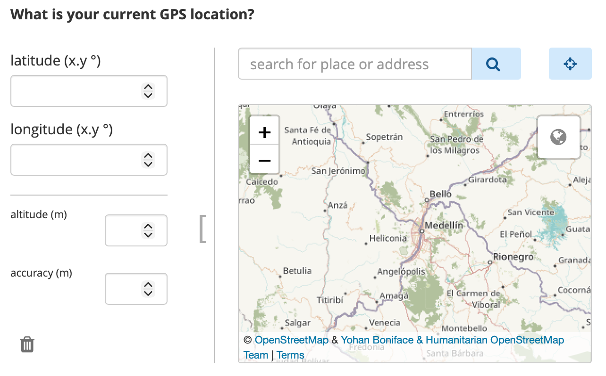

# Collecting GPS data with KoboToolbox
**Last updated:** <a href="https://github.com/kobotoolbox/docs/blob/cb1bef79ba41d9f8deb44c6ff231160337a57196/source/collect_gps.md" class="reference">13 Dec 2025</a>

KoboToolbox allows you to collect GPS data in your forms, including when working offline. GPS questions can capture **a single location, a route, or an area** during data collection. This is useful for tasks such as mapping infrastructure, tracking field visits, monitoring environmental sites, or recording service locations. GPS data can be collected using both [web forms](https://support.kobotoolbox.org/data_through_webforms.html) and [KoboCollect](https://support.kobotoolbox.org/data_collection_kobocollect.html).

This article explains how to collect GPS data in KoboToolbox, including the available GPS question types, how GPS data is collected in web forms and KoboCollect, how to use GPS data in advanced form logic, how to manage GPS data in KoboToolbox, and how to troubleshoot common GPS issues.

## Setting up your form to collect GPS data

KoboToolbox supports three GPS question types for collecting geographic data directly in a form, several metadata options that collect location information automatically in the background, and map-based select questions in XLSForm. 

### GPS question types 

GPS questions are visible to respondents. They allow respondents to collect GPS coordinates by manually selecting or automatically recording a single point, a line, or an area. The following GPS question types are available in KoboToolbox:

| Formbuilder | XLSForm | Description |
| :--- | :--- | :--- |
| Point | `geopoint` | Collects a single geographic location, such as the coordinates of a school, clinic, or household. |
| Line | `geotrace` | Collects multiple GPS points that form a line, such as a path, road, or route. |
| Area | `geoshape` | Collects multiple GPS points that form an enclosed area, such as a plot of land or a field. |

To learn more about adding GPS questions to your forms, see <a href="https://support.kobotoolbox.org/gps_questions.html">GPS questions in KoboToolbox and Question types in XLSForm</a>. 

### GPS metadata questions

GPS metadata questions are not visible to respondents. When enabled, they collect GPS data automatically in the background during form completion. The following metadata question types are available in KoboToolbox:

# GPS Question types
**Last updated:** <a href="https://github.com/kobotoolbox/docs/blob/2afa3a0c670fe98b296a79b798f33abf248d0273/source/gps_questions.md" class="reference">22 Apr 2026</a>

| Formbuilder | XLSForm | Description |
| :--- | :--- | :--- |
| audit | `audit` | Records detailed GPS location and other audit information during form completion, including location information for each question as the form is filled out. |
| start geopoint early | `start-geopoint` | Automatically captures a single location in the background when the form opens.  |
| *Not available* | `background-geopoint` | Automatically captures a single location in the background after respondents answer a specific question. |

To learn more about adding GPS metadata to your forms, see <a href="https://support.kobotoolbox.org/form_meta.html#">Adding form metadata in the Formbuilder</a> and <a href="https://support.kobotoolbox.org/metadata_xls.html#">Form metadata in XLSForm</a>. 

### Selecting options from a map 

In addition to collecting GPS coordinates, you can also let respondents select from predefined locations on a map in XLSForm. This is set up using a **select question** with the `map` or `quick map` appearance, along with a `geometry` column in the choices sheet that stores the coordinates for each choice. 

To learn more about setting up select from map questions, see <a href="https://support.kobotoolbox.org/select_from_map_xls.html">Selecting options from a map</a>.

## Collecting GPS data

GPS data can be collected in both [web forms](https://support.kobotoolbox.org/data_through_webforms.html) and the [KoboCollect](https://support.kobotoolbox.org/data_collection_kobocollect.html) app, but the collection process differs between them. 

### Web forms

When using web forms, respondents can enter GPS data in several ways:

- Detect the current location of the device
- Select a location directly on the map
- Search for an address
- Manually enter GPS coordinates

For line and area questions, respondents can add multiple points on the map to create a route or polygon. 

<strong>Note:</strong>
You can detect the current location of the device by clicking on the <strong>location target button</strong> in the top right corner, next to the search bar.

You can use [appearances](https://support.kobotoolbox.org/gps_questions.html#advanced-appearances) to change how the GPS question is displayed in web forms, specifically to hide the input fields for GPS coordinates. However, web forms do not allow you to fully prevent manual location selection. If you want to collect a location automatically without allowing manual selection, use **background-geopoint** instead.

<iframe src="" style="width: 100%; aspect-ratio: 16 / 9; height: auto; border: 0;" title="YouTube video player" frameborder="0" allow="accelerometer; autoplay; clipboard-write; encrypted-media; gyroscope; picture-in-picture; web-share" allowfullscreen></iframe>

In KoboCollect, GPS data is captured automatically from the device’s current location when the user taps a button. Manual location selection is not enabled by default for point questions, although additional [appearances](https://support.kobotoolbox.org/gps_questions.html#advanced-appearances) can change how GPS questions behave. 

The capture method in KoboCollect differs depending on the question type:

| Question type | GPS data capture |
| :--- | :--- |
| Point / `geopoint` | Tap Get point to begin capturing the device’s location. Once the device reaches the default target accuracy of 5 meters or better, the point is recorded automatically. The enumerator can also tap Save to record the current location manually before that accuracy is reached. |
| Line / `geotrace` | Tap Get line and click <i class="k-icon-qt-point"></i> to choose an input method. The available methods are:   <ul><li>Placement by tapping: The enumerator manually taps points on the map to draw the line.</li><li>Manual location recording: The enumerator moves to each location and taps Record a Point to capture each point from the device’s current position.</li><li>Automatic location recording: The app records points automatically while the enumerator moves, based on a selected time interval and required accuracy.</li></ul> A line requires at least two points. After recording your points, click the Save button in the bottom left corner. |
| Area / `geoshape` | Tap Get polygon and click <i class="k-icon-qt-point"></i> to choose an input method. The same input methods as above are available, but to create an enclosed area instead of a line. An area requires at least three points. |

Beyond the default behavior, you can use [appearances](https://support.kobotoolbox.org/gps_questions.html#advanced-appearances) to change how GPS questions function in KoboCollect. For example, you can use appearances to:

- Display a map of the automatically selected location
- Enable manual location selection

To learn more about GPS question appearances, see <a href="https://support.kobotoolbox.org/gps_questions.html#advanced-appearances">GPS questions in KoboToolbox</a>.

You can also configure KoboCollect map settings to control how maps are displayed for GPS based questions, including defining the map source, selecting a map style, and adding [offline map layers](https://docs.getodk.org/collect-offline-maps/).

To learn more about KoboCollect map settings, see <a href="https://support.kobotoolbox.org/kobocollect_settings.html#maps-settings">Customizing KoboCollect settings</a>.

## Improving GPS accuracy

GPS accuracy depends on both the device and the environment. It can be affected by factors such as whether the device has GPS enabled and a built-in GPS sensor, how recently it last determined its location, whether it is using satellite or network-based location services, and environmental conditions such as cloud cover or nearby buildings and trees.

### GPS parameters

When building forms in XLSForm, you can use [parameters](https://support.kobotoolbox.org/question_options_xls.html#question-parameters) to control GPS accuracy more precisely.

Common parameters include:

| Parameter | Example | Description |
| :--- | :--- | :--- |
| `capture-accuracy` | `capture-accuracy=15` | Automatically captures the point once the device reaches the target accuracy. If set to 0, the enumerator must explicitly accept the point. The default is 5 meters. |
| `warning-accuracy` | `warning-accuracy=30` | Triggers a warning message if the GPS accuracy is not within the specified accuracy threshold. This does not prevent saving the point. The default is 100 meters. |

<strong>Note:</strong>
For most workflows, a <strong>capture-accuracy</strong> of around <strong>5 meters</strong> is a practical target. In general, it is not recommended to set the target below <strong>3 meters</strong> unless you are using an external GPS device, because built-in device GPS is often not accurate enough to reach that level reliably.

### Recommendations for improving GPS accuracy

To improve GPS accuracy:

- Collect data outdoors in an open area with a clear view of the sky
- Stand away from buildings, trees, and other obstructions
- Make sure your body is not blocking the device’s view of the sky
- Warm up your device’s GPS by including `start-geopoint` at the beginning of your form
- Enable assisted GPS on the device if available

## Advanced form logic with GPS data

KoboToolbox supports advanced form logic with GPS data in XLSForm. For example, you can use GPS functions in calculations, constraints, and skip logic to measure distance, perimeter, or area, or to check whether a location falls within a defined boundary.

