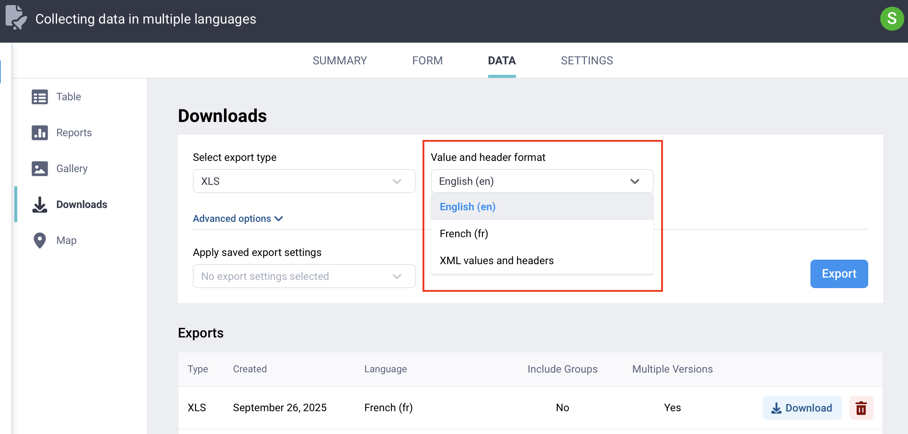

# Collecting data in multiple languages
**Last updated:** <a href="https://github.com/kobotoolbox/docs/blob/1710438b3a5cb33b4229492e00cb8d234a569f64/source/collecting_data_multiple_languages.md" class="reference">4 Jan 2026</a>
KoboToolbox supports collecting data in **as many languages as you need** within a single form, including languages that use non-Latin scripts. You can design your form with multiple translations, allow respondents to switch to their preferred language during data collection, and later view or export the data in any form language.

Adding translations to a single form removes the need for creating separate forms for each language, making it easier to manage multilingual projects and **keep your data consistent across languages.** Both [KoboCollect](https://support.kobotoolbox.org/kobocollect_on_android_latest.html) and [Enketo web forms](https://support.kobotoolbox.org/enketo.html) support form translations.

This article provides an overview of the different options for preparing forms with translations, how to collect data in multiple languages (including setting up language-specific links for Enketo web forms), and how to manage and export multilingual data in KoboToolbox.

## Setting up your forms with translations

You can add translations to your form **directly in the KoboToolbox interface** or by using **XLSForm.** KoboToolbox offers an intuitive interface that requires no technical expertise, and allows you to easily add multiple translations to your forms. This approach is useful when working with a small number of questions or when you want to make quick adjustments.

  To learn more about setting up translations from the KoboToolbox interface, see <a href="https://support.kobotoolbox.org/language_dashboard.html">Adding translations in KoboToolbox</a>.

For larger or more complex multilingual forms, XLSForm is often the more efficient option. It allows you to manage translations in bulk, which can save time when working with many questions or multiple languages.

  To learn more about setting up translations in XLSForm, see <a href="https://support.kobotoolbox.org/language_xls.html">Adding translations in XLSForm</a>.

Most elements displayed to respondents can be translated. These include **question labels, hints, choice labels, constraint messages**, and **required messages.** Elements that define the structure of the form, such as [XML values](https://support.kobotoolbox.org/glossary.html#xml-value), cannot be translated and should remain in the language you use for form development and data analysis.

  <strong>Note:</strong> XLSForm makes it easy to add translations in bulk using machine translation or online translation tools. Machine translations should always be reviewed by a fluent speaker to ensure accuracy, cultural appropriateness, and correct context. This helps maintain the quality and reliability of your translated content.

## Collecting data in multiple languages

<iframe src="https://www.youtube.com/embed/MWLlWtXYHig?si=nGuOVpt0tVR_ip7l" style="width: 100%; aspect-ratio: 16 / 9; height: auto; border: 0;" title="YouTube video player" frameborder="0" allow="accelerometer; autoplay; clipboard-write; encrypted-media; gyroscope; picture-in-picture; web-share" allowfullscreen></iframe>

When your form contains translations, respondents can choose their preferred language during data collection and switch languages at any time before submitting their responses.

To change the form language in Enketo web forms:

1. Open the form in your browser.
2. In the top right corner of the form, a **Choose Language** dropdown menu is displayed (only in forms with multiple languages).
3. Open the dropdown menu and choose from the list of available translations.

To change the form language in KoboCollect:

1. Open the form on your device.
2. Tap the <i class="k-icon-more-vertical"></i> **More options** button in the top right corner of the screen.
3. Select <i class="k-icon-language"></i> **Change Language.**
4. Choose from the list of available translations.

### Language-specific form URL

By default, form links copied from KoboToolbox open in the form’s default language. To share a link that opens in a different form language, add the `lang` parameter to the end of the form URL:

1. Copy your form link in **FORM > Collect data.**
2. Add `?lang=[language_code]` at the end of the URL.
    - For example: `https://ee.kobotoolbox.org/x/[form_id]?lang=fr`. 
3. Share the language-specific URL with respondents.

  <strong>Note:</strong> This overrides both the browser language setting and the form’s default language. This functionality applies only to Enketo web forms, not KoboCollect.

## Managing data in multiple languages

After collecting data in multiple languages, KoboToolbox allows you to view and export your data in any language included in your form.

  <strong>Note:</strong> If you are collecting audio responses in multiple languages, you can transcribe and translate those responses using KoboToolbox’s automatic transcription and translation features. To learn more, see <a href="https://support.kobotoolbox.org/transcription-translation.html">Transcription and translation of audio responses</a>.

### Viewing data in different languages in the Table view

In the **DATA > Table** view, you can change the language used for question and choice labels.

To view your data table in a different language:

1. In your project, go to **DATA > Table.**
2. In the top right corner, click <i class="k-icon-settings"></i> **Display Options.**
3. Under **Display labels or XML values?**, select the language you want to use.

  <strong>Note:</strong> All form data is displayed in the selected language, regardless of the language used for data collection, except for open text responses.

### Viewing data in different languages in the Reports view

In the **DATA > Reports** view, you can also switch the report language.

To view your data report in a different language:

1. In your project, go to **DATA > Reports.**
2. Click <i class="k-icon-settings"></i> **Configure Report Style.**
3. Go to the **TRANSLATION** tab.
4. Select the language you want to display in the report.

  <strong>Note:</strong> All form data is displayed in the selected language, regardless of the language used for data collection, except for open text responses.

### Selecting a language when exporting data

In the **DATA > Downloads** section, you can choose the language used in your exported dataset. 

To export your data report in a different language:

1. In your project, go to **DATA > Downloads.**
2. Click the dropdown menu under **Value and header format.**
3. Select the language you want to export your data in.
4. Click **Export**, and download the exported file.

  <strong>Note:</strong> All form data is exported in the selected language, regardless of the language used for data collection, except for open text responses.

You can also view or export your data using [XML values](https://support.kobotoolbox.org/glossary.html#xml-value). **XML values are not translated** and are usually generated in the language used during form development. 

Using XML values is recommended for analysis, as these provide short, consistent variable names and coded values that **remain consistent across translations**, regardless of the language used by respondents.
