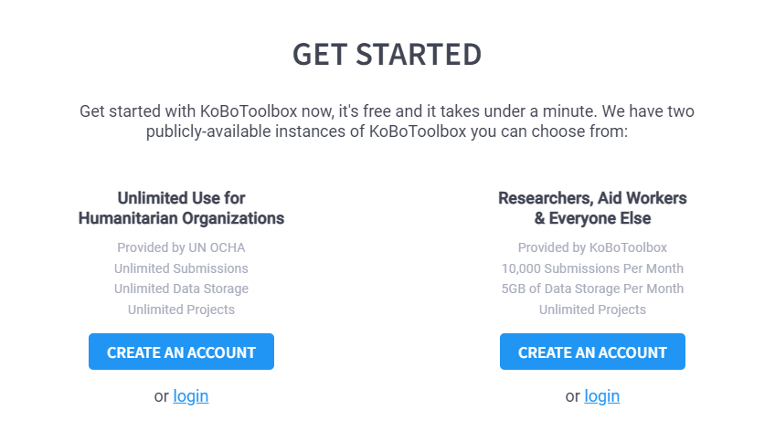

# Creating an account on KoboToolbox

**Last updated:**
<a href="https://github.com/kobotoolbox/docs/blob/511ea4cb3c698a4b45e7c2b4efd1af4e356e811f/source/creating_account.md" class="reference">15
Feb 2022</a>

The first step for all users when getting started with **KoboToolbox** is to
create an account. This article will guide you through the steps on creating and
accessing your account on one of **KoboToolbox** servers.

## How to access KoboToolbox

There are two main ways of accessing **KoboToolbox**:

1. **Public servers**: For most users, it is recommended to use either of our
   publicly available **KoboToolbox** servers listed on the
   [Get Started page](https://www.kobotoolbox.org/#sign-up). One server is for
   humanitarian organizations and the non-humanitarian server is for everyone
   else. Steps for creating an account are listed below.

2. **Install KoboToolbox on your own server**: Advanced users can install
   **KoboToolbox** on [their own server](kobo_your_servers.md) (or on a
   [local computer or device](kobo_local_computer.md)) using Docker. For more
   details on how to install your own instance of **KoboToolbox**,
   [visit our kobo-install repository on GitHub](https://github.com/kobotoolbox/kobo-install).

## Creating an account

-   To create a new account on **KoboToolbox**, go to the
    [KoboToolbox homepage](https://kobotoolbox.org) and click **SIGN UP** on the
    menu. This will take you to the **GET STARTED** section of the website.

-   Here, you are presented with two different servers where you can create your
    account.

If you are an individual researcher, aid worker, or a for-profit organization,
it is recommended to use the server provided by **KoboToolbox** (_Kobo server_).

If you are creating an account for a humanitarian organization, it is
recommended that you use the server provided by **UN OCHA** (_OCHA server_).

  To learn more about the differences between the two servers,
  <a href="server.html" class="reference">read this support article</a>.

-   Click **CREATE ACCOUNT** on the server of your choice
-   On the **Create Your Account** page, enter the details on the form and click
    **Create Account**.

  Make sure to keep your password in a safe place to avoid losing it.  
  The username must be all lowercase letters, without any spaces or symbols.

**KoboToolbox** will send you an email with a link to activate your account. If
you did not get the activation email, check your spam folder. For more help, you
can also read the support article
[Didn’t Receive Activation Link After Signing Up](activation_link.md).

-   Log in to the email address you used when creating your account and click
    the activation link sent to you. This will automatically log you into
    **KoboToolbox**.

## Logging back into KoboToolbox

Use one of the following links to log back into your account with your
_username_ and _password_:

| Server      | URL                                                                                                   |
| ----------- | ----------------------------------------------------------------------------------------------------- |
| OCHA server | <a href="https://kobo.humanitarianresponse.info" class="reference">kobo.humanitarianresponse.info</a> |
| Kobo server | <a href="https://kf.kobotoolbox.org" class="reference">kf.kobotoolbox.org</a>                         |

## Troubleshooting

1. Make sure to follow the guidelines listed below to create a valid username:
    - The length of a username can range from 2 to 30 characters.
    - All the characters used in a username should be in lowercase. The use of
      uppercase letters would make the username invalid, and the system should
      not accept such username.
    - A username could be made up of a combination of lowercase characters,
      numbers, and underscores. Use of special characters (such as `~`, `!`,
      `@`, `#`, `$`, `%`, `^`, `&`, `*`, `?`) are not accepted in a username.
      However, they can be used in the password to make your password strong.
    - The first character of a username should always be a letter or else the
      username will be invalid.
2. You may be suggested to choose another username (despite following all the
   checklist listed above) if the username you have applied for has already been
   registered within the system.
3. Check carefully and ensure you don't have any typos in the registration form
   (with the `username` and `password`) or otherwise you may end up with a
   mismatch and the system may not allow you to login. Store your `username` and
   `password` in a safe place so that you don't lose them and someone else does
   not access them without your consent.
4. If you make a typo in the email, while registering your user account, you may
   not receive the activation link sent by the system. Please verify the
   information on the registration form once it has been filled out. _(e.g. if
   you typed a wrong email ID say `example@gmai.com` or `exampl@gmail.com` you
   may not receive the activation link to your email id `example@gmail.com`)_
5. Make sure you change your `password` at a regular interval so that your
   account is safe and secure.
