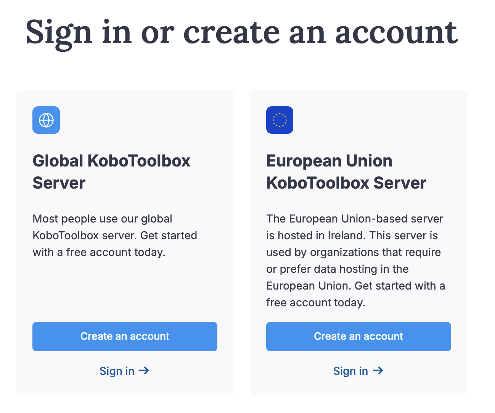

# Creating a KoboToolbox account
**Last updated:** <a href="https://github.com/kobotoolbox/docs/blob/6ecc0779b11c2939013ebde2ece70af7e9fa778e/source/creating_account.md" class="reference">21 Jul 2026</a>

Most users access KoboToolbox by creating an account on one of our public servers. Users can choose between:
- The **Global KoboToolbox Server**, used by most KoboToolbox users.
- The **European Union KoboToolbox Server**, hosted in Ireland for organizations that require or prefer data hosting in the European Union (EU).

This article explains how to create and activate a KoboToolbox account on one of our public servers.

<strong>Note:</strong>
    Some large organizations use a private KoboToolbox server. If your organization has a private server, create your account using the server URL provided by your organization.

## Creating an account

To create a free KoboToolbox account:
1. Go to [www.kobotoolbox.org/sign-up](https://www.kobotoolbox.org/sign-up/).
2. Select the server you want to use and click **Create an account.**
3. Enter your full name, username, email address, country, sector, organization type, newsletter preferences, and password.
4. Click **CREATE ACCOUNT.**
5. Check your inbox for an account activation email, and open the activation link to activate your account.

<strong>Note:</strong>
    Make sure your email address is correct. You will not receive the activation link if the address contains an error. You can use the same email address for multiple KoboToolbox accounts.

After activating your account, you will automatically have access to the free [KoboToolbox Community Plan](https://www.kobotoolbox.org/pricing/). You can [upgrade your plan](https://support.kobotoolbox.org/account_settings.html#plans) at any time if you need additional storage, submissions, or features.

    <strong>Note:</strong>
  Users from for-profit organizations can contact KoboToolbox for information about for-profit pricing.

### Choosing the right server

A server is the computer system where your KoboToolbox account, projects, and data are stored.

KoboToolbox has two public servers:

| **Server** | **Description** |
|:---|:---|
| **Global KoboToolbox Server** | Used by most KoboToolbox users. |
| **European Union KoboToolbox Server** | Hosted in Ireland for organizations that require or prefer data hosting in the EU. |

Both servers have the same features. The only difference is where your account and data are hosted.

<strong>Note:</strong>
    Projects and data cannot be shared between the Global and European Union servers. All users collaborating on a project must have accounts on the same server.

### Creating a username

Your username must:
- Contain between 2 and 30 characters.
- Start with a lowercase letter.
- Use only lowercase letters, numbers, and underscores.
- Not contain spaces or special characters, such as <code>~</code>, <code>!</code>, <code>@</code>, <code>#</code>, <code>$</code>, <code>%</code>, <code>^</code>, <code>&</code>, <code>*</code>, or <code>?</code>.

If the username you entered is already registered, you will need to choose a different username.

### Activating your account

After you create your account, KoboToolbox will send an activation link to the email address you provided. You must open the link **within 72 hours** to activate your account.

If the link has expired, try signing in with the username and password you created. KoboToolbox should automatically send you a new activation email.

If you do not receive the email, check for the following issues:

- The email address entered during registration contains an error.
- The activation email is in your spam or junk folder.
- Your organization’s email system is blocking messages from KoboToolbox.

## Signing back in to KoboToolbox

To sign back into KoboToolbox, use the sign-in page for the server where you created your account:

| **Server** | **Sign-in URL** |
|:---|:---|
| Global KoboToolbox Server | [kf.kobotoolbox.org](https://kf.kobotoolbox.org/) |
| European Union KoboToolbox Server | [eu.kobotoolbox.org](https://eu.kobotoolbox.org/) |

Enter the username and password you created during registration.

## Deleting your KoboToolbox account

You can permanently delete your KoboToolbox account at any time.

Before deleting your account, you must delete all projects you own or transfer their ownership to another user.

To delete your account:
- Delete or transfer ownership of all projects owned by your account.
- Open **Account Settings.**
- Go to the **Profile tab.**
- Click **Delete account.**
- Enter your username to confirm the deletion.

The **Delete account** button will remain disabled while your account owns any projects.

<strong>Note:</strong>
    Deleting your account is permanent and cannot be undone.

## Troubleshooting

<strong>Did not receive activation link</strong>

If you did not receive the email with an activation link, check for the following issues:
<ul>
  <li>The email address entered during registration contains an error.</li>
  <li>The activation email is in your spam or junk folder.</li>
  <li>Your organization's email system is blocking messages from KoboToolbox.</li>
</ul>

If you still cannot activate your account, contact <a href="mailto:support@kobotoolbox.org">support@kobotoolbox.org</a>.

 

<strong>Activation link has expired</strong>

If your activation link has expired, try signing in with the username and password you created. KoboToolbox should automatically send you a new activation email. 

 

<strong>Cannot sign in to account</strong>

If you are unable to sign in to your account, check that:
<ul>
    <li>Your username and password are correct.</li>
    <li>You are signing in to <strong>the server where you created your account.</strong></li>
    <li>Your account has been activated.</li>
</ul>
An account created on the <strong>Global KoboToolbox Server</strong> cannot be used to sign in to the <strong>European Union KoboToolbox Server</strong>, and vice versa.

 

