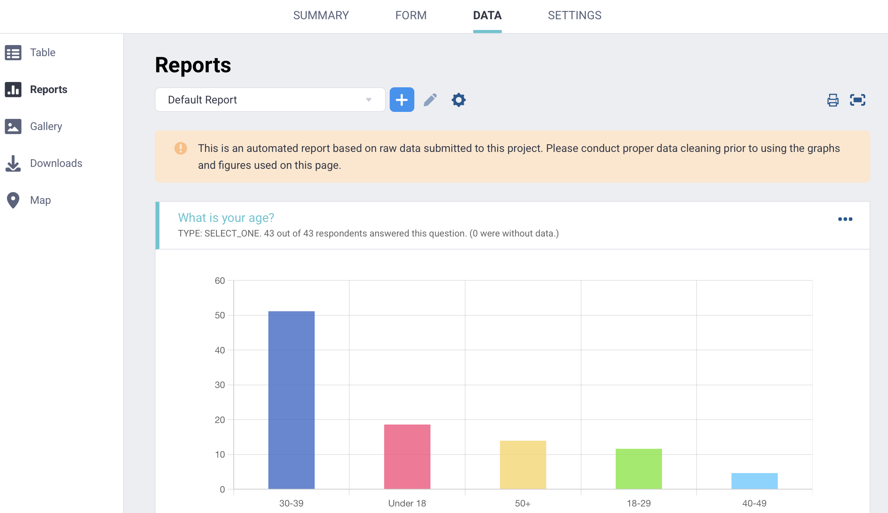
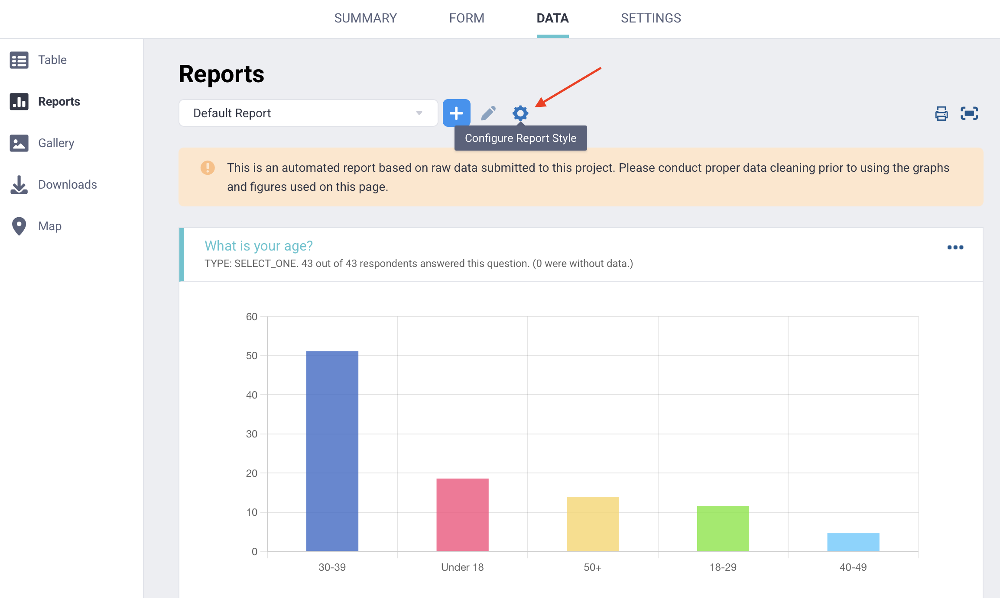
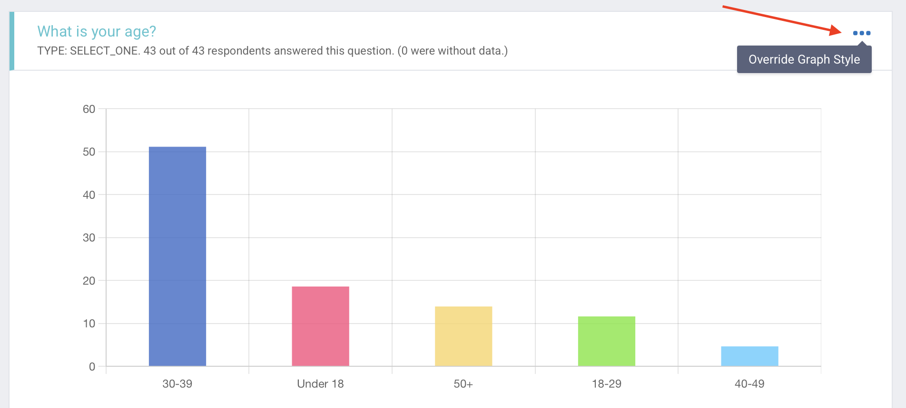
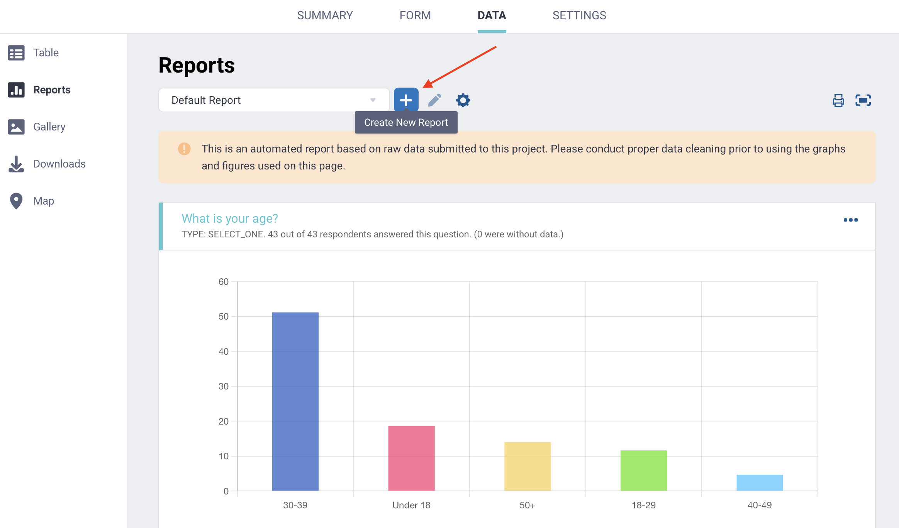

# Visualizing your data with reports
**Last updated:** <a href="https://github.com/kobotoolbox/docs/blob/6e9f496956ced232adb4985272fbee0a6465318d/source/creating_custom_reports.md" class="reference">15 Jun 2026</a>

KoboToolbox includes a reporting tool that you can use to monitor incoming data and view simple descriptive statistics. You can use reports to display charts, review response counts, compare responses by subgroup, and share or print a summary of selected form questions.

<strong>Note:</strong>
    Reports can help you review your data at a glance, but they do not replace in-depth data cleaning, processing, analysis, or visualization with external tools. For more in-depth analysis, KoboToolbox makes it easy to <a href="https://support.kobotoolbox.org/export_download.html">export your data</a> or connect it to <a href="https://support.kobotoolbox.org/synchronous_exports.html">external tools using the API</a>.

This article covers how to access data reports in KoboToolbox, customize report styles, create custom reports, and manage report permissions.

## Accessing data reports

To access your project reports:

1. Open your project.
2. Go to **DATA.**
3. Click <i class="k-icon-reports"></i> **Reports.**

The default report includes all questions in your form. Each question is displayed with a default chart and data table. The report also shows the **question type** and the **number of submissions** with a response to that question.

You can print the report or save it as a PDF by clicking the <i class="k-icon-print"></i> **print** button in the top right corner. You can also <i class="k-icon-expand"></i> **toggle full screen mode** to view the report across the full screen.

## Customizing your report

You can customize the style and configuration of your report by clicking <i class="k-icon-settings"></i> **Configure Report Style.** Changes made here will apply to all charts and tables after you click **Save.**

The following settings are available:

| Setting | Description |
|:---|:---|
| Chart type | The default chart type is a vertical bar graph. You can select a different chart type to apply to all charts in the report. |
| Colors | You can choose a different color scheme for all charts in the report. |
| Group by | You can select a **Select One** question from your form to group charts and tables by that variable. This can be useful for simple subgroup comparisons. |
| Translation | If your form has multiple languages, you can choose which language to display in the report. |

##  Customizing individual questions

You can also customize individual charts in the report.

To customize a chart:

1. Find the chart you want to edit.
2. Click <i class="k-icon-more"></i> **Override Graph Style** in the top right corner of the chart.
3. Select a chart type or color scheme.

These settings apply only to the selected chart.

## Creating a custom report

In addition to the default report, you can create custom reports. Custom reports allow you to choose which questions to include and save custom report settings.

To create a custom report:

1. Click <i class="k-icon-plus"></i> **Create New Report** next to **Default Report.**
2. Enter a title for your custom report.
3. Select the questions you want to include and click **Save.**
4. Click <i class="k-icon-settings"></i> **Configure Report Style** to set the report style and configuration.

To change the title or displayed questions in a custom report, click <i class="k-icon-edit"></i> **Edit Report Questions.**

<strong>Note:</strong> Custom report settings are saved and will remain available when you leave and return.

## Permissions and sharing

Users with **View submissions** permission can view data reports, including custom reports created by other users. However, they cannot configure report styles or create custom reports.

Users with **Manage project** permission can view reports, configure report styles, and create custom reports.

  To learn more about permissions and sharing, see <a class="reference external" href="https://support.kobotoolbox.org/managing_permissions.html">Sharing projects with user-level permissions</a>.

