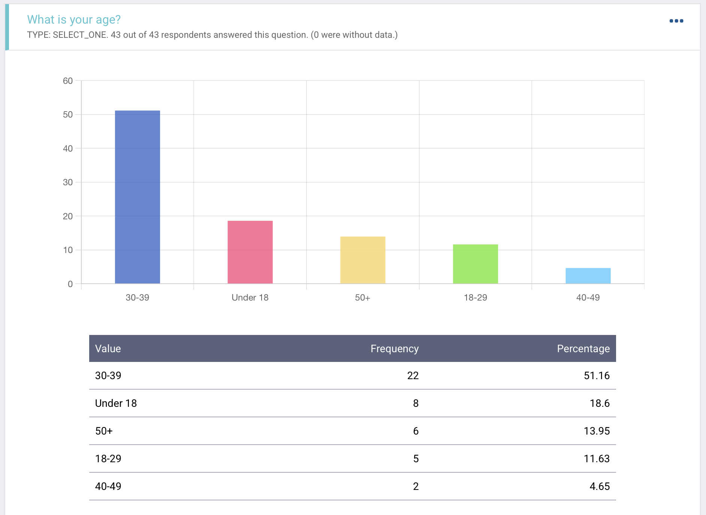
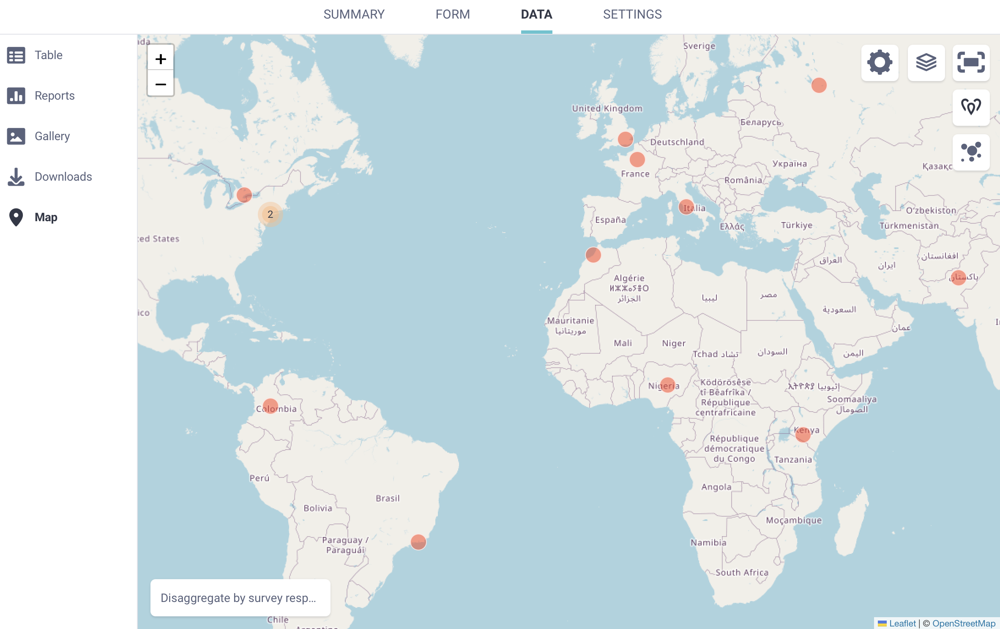
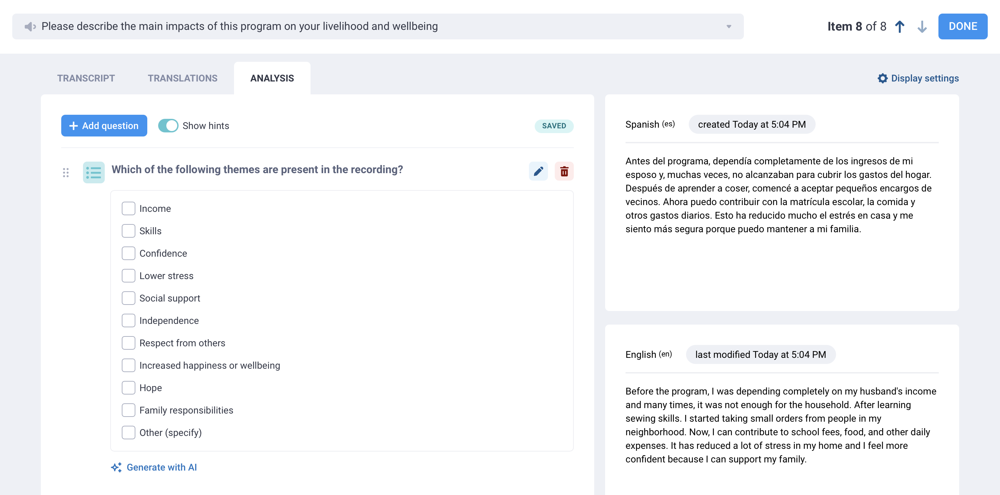

# Data analysis with KoboToolbox

KoboToolbox provides **built-in tools** to help you review, visualize, and analyze collected data. These tools can be used for descriptive statistics, mapping, and qualitative analysis. 

Beyond built-in tools, you can also **export your data** or **connect it to external platforms** for more advanced cleaning, processing, analysis, and visualization.

This article covers KoboToolbox’s data analysis options, from built-in reports, maps, and qualitative analysis tools to data exports, synchronous exports, and form design practices that support cleaner analysis.

## Analyzing and visualizing data in KoboToolbox

KoboToolbox includes several tools that help you understand your data directly in the platform.

### Data reports

KoboToolbox includes a reporting and visualization tool that you can use to **monitor incoming data** and view **simple descriptive statistics.**

You can use reports to display charts, review response counts, compare responses by subgroup, and share or print a summary of selected form questions.

Reports are useful for quickly reviewing your data, but they do not replace in-depth data cleaning, processing, analysis, or visualization in external tools.

  To learn more about data reports, see <a href="https://support.kobotoolbox.org/creating_custom_reports.html">Visualizing your data with reports</a>.

### Map view

KoboToolbox also provides a built-in **Map view** for submissions that include GPS data. The Map view helps you visualize single GPS points, explore geographic patterns, and better understand where submissions were collected.

  To learn more about mapping GPS data with KoboToolbox, see <a href="https://support.kobotoolbox.org/mapping_gps.html#">Mapping your GPS data</a>.

### Audio transcription, translation, and qualitative analysis

KoboToolbox’s natural language processing tools help you **transcribe, translate, and analyze qualitative data.** This can help turn open-ended audio responses into clearer, more usable insights.

You can process and analyze audio responses directly in the user interface, then save transcripts, translations, summaries, categories, and other analysis results as new columns in your dataset.

  To learn more about analyzing qualitative data in KoboToolbox, see <a href="https://support.kobotoolbox.org/transcription-translation.html">Transcription and translation of audio responses</a> and <a href=https://support.kobotoolbox.org/qualitative_analysis.html">Qualitative analysis of audio responses</a>.

## Exporting and connecting data for external analysis

KoboToolbox’s built-in tools can support simple descriptive analysis, mapping, and qualitative analysis. However, many projects require external tools for more advanced data cleaning, processing, analysis, and visualization. To do this, you can use **classic data exports** or **synchronous exports** to work with your KoboToolbox data outside the platform.

### Data exports

You can export your data from KoboToolbox in several formats, depending on how you plan to use it.

- For general analysis, you can **export your data in Excel or CSV format.** These formats can be used for cleaning and processing data, or for importing data into analysis software such as R, Stata, SPSS, or Python.
- For mapping and geospatial analysis, you can **export GPS data in formats such as CSV, XLS, GeoJSON, or KML.** These formats can be used in mapping tools and GIS software.

  To learn more about exporting KoboToolbox data, see <a href="https://support.kobotoolbox.org/export_download.html">Exporting and downloading your data.</a>

When exporting data for analysis in external software, it is recommended to export your data as **XML values and headers**, and to **separate multiple choice responses** into separate columns. These settings make exported data easier to process and analyze. 

If you are sharing raw data with non-technical audiences, **exporting labels** instead of **XML values and headers** may be more user-friendly. Labels can also be exported in multiple languages.

Other export settings, such as storing date and number responses as text or including data from all form versions, depend on your analysis needs and preferences.

  To learn more about advanced settings for exporting data, see <a href="https://support.kobotoolbox.org/advanced_export.html#">Advanced options for exporting data</a>.

### Synchronous exports

For ongoing projects, you may want to **connect your KoboToolbox data to external tools** instead of downloading a new export each time your data changes.

**Synchronous exports** allow you to automatically connect KoboToolbox data with external applications such as Microsoft Power BI, Excel, or Google Sheets. This can be useful for dashboards, project monitoring, advanced processing, or shared reporting workflows.

With synchronous exports, your connected data updates as new submissions are received, reducing the need for manual downloads and refreshes.

  To learn more about connecting your data to external tools, see <a href="https://support.kobotoolbox.org/synchronous_exports.html">Using the API for synchronous exports</a>.

## Preparing for data analysis with KoboToolbox

Many data quality problems do not begin during analysis, but during data collection. Decisions made when building a form, such as how questions are structured, how option choices are named, and how missing data is handled, can affect how much cleaning and preparation is required later.

KoboToolbox includes several tools that **support high quality data collection** and help prepare your data for analysis in the long run. 

  To learn more about best practices for form design, see <a href="https://support.kobotoolbox.org/preparing_for_analysis.html">Preparing your form for data analysis</a>.

