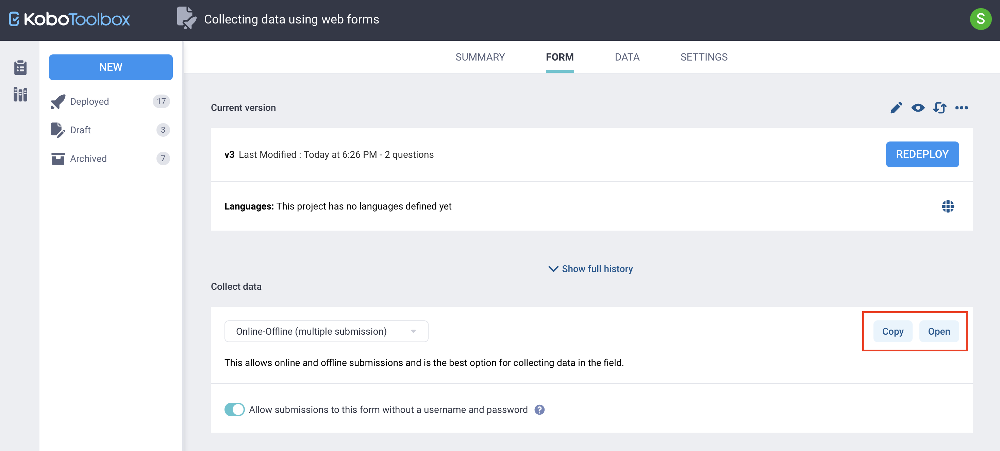
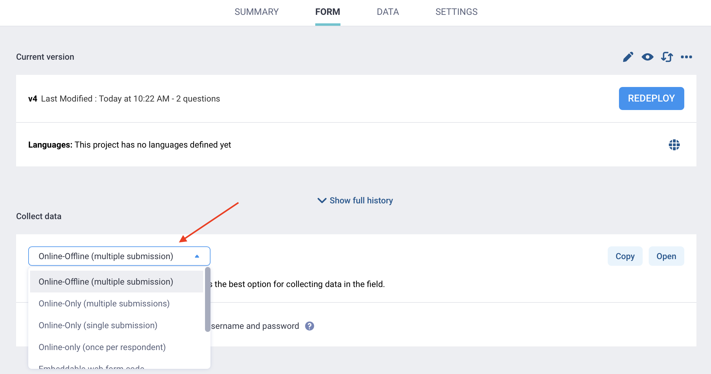
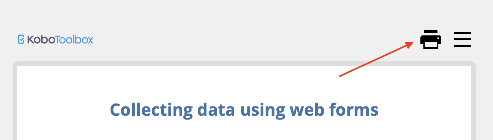
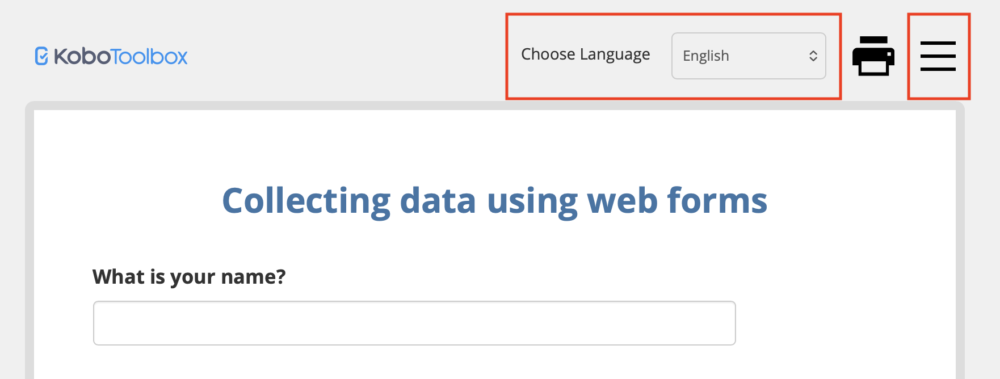
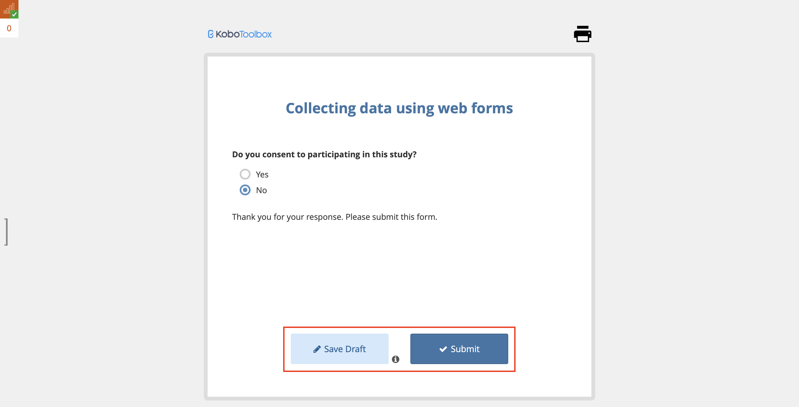
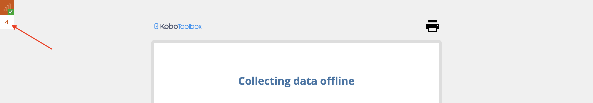
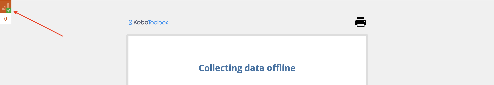

# Collecting data using web forms
**Last updated:** <a href="https://github.com/kobotoolbox/docs/blob/9153704b013430e55a763ac5c392dd30ae5d6bb9/source/data_through_webforms.md" class="reference">24 Sep 2025</a>

KoboToolbox web forms let you **collect data directly in a web browser**, without installing an app. They are browser-based versions of your form that you can use to preview and test your questionnaire or collect live data on phones, tablets, and computers.

Web forms work on most modern devices, including Android devices, iPhones, iPads, laptops, and desktop computers. They are especially useful in projects where respondents complete a form through a shared link, where the data collection team uses different types of devices, or where you want to enter data on a computer instead of through an app.

Web forms also support **offline data collection** once the form has been opened and cached in the browser. They support all form logic set up in KoboToolbox, including skip logic and validation rules, and their appearance can be customized through different [web form themes](https://support.kobotoolbox.org/alternative_enketo.html).

<strong>Note:</strong>
 KoboToolbox web forms were previously powered by <a href="https://enketo.org">Enketo</a>, which is why they used to be called Enketo web forms in older documentation.   

This article covers the following: 
- Sharing KoboToolbox web forms for data collection
- Choosing the right web form mode
- Collecting data and saving drafts in the browser
- Using web forms offline
- Customizing web form links for specific use cases
- Troubleshooting common issues

## Sharing web forms for data collection

Once your project is ready for data collection, you can easily share a link with respondents or data collectors to input data. 

To share a link with respondents:

1. Open the **FORM** page and ensure your form has been [deployed](https://support.kobotoolbox.org/deploy_form_new_project.html).
2. Under the **Collect data** pane, click **COPY** to copy the link and share it with data collectors or respondents.
3. You can also click **OPEN** to launch the form in a new browser tab.

### Authentication requirement

By default, deployed projects [require users to sign in](https://support.kobotoolbox.org/project_sharing_settings.html#allowing-submissions-without-authentication) before they can open a web form or submit data. 

- To keep authentication required, share the project with specific KoboToolbox users and give them **Add submissions** permission. 
- To allow anyone with the link to submit data without a username and password, you can disable the authentication requirement in the **Collect data** pane by toggling the “Allow submissions to this form to this form without a username and password” option.

To learn more about form sharing permissions, see <a href="https://support.kobotoolbox.org/project_sharing_settings.html">Sharing projects with project-level settings</a> and <a href="https://support.kobotoolbox.org/managing_permissions.html">Sharing projects with user-level permissions</a>.

### Data collection modes

KoboToolbox provides several web form link options under the **Collect data** section. These options affect the link you open or share, but they do not change the form itself.

Available web form modes include:

| Data collection mode | Description |
|:---|:---|
| Online-Offline (multiple submission) | Allows data collection online or offline and supports multiple submissions from the same device. |
| Online-Only (multiple submissions) | Supports multiple submissions from the same device, but requires an internet connection for use. |
| Online-Only (single submission) | Allows one submission at a time from the same device and can be used with a <a href="https://support.kobotoolbox.org/data_through_webforms.html#redirect-users-to-another-webpage-after-submission">redirect link</a> after submission. Users are not prevented from reopening the link to submit data again. |
| Online-only (once per respondent) | Prevents the same user on the same browser and device from submitting more than once. |
| Embeddable web form code | Provides HTML code to embed the form on your own website. |
| View only | Opens the form for previewing and testing without allowing submissions. |

### Printing a web form

You can also **print a web form** to share it during form development or use it for paper-based data collection. To do so: 

1. Open your web form.
2. Click the printer button in the top right corner.

The printed version includes all questions and guidance hints, regardless of any form logic.

## Collecting data with web forms

After opening the form, users can complete it directly in their browser. If the form includes [multiple languages](https://support.kobotoolbox.org/collecting_data_multiple_languages.html), users can change the language at the top of the form.

At the end of the form, users can either save their work as a draft or submit it:

- **Submit** finalizes the submission and sends it to the server when a connection is available. Once submitted, the entry can no longer be edited in the browser.
- **Save Draft** stores the submission on the device so it can be reopened and completed later.

### Managing draft submissions 

Saving a draft stores the submission in the browser so it can be reopened and completed later. Drafts are not sent to the KoboToolbox server until they are reopened, finalized, and submitted.

When you save a form as a draft, you will be asked to **name it** so it is easier to find later. 

The **queue counter** in the top left corner shows how many drafts are saved in the browser. To reopen a draft:

1. Click the **queue counter** to open the list of saved drafts.
2. Select the draft you want to open.
3. Review or edit the draft, then submit.

<strong>Note:</strong>
Drafts are stored in the browser until they are submitted, even if you close the browser, turn off the device, or go offline. Do not clear your browser cache or site data during data collection, and make sure the device is not set to clear them automatically, as this may permanently delete saved drafts.   

### Offline data collection

Web forms **support offline data collection** on all widely used browsers and devices. When using web forms, KoboToolbox can store the form and responses in the browser so users can continue entering data without an internet connection. 

<strong>Note:</strong>
When entering data offline, do not clear your browser cache or site data during data collection, and make sure the device is not set to clear them automatically, as this may permanently delete offline forms and queued submissions.

To collect data offline with web forms:

1. Before going offline, open the form while connected and wait for it to fully load and be cached on the device. This can take up to 30 seconds.
2. Once the form has been cached, a **confirmation icon** appears in the top left corner to show that it can now be used offline.
    - If you go offline before the form has been cached, you may lose access to the page when it refreshes.
      
    
3. When submitting data while offline, the submissions are added to the queue. The **queue counter** shows how many records are waiting to upload.

4. Click the **queue counter** to view finalized submissions waiting to upload when an internet connection is available. You can also export queued submissions as a ZIP file.
5. Once the device reconnects, saved submissions are uploaded automatically in the background while the form remains open.

<strong>Note:</strong>
For easier access during offline data collection, you may want to bookmark the form or add a shortcut to your phone’s home screen using the <strong>Add to Home Screen</strong> option in your browser menu.

## Customizing web form links

You can modify a web form link to control how the form opens or behaves for different users and use cases. For example, you can open the form in a specific language, prefill certain values, or redirect users to another page after they submit the form.

### Opening the form in a specific language

If your form has multiple languages, you can add a language parameter to the web form URL so it opens in a specific language. This can be useful when sharing different links with different user groups.

To share a link that opens in a different form language from the form’s default language:

1. Copy your form link in **FORM > Collect data.**
2. Add `?lang=language_code` at the end of the URL, where `language_code` is the language code of the selected language.
    - For example: `https://ee.kobotoolbox.org/x/[form_id]?lang=fr`.

For more information, see <a href="https://support.kobotoolbox.org/collecting_data_multiple_languages.html#language-specific-form-url">Collecting data in multiple languages</a>.

### Prefilling a field from the web link

You can also prefill a field in your form through the web link. This is useful when you want to pass a known value into the form automatically.

For example, you could share different links in different places, and each link could open the same form with a hidden field that shows where the link came from. You could also share a different link with each respondent, with that person’s unique ID already embedded in the link.

To share a link that prefills a field in your form:

1. Add the question you want to prefill to your form, then set its [data column name](https://support.kobotoolbox.org/glossary.html#xml-value).
    - This can be a [Hidden](https://support.kobotoolbox.org/form_logic.html#storing-constants-in-your-form) question if you want to store the value in the background, or any standard question type if you want respondents to see it in the form.
2. Copy your form link in **FORM > Collect data.**
3. Add `?d[data_column_name]=value` at the end of the URL, where `data_column_name` is the data column name of the Hidden question and `value` is the prefilled value.
    - For example: `https://ee.kobotoolbox.org/x/[form_id]?d[prefilled_field]=12345`.

<strong>Note:</strong>
Use the full data column name in the URL parameter. If the question is inside one or more groups, the name must include the <strong>group name or names</strong> as well (e.g., <code>group1/question1</code>). You can find the exact name in the question’s <a href="https://support.kobotoolbox.org/question_options.html#data-column-name">Data column name</a> field in the Formbuilder, or in the <code>name</code> column of an XLSForm.

### Redirecting users to another webpage after submission

When using the **Online-Only (single submission)** data collection mode, you can redirect users to another webpage after they submit their form. 

To redirect users to another webpage: 

1. In **FORM > Collect data**, select the **Online-Only (single submission)** data collection mode.
2. Copy your form link.
3. Add `?return_url=webpage` at the end of the URL, where `webpage` is the language URL of the webpage.
    - For example: `https://ee.kobotoolbox.org/x/[form_id]?return_url=https://website.com`.

<strong>Note:</strong>
You can combine multiple parameters in the same link by separating them with <code>&</code>.

## Troubleshooting

<strong>The form does not work offline</strong>

Before going offline, make sure the form has been fully opened and cached in the browser. Check the offline availability indicator in the form before starting data collection without internet access.  

 

<strong>Browser crashes during data collection</strong>

If your device restarts, the browser refreshes, or the form closes while you are in the middle of entering data, your responses are usually saved in the browser. When you reopen the form, KoboToolbox will prompt you to either discard the previously entered data or load it back into the form and continue. 

 

<strong>Submissions are not reaching the server</strong>

If the form was used offline, submissions may still be waiting in the queue. Check the queue counter and make sure the device has reconnected to the internet. Web forms upload queued submissions automatically when a connection is available.  

 

<strong>Respondents are asked to sign in </strong>

Check whether the project is set to <a href="https://support.kobotoolbox.org/project_sharing_settings.html#allowing-submissions-without-authentication">require authentication</a> for submissions. If it is, users must sign in with an account that has permission to add submissions, or you can disable the requirement in <strong>FORM > Collect data.</strong> 

 

<strong>Data appears to be missing</strong>

Do not clear the browser cache or delete browser data while collecting data with web forms. Clearing the cache <strong>removes stored forms, drafts, and queued submissions from the device</strong>, and this data cannot be recovered if it has not already been uploaded to the KoboToolbox server.

 

<strong>Browser not supported</strong>

Use the latest version of a modern browser. Chrome is generally recommended for working with web forms, but Safari, Firefox, Edge, Opera, Samsung Internet, and other browsers also are well supported. Internet Explorer is not supported. 

 

<strong>Web form submission fails </strong>

If a web form submission fails, check whether your form uses a <strong>reserved XLSForm term</strong> as the <a href="https://support.kobotoolbox.org/glossary.html#data-column-name">data column name</a>. Reserved words are terms that cannot be used as variable names because they are used by the underlying XForms engine for structure, logic, or data analysis (e.g., type, label, start, today). Using these words can cause form validation errors, publishing failures, or data export issues.  

To fix the issue, rename the affected question to a different value, then redeploy the form. This issue usually affects web forms even when the form opens normally, while KoboCollect may continue to work as expected. Note that any submissions already saved against the old version of the form may remain unsubmittable, so it is important to update the form as soon as possible if you are collecting data through web forms. Always <strong>test form submission before launching data collection</strong> so you can catch naming issues early.

 
