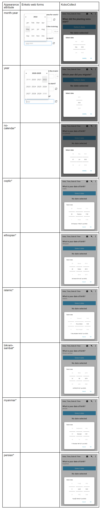

# Date and time question types
**Last updated:** <a href="https://github.com/kobotoolbox/docs/blob/c0db4b85c885da715ece9bd7c77707400b471f80/source/date_time.md" class="reference">28 Oct 2024</a>

There are 3 different date and time question types in KoboToolbox: “Date”,
“Time” and “Date and time”.

The “Date” question type is for capturing date values, for example when asking
for date of birth, etc. In both KoboCollect and Enketo web forms, a
calendar-style date picker will be shown for selecting the date.

The “Time” question type is for capturing time values, for example on a question
like “At what time do you leave for work?” In both KoboCollect and Enketo, a
time picker is shown where a user can select their response.

The third type “Date and time” is for capturing both date and time responses on
a single question.

## How to set up Date and Time question types

### Setting up in formbuilder

Adding “Date”, “Time”, and “Date and Time” questions is simple:

- In the formbuilder, click the <i class="k-icon k-icon-plus"></i> button to add
  a new question
- Type the question text, for example “What is your date of birth?”, then click
  **ADD QUESTION** or press ENTER on your keyboard
- Choose the question type

### Setting up in XLSForm

To add "Date", "Time", and "Date and Time" questions in the XLSForm, use the
`date`, `time` and `datetime` question types as shown in the example below:

In XLSForm, you can set up the following:

| type     | name      | label                                         |
| :------- | :-------- | :-------------------------------------------- |
| date     | dob       | On what date were you born?                   |
| time     | time      | At what time do you you leave for work?       |
| datetime | date_time | At what date and time did the training start? |
| survey   |

## Appearance of date and time question types in web forms and KoboCollect

### Default appearance

### Advanced appearances

When adding the “Date” question type in the formbuilder, you can choose from a
number of display options (under the question settings). Appearances change the
way the question is displayed on web forms and on KoboCollect.

For the "Date" question type, you can control how the default Gregorian calendar
displays by choosing between the options "month-year", "year" and "no-calendar".
Apart from these options, you can also change the calendar style to supported
non-Gregorian calendars.

To add appearance values that are not listed on the drop-down list in the
formbuilder, choose "other", and type the appearance value in the text field
that appears.

_\* These options must be entered manually in the formbuilder after "other" is
selected._

### Adding custom appearances for date questions in XLSForm

You can specify advanced appearances in XLSForm through the appearance column as
follows:

#### Date picker appearances

| type   | name             | label                              | appearance  |
| :----- | :--------------- | :--------------------------------- | :---------- |
| date   | rains_start      | When did the planting rains start? | month-year  |
| date   | year_migrate     | In which year did you migrate?     | year        |
| date   | no-calendar_date | Date picker without calendar       | no-calendar |
| survey |

### Supported non-Gregorian calendars

| type   | name                | label                                   | appearance     |
| :----- | :------------------ | :-------------------------------------- | :------------- |
| date   | coptic_date         | Date picker with Coptic calendar        | coptic         |
| date   | ethiopian_date      | Date picker with Ethiopian calendar     | ethiopian      |
| date   | islamic_date        | Date picker with Islamic calendar       | islamic        |
| date   | bikhram_sambat_date | Date picker with Bikram Sambat calendar | bikhram_sambat |
| date   | myanmar_date        | Date picker with Myanmar calendar       | myanmar        |
| date   | persian_date        | Date picker with Persian calendar       | persian        |
| survey |

## Using date and time questions in custom logic

When defining custom skip logic (relevant), validation criteria (constraint),
and mandatory response criteria (required) using XLSForm code, date values
should be included
[using the `date()` function](https://docs.getodk.org/form-operators-functions/#date),
and in the format `“YYYY-MM-DD”`. For example, if you are creating validation
criteria on a date question so that all survey responses must be before the date
“April 10th, 2022”, your validation logic will be `. < date('2022-04-11')`.

To use “Time” questions in XLSForm logic, it is always a good idea to convert
the raw time values into a number representing time as a fraction of a day,
called the decimal time. You can do this using
[the `decimal-time()` function](https://docs.getodk.org/form-operators-functions/#decimal-time).
Then, you can compare this value with another decimal time value. For example,
if you would like to limit the time entered on a question to only after 12 noon,
you can define the following custom validation logic `decimal-time(.)>=0.5`.

Learn more about related topics:

- [Skip logic](skip_logic.md)
- [Validation criteria](validation_criteria.md)
- [Date and time functions](https://docs.getodk.org/form-operators-functions/#date-and-time)
  (ODK documentation)

  You can download the example XLSForm
  <a
    download
    class="reference"
    href="./_static/files/date_time/date_time.xlsx"
    >here <i class="k-icon k-icon-file-xls"></i></a
  >.

