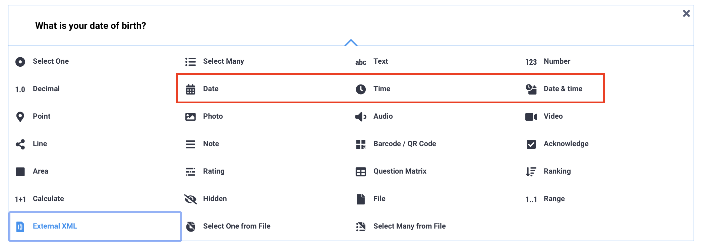
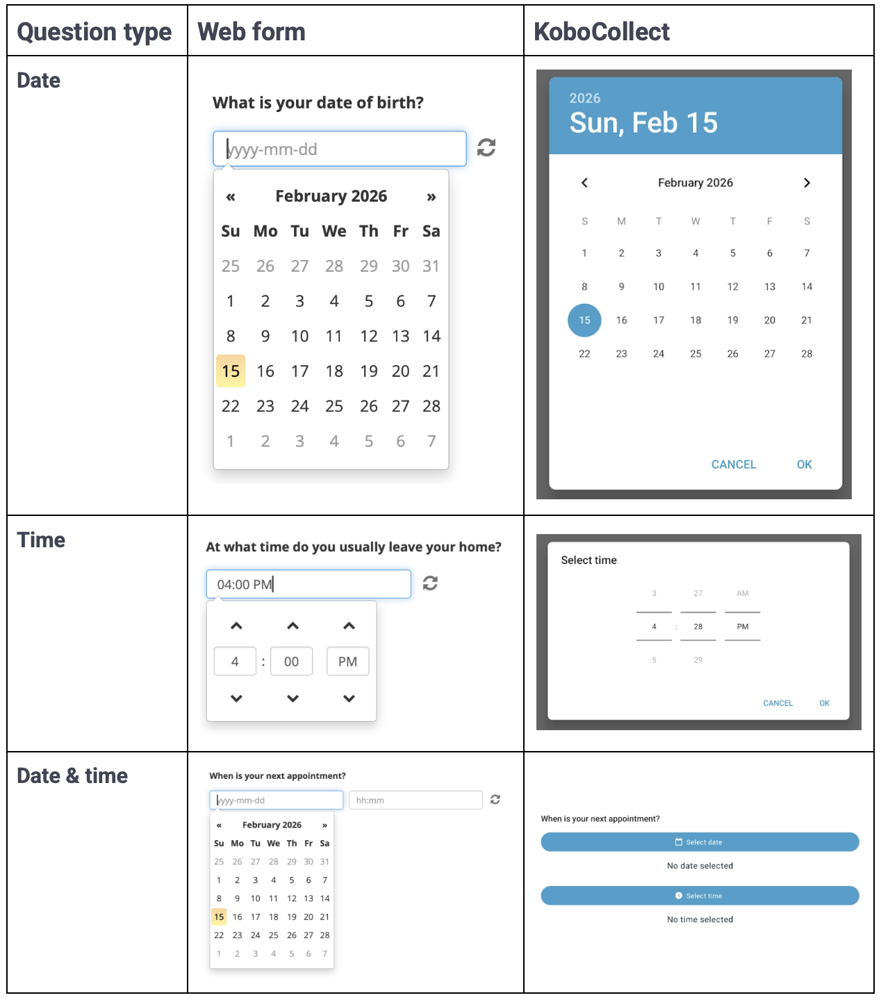
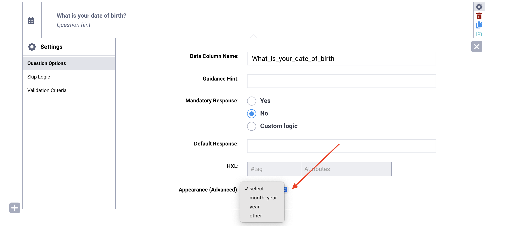
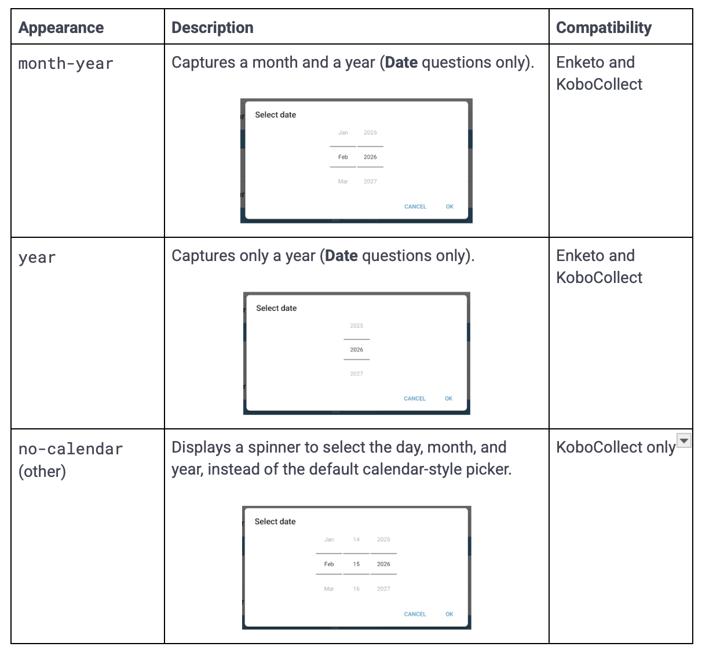
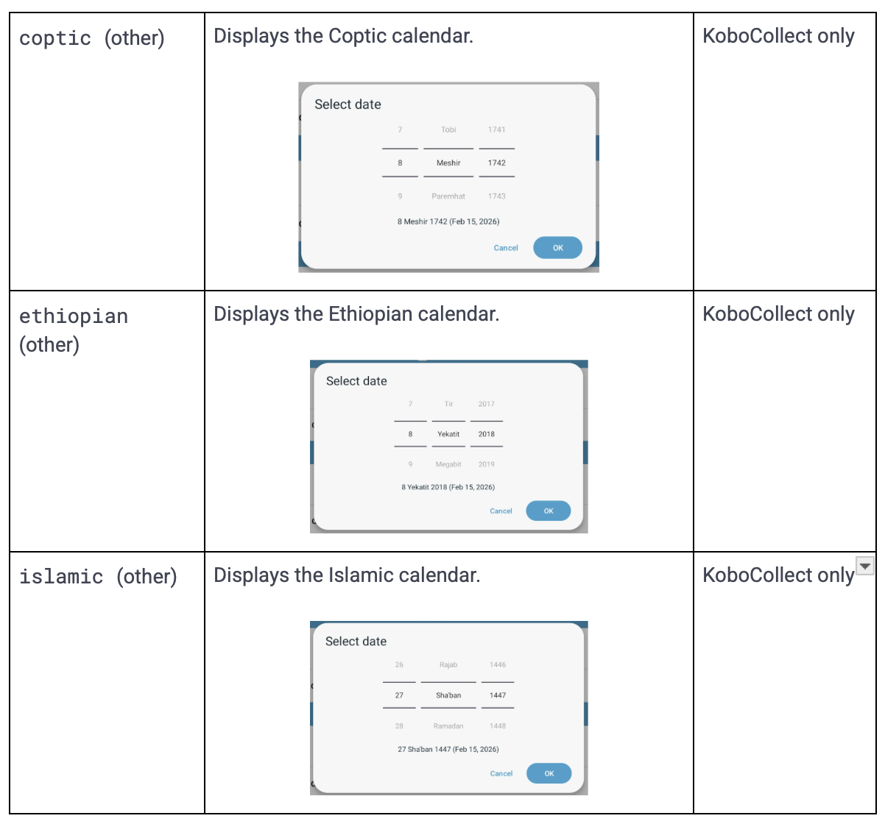
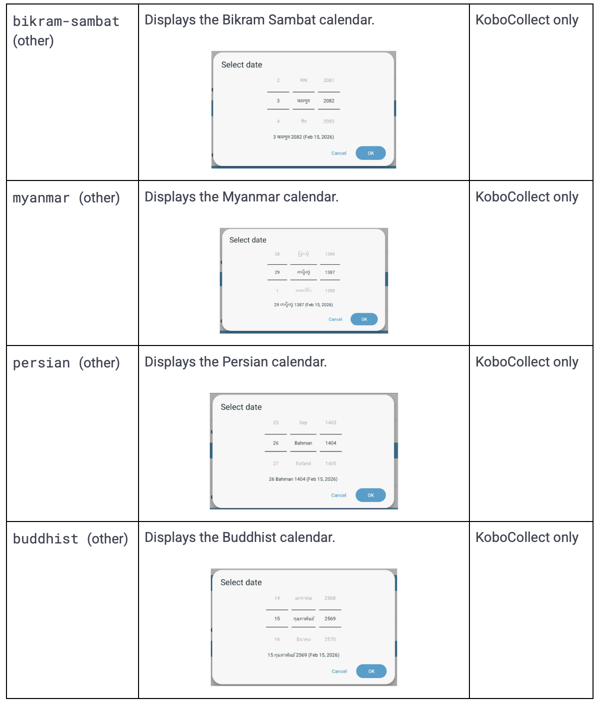

# Date and time questions in KoboToolbox
**Last updated:** <a href="https://github.com/kobotoolbox/docs/blob/77e153e038a82ecf8311314bb2ff68028a5be09a/source/date_time.md" class="reference">21 Mar 2026</a>

Date and time questions are used to collect temporal information such as event dates, appointment times, or timestamps. These question types ensure that responses are **captured in a standardized format**, which supports accurate sorting, filtering, calculations, and analysis.

This article explains the available date and time question types, how to add them in the Formbuilder, the appearance options you can apply, and platform-specific display differences to consider during data collection.

## Date and time question types

The following question types are available in the Formbuilder for respondents to enter dates and times:

| Question type | Description |
|:---|:---|
| <i class="k-icon-qt-date"></i> Date | Captures a specific calendar date, typically in the format of day, month, and year. |
| <i class="k-icon-qt-text"></i> Time | Captures a specific time in hours and minutes. |
| <i class="k-icon-qt-date-time"></i> Date & time | Captures both a date and a time in a single combined response. |

## Adding date and time questions in the Formbuilder

To add date and time questions to your form:

1. Click the <i class="k-icon-plus"></i> button. 
2. Enter your question label.
3. Click **+ ADD QUESTION.**
4. Choose the appropriate question type. 

## Appearances of date and time questions

The table below displays the default appearances for date and time questions:

### Advanced appearances

You can apply advanced appearances to **Date** and **Date & time** questions to modify how they display and behave in your form. 

To add an advanced appearance:

1. Open the question settings by clicking <i class="k-icon-settings"></i> **Settings** to the right of the question. This will take you to the **Question Options** tab.
2. In **Appearance (Advanced)**, choose the desired appearance.
    - If the appearance is not listed, select **other** and type the name of the appearance in the text box, exactly as written below.
    - For Date & time questions, type the name of the appearance directly in the **Appearance (Advanced)** text box.

The following advanced appearances are available for **Date** and **Date & time** questions:

