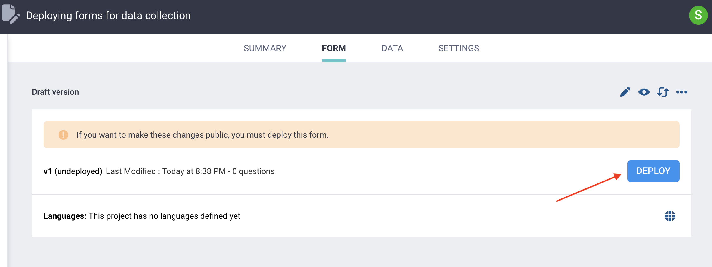
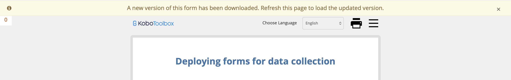
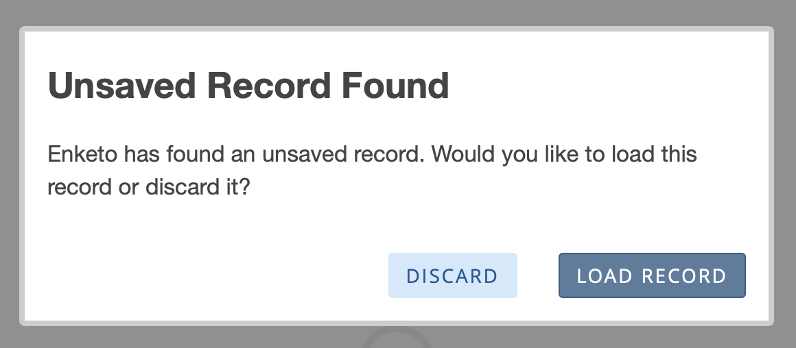

# Deploying forms for data collection
**Last updated:** <a href="https://github.com/kobotoolbox/docs/blob/a14700f771e43d4c8576ee8081f23d197cdd5110/source/deploy_form_new_project.md" class="reference">24 Sep 2025</a>

Before you can collect data in KoboToolbox, your form must be **deployed**. Deployment makes the form live and available for submissions. You can **redeploy** a form any time you make changes and want those changes to go live. 

This article explains how to deploy and redeploy forms in KoboToolbox, how updates affect web forms and KoboCollect, what to check before making a form live, and what changes to avoid once data collection has started.

<strong>Note:</strong>
   To learn more about collecting data with KoboToolbox, see <a href="https://support.kobotoolbox.org/data-collection-tools.html">Data collection with KoboToolbox</a>. 

## Deploying a form for data collection

When your form is ready to receive data, open the project and click **DEPLOY** in the **FORM** page to make it live. 

Once you have deployed a form, you can begin [collecting data](https://support.kobotoolbox.org/data-collection-tools.html) with it. 

After a form has already been deployed, you will be prompted to **REDEPLOY** whenever you make changes that are not yet public. A yellow banner will appear saying “If you want to make these changes public, you must deploy this form.”

<strong>Note:</strong>
    Always redeploy forms after making changes to form media, translations, or form titles, even if KoboToolbox does not prompt you to redeploy.

## Updating forms after changes have been redeployed

After you redeploy a form, users will need to refresh or download the updated version to see the changes.

### Web forms

When using **web forms**, updates may take a few seconds to appear. Once the new version is ready, a yellow banner will appear at the top of the form saying: “A new version of this form has been downloaded. Refresh this page to load the updated version.” Refresh the page to load the latest version. 

If someone has already started entering data, they can still refresh. KoboToolbox will prompt them to either discard the data already entered or load it into the new version of the form.

### KoboCollect

When using KoboCollect, users must download the latest version of the form to receive any updates. This requires an internet connection. 

Retrieving the latest version of a form can be [done manually](https://support.kobotoolbox.org/data_collection_kobocollect.html#downloading-forms) whenever the form changes, or it can be configured to happen automatically at a set frequency through the [form update settings](https://support.kobotoolbox.org/kobocollect_settings.html#form-management-settings) in KoboCollect.

<strong>Note:</strong>
    After redeploying a form, make sure all data collectors update to the latest version. Otherwise, some users may continue submitting data with an outdated version, which can lead to errors or inconsistencies in the collected data. 

## Best practices for deploying and redeploying forms

The following steps are recommended before launching data collection:

1. **Test the form preview before deployment.** Only deploy a new form, or redeploy changes to an existing form, after testing it thoroughly in the form preview. This helps prevent faulty forms from going live.
2. **Test the live deployed form.** After deployment, open the form and submit test data to confirm that the data appears in the data table as intended.
3. **If relevant, test the form in KoboCollect.** Always test the same data collection method(s) that will be used for actual data collection, whether that is web forms, KoboCollect, or both. This is especially important for KoboCollect, since it cannot be fully tested until the form has been deployed.
4. **Share your form using View only mode for external testing.** Once a form has been deployed, you can also share it with others for testing by using the **View only** [web form mode](https://support.kobotoolbox.org/data_through_webforms.html#data-collection-modes).

Once you have thoroughly tested your form, you can begin data collection. Testing thoroughly before launch helps reduce the need to make changes after data collection has started.

### Important considerations when redeploying a form

If you make changes to a form after data collection has already started, those changes can affect both your data structure and your ability to review or edit older submissions. Because of this, it is best to **avoid major structural changes** once live data collection is underway unless they are absolutely necessary. 

Changes that can affect your data structure include:

- **Changing a question’s [data column name](https://support.kobotoolbox.org/glossary.html#data-column-name)**: KoboToolbox will treat it as a new variable and create a new column in the data table.
- **Changing a question type while keeping the same data column name**: This can create inconsistent data in the same column and lead to errors (e.g., in the DATA > Reports view).
- **Moving questions into or out of groups**: KoboToolbox will treat these questions as new variables and create new columns in the data table.
- **Removing choices from a choice list**: Previous submissions may still contain those choice values, but they may no longer have an associated label in the form.
- **Adding new choices to a Select one or Select many question**: Make sure each new choice has a unique [XML value](https://support.kobotoolbox.org/glossary.html#xml-value) within a given choice list.
- **Deleting a question that is used elsewhere in the form**: If the question is referenced in a calculation, relevance condition, constraint, or another expression, you will also need to update those references.
- **Changing question or choice labels**: Does not affect the data structure if the data column name or XML value stays the same, but previously collected data will use the updated label.
- **Changing the meaning of existing choice values**: Changing choice names or labels can make data inconsistent across form versions and lead to misinterpretation. For example, this can happen if you reverse the meaning of values such as `1 = Yes` and `0 = No`, or change the direction of a Likert scale.

<strong>Note:</strong>
    If your form uses multiple languages, remember to also <a href="https://support.kobotoolbox.org/language_dashboard.html">update the translations</a> whenever you change the form. This is easy to miss after redeployment.

Changes to a form can also affect how older submissions behave when you edit them, because a submission created with an earlier version of the form may no longer match the current version. For example:

