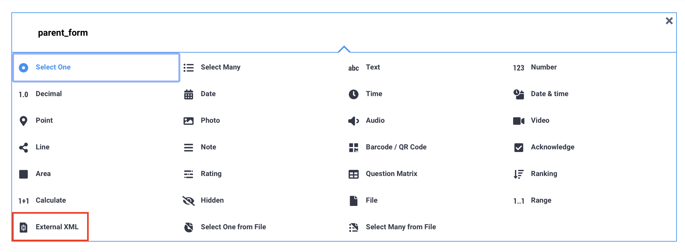
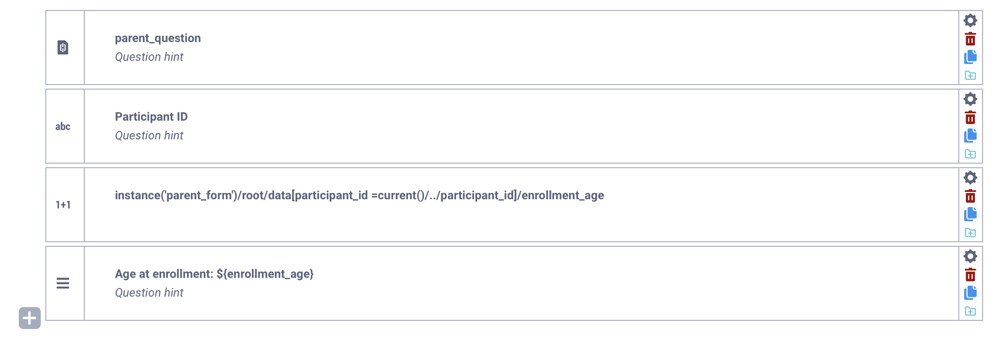
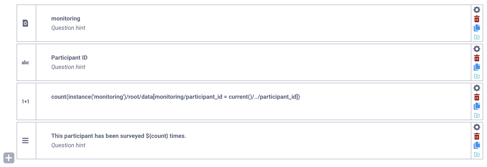

# Dynamic data attachments using the Formbuilder

Dynamic linking allows you to retrieve data from a **parent project** within **child projects**, simplifying the management of longitudinal data collection. 

You can retrieve various **non-media responses** from a parent project and perform calculations on this linked data in a child project. This can be useful for retrieving baseline data, contact information, or health records in cohort studies, or for confirming or verifying previously collected data. 

This article explains how to dynamically link data between KoboToolbox projects within the KoboToolbox Formbuilder. 

<strong>Note:</strong>  It can be easier to use XLSForm to set up dynamic data attachments. To learn more, see <a href="https://support.kobotoolbox.org/dynamic_data_attachment.html">Dynamic data attachments in XLSForm</a>.

## Dynamically linking projects in the Formbuilder

Dynamically linking projects requires a **parent project** and at least one **child project.** The **parent project** requires no modification from a normal KoboToolbox form. However, setting up the **child project(s)** involves the following steps:

First, add an **External XML** question to your child form. This links the parent form to the child form. To do so:

1. Click the <i class="k-icon-plus"></i> button. 
2. Click **+ ADD QUESTION.**
3. Choose the <i class="k-icon-qt-external-xml"></i> External XML question type.
4. Instead of the question label, provide a short name for the parent form. This name can consist of Latin alphabet characters, underscores, and numbers.

Then, throughout the form, you can retrieve values from the parent project using **Calculate** questions: 

1. Click the <i class="k-icon-plus"></i> button. 
2. Click **+ ADD QUESTION.**
3. Choose the <i class="k-icon-qt-calculate"></i> Calculate question type.
4. Instead of the question label, include a calculation expression to retrieve the parent data (see table [below](#calculation-syntax-for-dynamic-data-attachments)).

After retrieving the parent data in a **Calculate** question, you can reference it elsewhere in your form, including in question labels, notes, or form logic, using the standard [question referencing format](https://support.kobotoolbox.org/form_logic.html#question-referencing).

To learn more about calculations in the Formbuilder, see <a href="https://support.kobotoolbox.org/calculate_questions.html">Adding calculations in the Formbuilder</a>.

## Calculation syntax for dynamic data attachments

In the **question label** field of the Calculate question where linked data will be retrieved, include one of the expressions in the table below. These expressions are called **XPaths.**

For each expression in the table below:

- `parent` is the unique name assigned to the **parent form** (in the External XML question of the **child form**).
- `parent_question` refers to the data column name of a question from the **parent form.**
- `child_question` refers to the data column name of a question from the **child form.**
- `parent_index_question` is the identifying question from the **parent form** that links it to the **child form** (e.g., unique ID, organization name).
- `child_index_question` is the identifying question from the **child form** that links it to the **parent form** (e.g., unique ID, organization name).
- `parent_group` refers to the data column name of the group in the **parent form** in which the `parent_question` is located.
- `parent_index_group` refers to the data column name of the group in the **parent form** in which the `parent_index_question` is located.

| **XPath**    | **Description**                                |
| :----------------- | :--------------------------------------------- |
| `count(instance('parent')/root/data)` | Returns the total number of rows in the parent project. |
| `count(instance('parent')/root/ data[parent_group/parent_question])`      | Returns the total number of rows in the parent project where `parent_question`  (in `parent_group`) is not empty. |
| `count(instance('parent')/root/ data[parent_group/parent_question= current()/../child_question])` | Returns the total count of instances where the value of `parent_question`  (in `parent_group`) in the parent project is equal to the value of `child_question` in the child project. |
| `instance('parent')/root/ data[parent_index_group/parent_index_question= current()/../child_index_question]/parent_group/ parent_question` | Returns the value of `parent_question` (in `parent_group`) from the parent project where `child_index_question` in the child project is equal to `parent_index_question` in the parent project. |
| `instance('parent')/root/ data[parent_index_group/parent_index_question= current()/../child_index_question][position()= 1]/parent_group/parent_question` | Same as above, but specifies that only data from the first instance of `parent_index_question` should be returned, using the `[position() = 1]` argument. Used in case of possible duplicates in the parent form. |
| `sum(instance('parent')/root/ data/parent_group/parent_question)` | Returns the sum of values from `parent_question` (in `parent_group`) from the parent project. Note that `parent_question must be numeric` |
| `max(instance('parent')/root/ data/parent_group/parent_question)`         | Returns the maximum value entered in `parent_questio`n (in parent_group) from the parent project. Note that `parent_question` must be numeric.     |
| `min(instance('parent')/root/ data/parent_group/parent_question)`      | Returns the minimum value entered in `parent_question` (in `parent_group`) from the parent project. Note that `parent_question` must be numeric.     |   

<strong>Note:</strong> If the parent question is not included in any group, omit <code>parent_group/</code> from the expression. 

## Setting up projects for dynamic linking

<iframe src="https://www.youtube.com/embed/pBqEsFlxqE4?si=6BPiDgOzO4LPO7zv" style="width: 100%; aspect-ratio: 16 / 9; height: auto; border: 0;" title="YouTube video player" frameborder="0" allow="accelerometer; autoplay; clipboard-write; encrypted-media; gyroscope; picture-in-picture; web-share" allowfullscreen></iframe>

Once your parent and child projects are set up and deployed in KoboToolbox, follow these steps:

1. Enable data sharing for the parent project: 
    - In the **SETTINGS > Connect Projects** tab of the parent project, toggle the **Data sharing** switch (disabled by default) and click **ACKNOWLEDGE AND CONTINUE** in the confirmation window. 
    - All data is shared by default, but you can restrict specific variables to share with child projects by clicking "Select specific questions to share".

    <strong>Note:</strong> If projects have different owners, the parent project owner must <a href="https://support.kobotoolbox.org/managing_permissions.html">share the project</a> with the child project owner. The minimum permissions required for dynamic data attachments to work are <strong>View form</strong> and <strong>View submissions</strong>. Note that this allows child project administrators to view all parent project data.

2. Connect the child project to the parent project:
    - In the **SETTINGS > Connect Projects** tab of the child project, click the “Select a different project to import data from.” A dropdown menu will allow you to select a parent project to link.
    - Rename the linked parent project to the External XML question label defined in the Formbuilder and click **IMPORT.**
    - You can then select specific questions from the parent project to share with the child project (recommended), or select all questions.
3. If you add new fields to the parent form and wish to use them in the child project, re-import the parent project in the child project settings.

<strong>Note:</strong> Forms can only be linked together if they are on the same KoboToolbox server.

## Dynamically linking a form to itself

It is possible for a parent and child project to be the same project. The steps are the same as those described above. Examples of use cases include: 

- **Daily monitoring:** If a form is used to survey the same person over time, you can link it to itself to count previous submissions. This can allow you to display a message (e.g., "monitoring is complete") after a certain number of entries or to inform the enumerator of the number of forms submitted, as shown in the example below.

- **Registration form:** By linking a registration form to itself, you can check whether a user has already been registered. This can allow you to generate an error message or add [validation criteria](https://support.kobotoolbox.org/validation_criteria.html) if they are already registered, preventing duplicate registrations.

## Collecting and managing data with dynamic linking

Data for dynamically linked projects can be collected using the [KoboCollect Android app](https://support.kobotoolbox.org/kobocollect_on_android_latest.html) or [Enketo web forms](https://support.kobotoolbox.org/data_through_webforms.html).

When collecting data, note the following:

- The parent project must have at least one submission for the child project to function correctly.
- When collecting data online, there is a five-minute delay in syncing new parent project data with the child project.
- In offline mode, frequently download the child project to ensure data synchronization with the parent project.

You can [configure the KoboCollect Android app](https://support.kobotoolbox.org/kobocollect_settings.html#form-management-settings) to automatically update the parent project's data when an internet connection is available:

1. Go to **Settings > Form management > Blank form update mode**
2. Select either **Previously downloaded forms only** or **Exactly match server.**
3. Set the automatic download frequency to occur every 15 minutes, every hour, every six hours, or every 24 hours. Note that enabling this setting may increase battery consumption.

<strong>Note:</strong> To learn how to set up dynamic data attachments in XLSForm and for additional troubleshooting support, see <a href="https://support.kobotoolbox.org/dynamic_data_attachment.html">Dynamic data attachments in XLSForm</a>.

