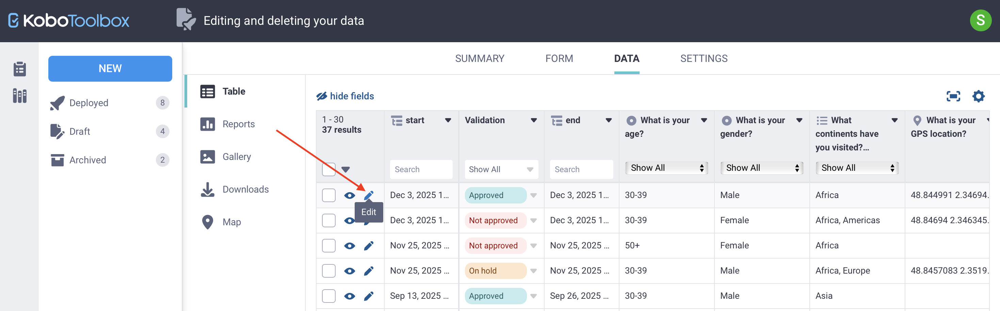
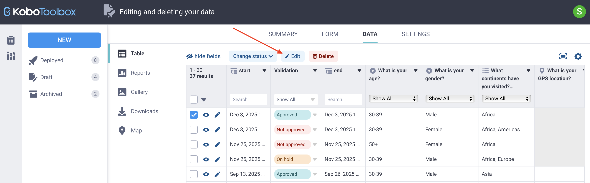
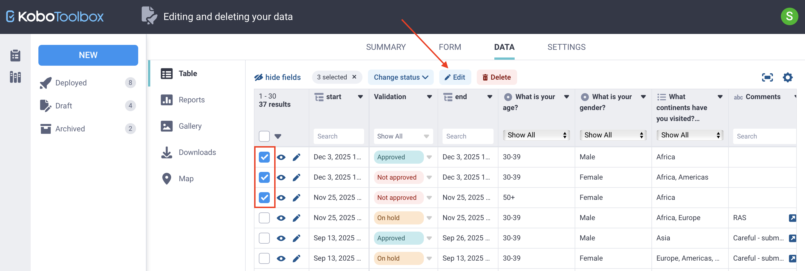
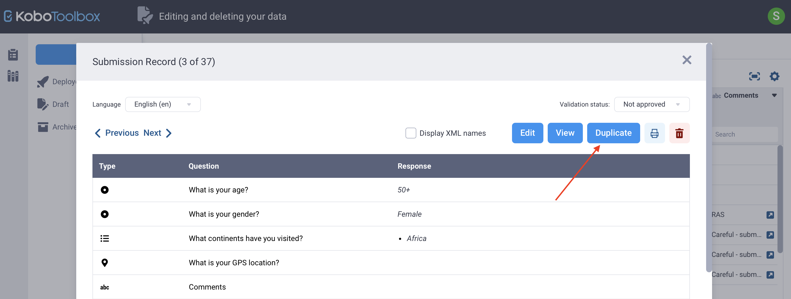

# Editing and deleting your data

Editing and deleting data helps **maintain data quality** after submissions are collected. You may need to correct individual responses, update multiple records at once, duplicate a submission, or remove records that are no longer needed. KoboToolbox offers several ways to manage these tasks, including **editing submissions in Enketo, editing raw data directly, and applying bulk updates.** This article explains each method and when to use it.

<strong>Note:</strong> Submissions collected with the <a href="https://support.kobotoolbox.org/kobocollect_on_android_latest.html">KoboCollect app</a> cannot be edited or deleted <strong>in KoboCollect</strong> after they are submitted. All post-submission changes must be made in KoboToolbox.

Project owners can control data access by assigning separate permissions to view, edit, validate, and delete submissions. For example, they can allow some team members to edit data while restricting deletion permissions.

To learn more about user-level permissions for editing and deleting data, see <a href="https://support.kobotoolbox.org/managing_permissions.html">Sharing projects with user-level permissions</a>.

## Editing individual submissions

KoboToolbox offers two editing approaches, each designed for different use cases. Understanding how they differ helps you choose the safest and most appropriate method for updating data.

The two methods for editing submissions in KoboToolbox are:

- **Editing submissions in Enketo:** Opens the submission in Enketo so you can correct responses and resubmit the form. This method is recommended when form logic needs to be applied.
- **Editing raw data directly in KoboToolbox:** Opens a data editor that lets you modify specific responses directly. This method is recommended when you need precise control over edits and do not need form logic to apply.

Each method comes with its advantages and limitations:

| Editing method | Advantages | Limitations |
|:---------------|:-----------|:------------|
| <strong>Editing in Enketo</strong> | <ul><li>**Maintains form logic:** calculations and skip logic are automatically re-evaluated.</li><li>**Provides a more intuitive, form-based editing experience:** the submission opens in the same layout and flow used during data collection.</li><li>**Minimizes data entry errors** by enforcing choice lists, required questions, and validation rules during editing.</li></ul> | <ul><li>Reopening the form can **unintentionally modify other responses** because all form logic and calculations run again.</li><li>**Skip logic may hide or delete existing answers** if they no longer meet the relevance conditions defined in the updated form.</li><li>May require entering responses for newly added questions, and may delete responses to questions that have been removed from the form.</li></ul> |
| <strong>Editing raw data</strong> | <ul><li>**Allows targeted edits** to specific fields without reopening the form.</li><li>**Preserves the rest of the submission unchanged**, since no form logic, calculations, or constraints are triggered.</li><li>Allows entering values **not included in choice lists** or **supported by question type** as well as deleting **required responses.**</li><li>Allows for **editing multiple submissions** in bulk.</li></ul> | <ul><li>**Skip logic and validation rules are ignored**, which may lead to inconsistent values.</li><li>**Question types** and **option choices** are not enforced.</li><li>Cannot edit **calculation** results or **metadata.**</li><li>Not currently supported for editing questions inside **repeating groups.**</li><li>Must manually enter correct XML values for select questions.</li><li>Incorrect response type, choice name, or GPS coordinate formatting can lead to issues in reports or during analysis.</li></ul> |

<strong>Note:</strong> When editing data using either method, the <code>_uuid</code> metadata field is updated each time a change is saved. When editing in Enketo, the <code>end</code> field is also updated. All other metadata fields remain unchanged, including <code>_id</code>, <code>start</code>, <code>today</code>, <code>_submission_time</code>, and <code>_submitted_by</code>.

### Editing submissions in Enketo

This method opens a submission in Enketo so you can correct responses.

To edit a submission in Enketo:

1. In the submission row, next to the checkbox, click <i class="k-icon-edit"></i> **Edit.** The submission opens in an Enketo web form.
2. Make the necessary changes.
3. Click **Submit.**

All updates, including recalculated fields and updated metadata, appear in the data table.

<strong>Note:</strong> Because this method reopens and resubmits the form, it can <strong>unintentionally change other fields</strong>, particularly those affected by skip logic or calculations. It also uses the most up-to-date version of the form. As a result, you may need to <strong>provide responses for newly added questions</strong>, and any responses to questions that have been removed from the form <strong>will be deleted.</strong>

### Editing raw data in KoboToolbox

This method lets you bypass form logic and edit stored responses directly without reopening the form. It is useful when changes cannot be made in Enketo, for example, if form logic prevents resubmission or newly required questions need responses. 

To edit raw data in KoboToolbox:

1. Select the submission using the checkbox.
2. Click <i class="k-icon-edit"></i> **Edit** above the data table.
3. In the edit window, click **Edit** next to the field you want to change and enter the new value.
    - For select type questions, enter one or more valid [XML values](https://support.kobotoolbox.org/glossary.html#xml-value), separated by spaces.
4. Click **Save**, then **Confirm & close.**

<strong>Note:</strong> It is recommended to track data edits in an external log or a dedicated comments field. Edits cannot be undone, but they can be modified again later.

## Editing multiple submissions in bulk

When working with large datasets, you may need to update multiple records at the same time. Bulk editing helps correct systematic errors, fill in missing information, and standardize responses across many submissions. This approach reduces repetitive work and speeds up the data cleaning process.

You can edit multiple submissions in bulk using the raw data editing method in KoboToolbox:

1. Select the submissions you want to edit using the checkboxes.
2. Click <i class="k-icon-edit"></i> **Edit** above the table. A window opens showing responses for all selected submissions.
3. Click **Edit** next to the field you want to update.
4. Enter a new value, or click **Select** to apply an existing value across all selected submissions.
5. Click **Save**, then **Confirm & close.**

<strong>Note:</strong>  You can select all submissions on the current page by clicking the checkbox in the table header. To select all submissions in the project across all pages, click the arrow next to the checkbox and choose <strong>Select all results.</strong>

## Duplicating submissions

You can duplicate a submission using the following steps:

1. In the submission row, next to the checkbox, click <i class="k-icon-view"></i> **View.**
2. In the top right corner, click **Duplicate.**
3. The duplicated submission opens in a new window, where you can **Edit** or **Discard** it as needed.

<strong>Note:</strong> When duplicating a submission, the response data is copied, but the validation status is reset. Metadata fields are updated to reflect the new submission, including </code>start</code>, <code>end</code>, <code>today</code>, <code>_id</code>, <code>_uuid</code>, <code>_submission_time</code>, and <code>_submitted_by</code>.

## Deleting your data

Deleting data permanently removes records from your project and should be done with care. You may need to delete submissions when removing duplicates, cleaning test data, or addressing data quality issues. KoboToolbox allows you to delete individual submissions or multiple submissions at once.

### Deleting submissions

1. Select the submission(s) you want to delete.
2. Click <i class="k-icon-trash"></i> **Delete** above the data table.
3. Confirm the deletion.

Deleted submissions are permanently removed and cannot be recovered.

<strong>Note:</strong> You can use <strong>project history logs</strong> to <a href="https://support.kobotoolbox.org/activity_logs.html">track edits and deletions</a> by project users.

### Deleting the response for a specific field

In some cases, you may want to remove responses for a single field without deleting the entire submission. This can be useful for data anonymization, for example, when removing personally identifiable information after it has been stored securely.

There is no dedicated option to delete a single field value. Instead, you can clear or replace the value using the following approach:

1. Select the submission(s) you want to update.
2. Click <i class="k-icon-edit"></i> **Edit** above the data table.
3. Click **Edit** next to the field you want to clear, then enter a space or a replacement value such as “deleted” or “N/A”.
4. Click **Save**, then **Confirm & close.**

## Troubleshooting

  
<strong>Editing in Enketo modifies or removes data</strong>

  When you reopen complex forms in Enketo, fields affected by skip logic, calculations, or dynamic data attachments may change. These behaviors can prevent the form from being resubmitted or remove data that no longer meets logic conditions. If you cannot resubmit the form, you can exit the Enketo form and no changes will be saved. To avoid these effects, edit the raw data directly instead.

 

  
<strong>Editing in Enketo after new questions are added</strong>

  If you edit an older submission in Enketo after updating and redeploying the form, the submission opens in the latest version of the form. This can cause issues when new required questions have been added, because you must provide valid responses to those questions in order to save your edits to the original submission.

 

  
<strong>Edited data not appearing in exports</strong>

  If you edit a submission and add data to a question that exists only in a newer version of the form, that data may not appear in exports when <strong>Include fields from all versions</strong> is selected in the <a href="https://support.kobotoolbox.org/advanced_export.html#selecting-data-fields-for-export">export settings</a>.
  
To resolve this, uncheck <strong>Include fields from all versions</strong> in the export settings. Data added to questions from newer form versions will then be included in the export.

 

  
<strong>Self-intersecting geoshapes block edits in Enketo</strong>

  KoboCollect may record self-intersecting geoshapes when GPS coordinates fluctuate while a data collector is standing still. These polygons can be submitted successfully from KoboCollect, but reopening the same submission in Enketo may trigger a geometry error. Enketo does not allow the form to be saved until the polygon is corrected, which can be difficult to fix manually.
      
In this situation, use raw data editing in KoboToolbox to update the required fields without reopening the submission in Enketo. This avoids the geometry validation error.

 

  
<strong>Coordinate edits fail to save if the required format is not used</strong>

  When editing coordinates using the raw data editing method, values must follow the exact KoboToolbox format: `latitude longitude altitude accuracy`. For example, the coordinates for Paris would be `48.8566 2.3522 0 0`.   
If any part is missing or incorrectly formatted, the edit may not save or may cause problems during export. Make sure all four values are included and separated by spaces before saving.

 

  
<strong>Form using dynamic data attachments to prevent duplicate submissions cannot be edited in Enketo</strong>

  If your form uses dynamic data attachments to <a href="https://support.kobotoolbox.org/dynamic_data_attachment.html#dynamically-linking-a-form-to-itself">prevent duplicate submissions</a>, reopening a submission in Enketo will block resubmission because it is detected as a duplicate. In this case, use raw data editing in KoboToolbox instead of editing in Enketo.

 
