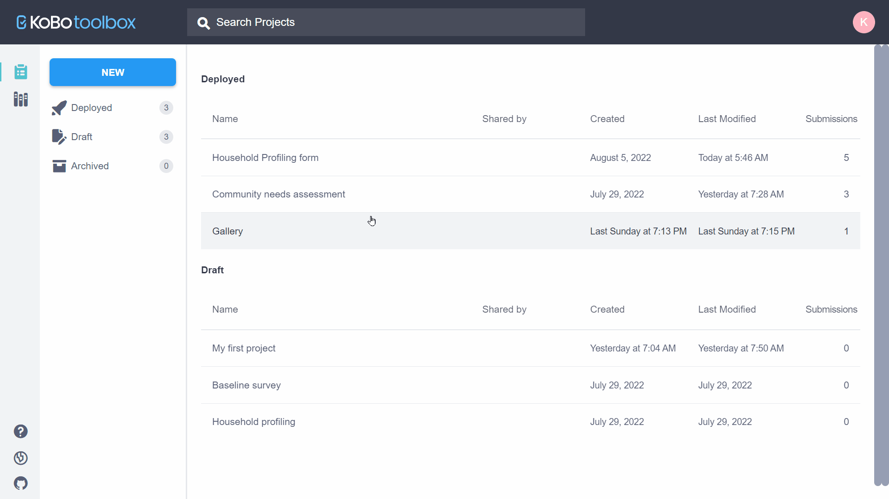
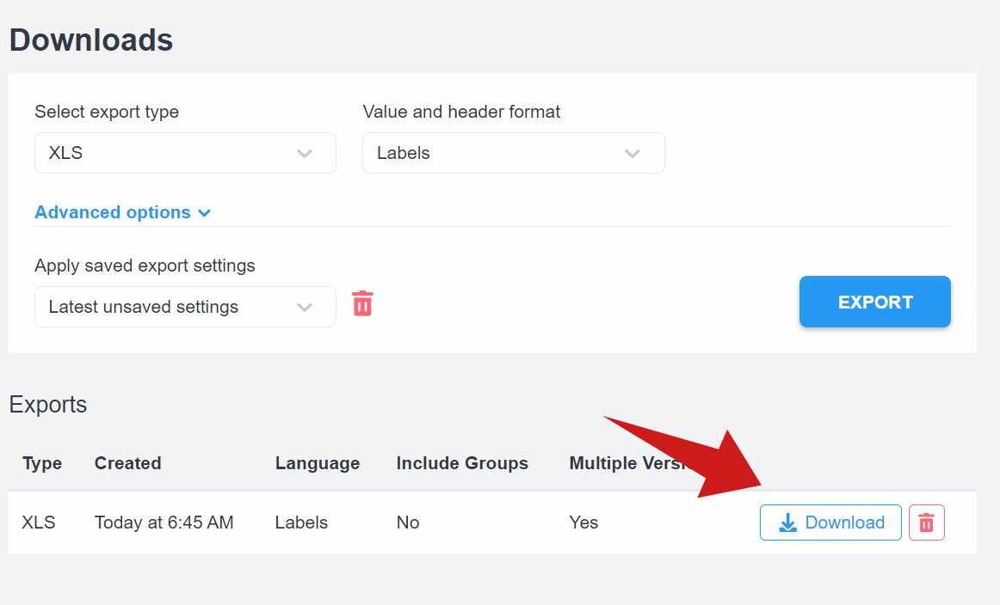
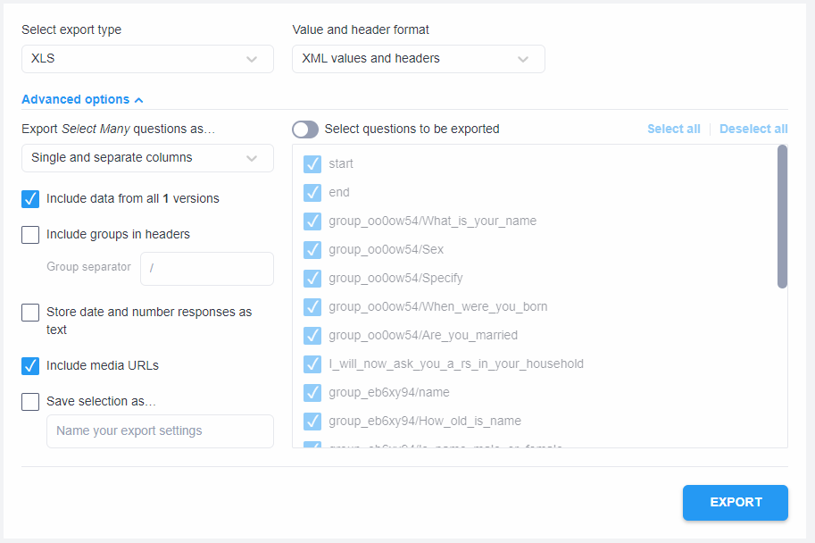
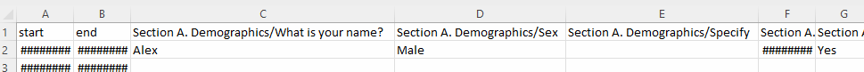

# Exporting and Downloading Your Data
**Last updated:** <a href="https://github.com/kobotoolbox/docs/blob/e21558a7adc19f5065e71c905479a71a67d66a51/source/export_download.md" class="reference">22 Sep 2022</a>

KoboToolbox allows you to download the data you have collected in several
different formats. There are also a number of customizations you can make to
your export settings.

To download your data:

- Open your project and navigate to **DATA -> Downloads**.

- Choose your export settings (detailed below).
- Click **EXPORT**. This will generate an export which will be shown in a table
  below.
- Click **DOWNLOAD** to download the exported file.

  A new export can take between a few seconds and several minutes to be created
  (depending on the number of submissions, size of the form and current load on
  the servers) and will be shown below in the <strong>Exports</strong> section
  of the page.

## Export types

You can choose from the following export types:

  Only the XLS format supports repeat group data; each repeat group will be
  exported as a separate sheet in the exported file. If you need to merge the
  repeat data with the main survey data, follow the instructions
  <a href="merging_dataset_excel_power_query.html" class="reference">here</a>.

- **XLS** - Microsoft Excel file (XLSX format)
- **CSV** - Comma Separated Values file. This file type is great for importing
  into almost any data management software, such as databases
- **GeoJSON** - Open standard geospatial data interchange format best for
  integrating with GIS software, such as ArcGIS
- **SPSS Labels** - Generates SPSS syntax file which will apply question labels
  and value labels to variables of KoboToolbox data imported into SPSS when run.
  Learn more about importing data into SPSS (and STATA)
  [here](converting_to_spss_and_stata.md)
- **GPS Coordinates (KML)** - Generates a KML file which can be used to work
  with your data in GIS software, such as Google Earth
- **Media Attachments (ZIP)** - Downloads a ZIP file with all the media
  collected through the form
- **XLS (legacy)** - Generates an XLSX (Microsoft Excel) file using a legacy
  interface of KoboToolbox
- **CSV (legacy)** - Generates a CSV file using a legacy interface of
  KoboToolbox

  The <strong>legacy</strong> formats for XLS and CSV should only be used if
  there are occasional issues with the standard XLS and CSV export options. The
  legacy exports will be removed in a future update.

## Value and header format

When you choose the non-legacy export formats (XLS, CSV, GeoJSON and SPSS
Labels), you can also select the format of the data values and headers:

- **Labels (default)** - The exported file will use the question labels
  (question text) as column headers and value labels for the responses (in the
  case of "Select One" and "Select Many" questions)
- **XML values and headers** - The exported file will use the "Data Column
  Names" (variable names) as column headers and XML values for the responses (in
  the case of "Select One" and "Select Many" questions)
- Labels in any of the defined languages set within the form.

## Advanced options

Aside from being able to customize the value and header format, non-legacy
formats also allow you to customize other aspects of the exported file in the
**Advanced Options** section:

- **Export Select Many questions as …**: This option allows you to choose how
  you want "Select Many" questions to be exported. You can choose to export them
  as:

  - _Single and separate columns_: This is the default setting that will export
    a column with all the selected options in the "Select Many" question, as
    well as separate columns for each response, as shown below.

    

  - _Separate columns_: Each response in the "Select Many" question will be
    exported into separate columns.
  - _Single column_: Selected responses in the "Select Many" question will be
    exported into a single column.

  In the separate columns, the value <code>1</code> means the option was
  selected, while <code>0</code>
  means the respondent did not pick the option.

- **Include groups in headers**: Choose this option when you want the group
  names to be added to each question header, as shown in the example below.

  

- **Store date and number responses as text**: By default, "Date", "Date &
  Time", "Number" and "Decimal" questions are saved in their corresponding data
  type when exporting to XLSX format. If you instead want to export them as
  text, check this option.

  Since time formats in Excel do not support timezone data, if the
  response value does include timezone data it will be stripped for the export.
  If you would like to retain this data, ensure that you check the option for
  dates to export as text values.

- **Include data from all … versions**: By default, this option is checked. When
  selected, this option allows you to download the data from all your form
  versions. When unchecked, you will only be able to download the data from the
  latest deployed form version.
- **Include media URLs**: If your form collected media such as _photos_,
  _audio_, _videos_ and _files_, you can turn this option **ON** to ensure that
  your exported file includes links to the files in KoboToolbox.
- **Select questions to be exported**: If you want to export data from only a
  few questions, you can turn this option **ON** and select the questions you
  want to include in the export.
- **Save selection as…**: After defining your export settings, you can turn
  **ON** this option and enter a name for the export settings. When you click
  the **EXPORT** button, the export settings will be saved and the name will
  appear in the "Apply saved export settings" box. This is helpful for when you
  want to use the same settings to create another export at a later date. It is
  also useful when you are
  [generating a synchronous exports link](synchronous_exports.md) you can use to
  pull your data into software such as PowerBI or Excel.

## Exports stuck in pending state or failed

As noted earlier, the export time can depend on the number of submissions,
number of questions in your form and current load on the server. If you have
exports stuck in the pending state for a long time:

- Remove the stuck exports by clicking on the red trash can
  <i class="k-icon k-icon-trash"></i> icon for each one.
- Retry the export by clicking the **EXPORT** button again.

  Please do not create multiple exports in quick succession as this can put high
  load on the server and decrease performance for the rest of the community.

  Exports will timeout after 30 minutes and show in the list as failed. This is
  a limit enforced at the server-level and may require that you filter the
  number of submissions included for the export to succeed in the allowed time.
  An example of how this can be done is discussed <a href="https://community.kobotoolbox.org/t/how-to-download-data-between-two-dates-from-date-to-date/25569/4">here</a> in the
  forum.

If you have still issues exporting your data, please don't hesitate to let us
know in the [community forum](https://community.kobotoolbox.org/).
