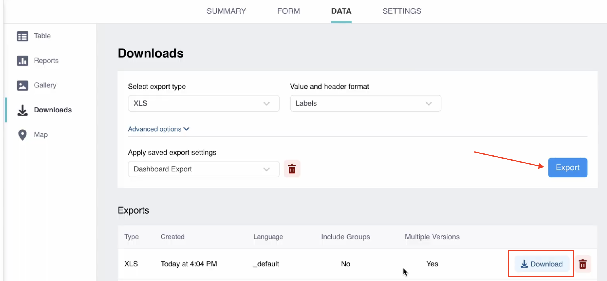

# Exporting and downloading your data
**Last updated:** <a href="https://github.com/kobotoolbox/docs/blob/e21558a7adc19f5065e71c905479a71a67d66a51/source/export_download.md" class="reference">22 Sep 2022</a>

<iframe src="https://www.youtube.com/embed/bXzwvvnhj7U" style="width: 100%; aspect-ratio: 16 / 9; height: auto; border: 0;" title="YouTube video player" frameborder="0" allow="accelerometer; autoplay; clipboard-write; encrypted-media; gyroscope; picture-in-picture; web-share" allowfullscreen></iframe>

When using KoboToolbox, you can download your collected data in various formats and customize your export settings. This article explains how to download your collected data, including an overview of export types and available formats.

## Downloading your data

To download your data:

1. Open your project and navigate to **DATA > Downloads**.
2. Choose your export settings (detailed below).
3. Click **EXPORT**. This will generate an export which will be shown in a table underneath the export settings.
4. Click **DOWNLOAD** to download the exported file.

    <strong>Note:</strong> An export can take from a few seconds to several minutes to generate, depending on the number of submissions, form size, and server load. Once created, it will appear in the <strong>Exports</strong> section of the page.

## Export types

You can choose from the following export types:

| **Export type**    | **Description**                                |
| :----------------- | :--------------------------------------------- |
| XLS               | Microsoft Excel file (.xlsx format). This file type is recommended when collecting repeat group data.                                  |
| CSV      | Comma Separated Values file. This file type is ideal for importing into most data management software, including databases.                                  |
| GeoJSON           | This is an open standard geospatial data interchange format, best for integrating with GIS software like ArcGIS.            |
| SPSS Labels           | Generates an SPSS syntax file that applies question labels and value labels to variables of KoboToolbox data imported into SPSS. For more information, see <a href="https://support.kobotoolbox.org/converting_to_spss_and_stata.html">Converting Data into SPSS and/or Stata</a>.         |
| GPS Coordinates (KML)               | Generates a KML file for working with your data in GIS software, such as Google Earth.                               |
| Media Attachments (ZIP)               |  Downloads a ZIP file containing all media collected through the form.                               |
| XLS (legacy)              | Generates an .xlsx file (Microsoft Excel) using a legacy KoboToolbox interface. Only use this option in case of occasional issues with standard XLS and CSV exports, as it will be removed in a future update.                                  |
| CSV (legacy)               | Generates a CSV file using a legacy KoboToolbox interface. Only use this option in case of occasional issues with standard XLS and CSV exports, as it will be removed in a future update.                                  |

## Value and header format

When using the standard export formats (XLS, CSV, GeoJSON, and SPSS Labels), you can select the format of your data values and headers:

| **Format**    | **Description**                                |
| :----------------- | :--------------------------------------------- |
| Labels (default)               | The exported file uses <strong>question labels</strong> (question text) as column headers and <strong>choice labels</strong> for responses to Select One and Select Many questions.                                  |
| XML values and headers      | The exported file uses <strong>question names</strong> (Data Column Names) as column headers and <strong>choice names</strong> (XML values) for responses. This export setting is recommended for importing your data into data analysis software.                                  |
| Labels in any of the defined languages           | The exported file uses <strong>question and choice labels</strong> in any of the languages set within the form.            |

## Advanced options

In addition to customizing value and header formats, non-legacy export formats also offer other customization options within the **Advanced Options** section. For more information on advanced options, see [Advanced options for exporting data](https://support.kobotoolbox.org/advanced_export.html).

## Troubleshooting

    
<strong>Exports stuck in pending state or failed</strong>

    
Export time depends on the number of submissions, form complexity, and current server load. If exports remain in a pending state for an extended period:
- Remove the stuck exports by clicking the <i class="k-icon-trash"></i> red trash can icon.
- Retry the export by clicking the <strong>EXPORT</strong> button again.
- Avoid creating multiple exports rapidly, as this can overload the server and reduce performance for all users.

    <strong>Note:</strong> Exports will time out and show as <strong>failed</strong> after 30 minutes. This server-level limit may require you to filter the number of submissions included in the export to complete within the allowed time. An example of how to do this is discussed in the <a href="https://community.kobotoolbox.org/t/how-to-download-data-between-two-dates-from-date-to-date/25569/4">Community Forum</a>.

If you continue to experience issues exporting your data, please post in the <a href="https://community.kobotoolbox.org/">Community Forum</a>.

 

    
<strong>Repeat group data not found</strong>

Only the XLS format supports repeat group data. Each repeat group will be exported <strong>as a separate sheet</strong> in the exported file. CSV downloads will only provide the main data, without repeat group data. 
For more information about exporting and using repeat group data, see <a href="https://support.kobotoolbox.org/managing_repeat_groups.html">Managing repeat group data</a>.    

 

    
<strong>Some data not being exported</strong>

    If some of your data is not being exported, check the <a href="https://support.kobotoolbox.org/advanced_export.html">advanced options</a>. For example, ensure that data from all versions of your form are selected for export.

 

    
<strong>Downloading data from different versions</strong>

    When downloading data that includes multiple form versions, you may encounter changes in the format of your data files. 

 

    
<strong>Timezone data getting lost in export</strong>

    Excel time formats do not support timezone data. Therefore, any timezone data in the response value will be removed during XLS export. To retain this information, check the option to export dates as text values. 

For more information on this setting, see <a href="https://support.kobotoolbox.org/advanced_export.html">Advanced options for exporting data</a>.

