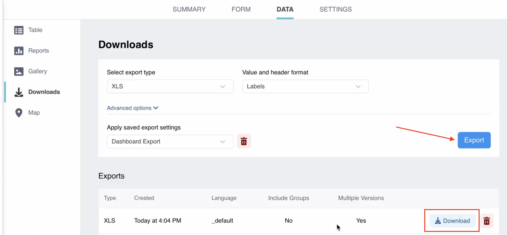

# Exporting and downloading your data
**Last updated:** <a href="https://github.com/kobotoolbox/docs/blob/d9b44de6b0f7192771a9f7bf86edf271321f398b/source/export_download.md" class="reference">27 Jan 2026</a>

<iframe src="https://www.youtube.com/embed/bXzwvvnhj7U" style="width: 100%; aspect-ratio: 16 / 9; height: auto; border: 0;" title="YouTube video player" frameborder="0" allow="accelerometer; autoplay; clipboard-write; encrypted-media; gyroscope; picture-in-picture; web-share" allowfullscreen></iframe>

When using KoboToolbox, you can download your collected data in various formats and customize your export settings. This article explains how to download your collected data, including an overview of export types and available formats.

## Downloading your data

To download your data:

1. Open your project and navigate to **DATA > Downloads**.
2. Choose your export settings (detailed below).
3. Click **EXPORT**. This will generate an export which will be shown in a table underneath the export settings.
4. Click **DOWNLOAD** to download the exported file.

    <strong>Note:</strong> An export can take from a few seconds to several minutes to generate, depending on the number of submissions, form size, and server load. Once created, it will appear in the <strong>Exports</strong> section of the page.

## Export types

You can choose from the following export types:

| **Export type**    | **Description**                                |
| :----------------- | :--------------------------------------------- |
| XLS               | Microsoft Excel file (.xlsx format). This file type is recommended when collecting repeat group data.                                  |
| CSV      | Comma Separated Values file. This file type is ideal for importing into most data management software, including databases.                                  |
| GeoJSON           | This is an open standard geospatial data interchange format, best for integrating with GIS software like ArcGIS. This file type is recommended for <a href="https://support.kobotoolbox.org/mapping_gps.html#exporting-as-geojson">analyzing GPS data</a>.            |
| SPSS Labels           | Generates an <a href="https://support.kobotoolbox.org/converting_to_spss_and_stata.html">SPSS syntax file</a> that applies question labels and value labels to variables of KoboToolbox data imported into SPSS.         |
| GPS Coordinates (KML)               | Generates a <a href="https://support.kobotoolbox.org/mapping_gps.html#exporting-as-kml">KML file</a> for working with your data in GIS software, such as Google Earth. This export format will not be supported in the future. We recommend using one of the other available export types instead. |
| Media Attachments (ZIP)               |  Downloads a ZIP file containing all <a href="https://support.kobotoolbox.org/managing_media_responses.html#downloading-media-files">media</a> collected through the form.                               |
| XLS (legacy)              | Generates an .xlsx file (Microsoft Excel) using a legacy KoboToolbox interface. Only use this option in case of occasional issues with standard XLS and CSV exports, as it will be removed in a future update.                                  |
| CSV (legacy)               | Generates a CSV file using a legacy KoboToolbox interface. Only use this option in case of occasional issues with standard XLS and CSV exports, as it will be removed in a future update.                                  |

    To learn more about export types, see <a href="https://support.kobotoolbox.org/mapping_gps.html#exporting-gps-data">Exporting GPS data</a> and <a href="https://support.kobotoolbox.org/managing_media_responses.html#downloading-media-files">Downloading media files</a>.

## Value and header format

When using the standard export formats (XLS, CSV, GeoJSON, and SPSS Labels), you can select the format of your data values and headers:

| **Format**    | **Description**                                |
| :----------------- | :--------------------------------------------- |
| Labels (default)               | The exported file uses <strong>question labels</strong> (question text) as column headers and <strong>choice labels</strong> for responses to Select One and Select Many questions.                                  |
| XML values and headers      | The exported file uses <strong>question names</strong> (Data Column Names) as column headers and <strong>choice names</strong> (XML values) for responses. This export setting is recommended for importing your data into data analysis software.                                  |
| Labels in any of the defined languages           | The exported file uses <strong>question and choice labels</strong> in any of the languages set within the form.            |

## Advanced options

In addition to customizing value and header formats, non-legacy export formats also offer other customization options within the **Advanced Options** section. For more information on advanced options, see [Advanced options for exporting data](https://support.kobotoolbox.org/advanced_export.html).

## Troubleshooting

    
<strong>Exporting GPS data</strong>

There are several options for <a href="https://support.kobotoolbox.org/mapping_gps.html#exporting-gps-data">downloading GPS data</a>. When you export your data as CSV or XLS, the coordinates appear in multiple columns: one column with the full coordinate set, and additional columns for latitude, longitude, altitude, and precision. To prepare your data for use in GIS software such as ArcGIS, use the GeoJSON export option. The KML export format is limited and will not be supported in the future.    

 

    
<strong>Exports stuck in pending state or failed</strong>

    
Export time depends on the number of submissions, form complexity, and current server load. If exports remain in a pending state for an extended period:
- Remove the stuck exports by clicking the <i class="k-icon-trash"></i> <strong>trash icon.</strong>
- Retry the export by clicking the <strong>EXPORT</strong> button again.
- Avoid creating multiple exports rapidly, as this can overload the server and reduce performance for all users.

    <strong>Note:</strong> Exports will time out and show as <strong>failed</strong> after 30 minutes. This server-level limit may require you to filter the number of submissions included in the export to complete within the allowed time. An example of how to do this is discussed in the <a href="https://community.kobotoolbox.org/t/how-to-download-data-between-two-dates-from-date-to-date/25569/4">Community Forum</a>.

If you continue to experience issues exporting your data, please post in the <a href="https://community.kobotoolbox.org/">Community Forum</a>.

 

    
<strong>Repeat group data not found</strong>

Only the <b>XLS format</b> supports repeat group data. Each repeat group will be exported <strong>as a separate sheet</strong> in the exported file. CSV downloads will only provide the main data, without repeat group data. 
  
For more information about exporting and using repeat group data, see <a href="https://support.kobotoolbox.org/managing_repeat_groups.html">Managing repeat group data</a>.    

 

    
<strong>Some data not being exported</strong>

    If some of your data is not being exported, check the <a href="https://support.kobotoolbox.org/advanced_export.html">advanced options</a>. For example, ensure that data from all versions of your form are selected for export.

 

    
<strong>Downloading data from different versions</strong>

    When downloading data that includes multiple form versions, you may encounter changes in the format of your data files. 

 

    
<strong>Timezone data getting lost in export</strong>

    Excel time formats do not support timezone data. Therefore, any timezone data in the response value will be removed during XLS export. To retain this information, check the option to export dates as text values. 
  
For more information on this setting, see <a href="https://support.kobotoolbox.org/advanced_export.html">Advanced options for exporting data</a>.

 

    
<strong>Additional columns added to data export</strong>

     Your data export may include extra columns that were not added as questions in your form. KoboToolbox includes <a href="https://support.kobotoolbox.org/viewing_validating_data.html#system-generated-submission-fields">system-generated fields</a> for each submission, such as <code>_id</code>, <code>_uuid</code>, <code>_submission_time</code>, <code>_submitted_by</code>, and <code>rootUuid</code>.
  
In addition to the system-generated fields shown in the data table, some extra fields may be added when you export your data. 
  
    
<ul>
    <li><code>_validation_status</code>: Shows the submission’s <a href="https://support.kobotoolbox.org/viewing_validating_data.html#validating-your-data">validation status</a>. This helps track whether a submission has been reviewed and whether it is ready to use. Possible values are <strong>Approved</strong>, <strong>Not Approved</strong>, and <strong>On Hold</strong>.</li>
    <li><code>_index</code>: A sequential row number generated at export time. It is used mainly to link rows between the main sheet and repeat group sheets in multi-sheet exports. Because it is created during export, it should not be used as a stable identifier for a submission.
</li>
    <li><code>_status</code>: Shows how the submission was sent. In many exports, this field is not very useful because it may contain the same value for all records.
    </li>
    <li>You may also see <code>_notes</code> and <code>_tags</code> in some exports. These fields are deprecated but can still appear in older or existing export workflows.
    </li>
</ul>

If you do not need these columns for your analysis, you can remove them from the exported file after download or when configuring <a href="https://support.kobotoolbox.org/advanced_export.html#selecting-data-fields-for-export">export settings</a>. 

