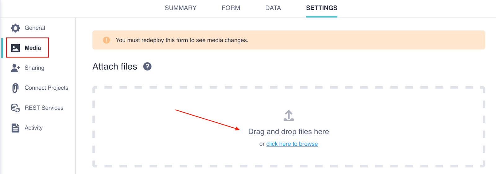
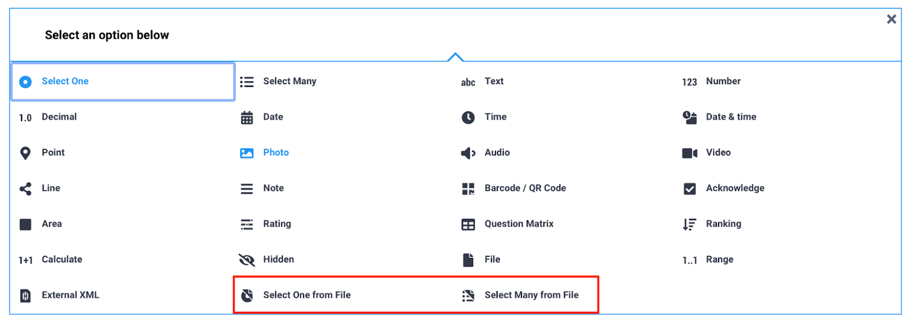
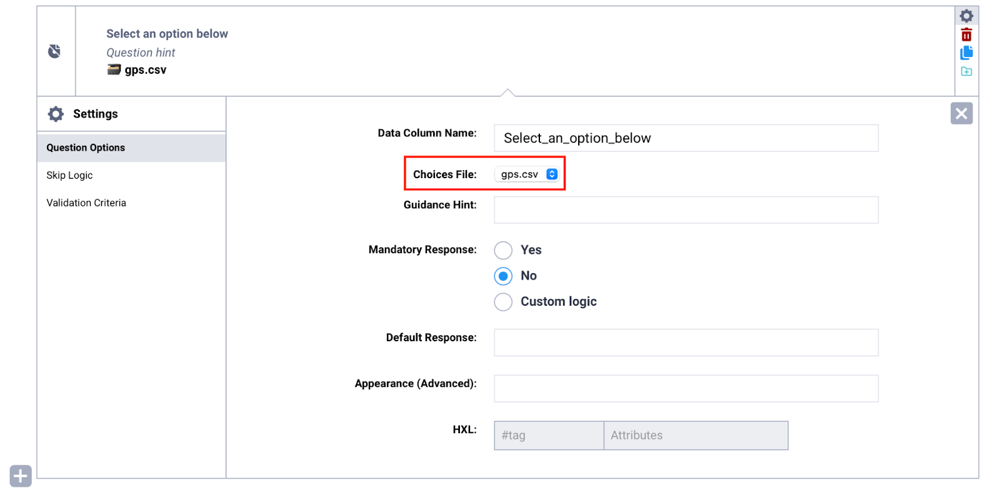

# Selecting options from an external file
**Last updated:** <a href="https://github.com/kobotoolbox/docs/blob/87ff8377b846dacb801191e0b619126a563040a9/source/external_file.md" class="reference">28 Aug 2025</a>

**Select from file** questions allow you to use a list of choice options stored in an external file instead of defining them directly in your form. There are two types: **Select One from File** for selecting a single choice, and **Select Many from File** for selecting multiple choices. 

Using a separate file for your choice list makes it easier to use and manage long lists in the Formbuilder. Supported file formats include CSV, XML, and GeoJSON.

This article explains how to format your external file, upload it to KoboToolbox, and set up **select from file** questions in the Formbuilder.

## Formatting external choice lists

To get started, create your list of choices in a separate external file. The required structure of this file depends on the format you choose (CSV, XML, or GeoJSON). Use a separate file for each choice list.

To learn more about formatting XML or GeoJSON files, see <a href="https://xlsform.org/en/#multiple-choice-from-file">XLSForm</a> and <a href="https://docs.getodk.org/form-datasets/#building-selects-from-geojson-files">ODK</a> documentation. GeoJSON files are primarily used for <a href="https://support.kobotoolbox.org/select_from_map_xls.html">selecting options from a map</a>. 

If you are using a CSV file for your option choices, it should contain at least two columns: `name` and `label`. The `name` column represents the [XML value](https://support.kobotoolbox.org/question_types.html#setting-xml-values-for-option-choices) for your option choice, and the `label` column represents the choice label as it is displayed in your form. 

**External CSV file**

| name    | label    |
|:--------|:---------|
| option1 | Option 1 |
| option2 | Option 2 |
| option3 | Option 3 |

If your file uses different names for the choice name and label, you can [specify this](https://support.kobotoolbox.org/select_from_file_xls.html#configuring-choice-name-and-label-columns) by [downloading your file as an XLSForm](https://support.kobotoolbox.org/xlsform_with_kobotoolbox.html#downloading-an-xlsform-from-kobotoolbox) and adding a `parameters` column.

<strong>Note:</strong> Use short, simple file names for your external files, avoiding spaces or special characters. The file name will be used to link questions to their choice lists. If you use multiple external files, make sure each one has a unique name, even if they use different file types.

## Uploading the external file to KoboToolbox

Before creating a **select from file** question in the Formbuilder, you must upload the external file that contains your list of choices:

1. In KoboToolbox, navigate to the project **SETTINGS** page.
2. In the **Media** tab, upload the external file. Ensure the file name matches exactly the file name specified in the XLSForm.

To update your list of choices, edit the external file as needed, re-upload it to KoboToolbox, and redeploy your form.

  To learn more about uploading media files, see <a href="https://support.kobotoolbox.org/upload_media.html">Uploading media files to a project</a>.  

## Setting up the question in the Formbuilder

After uploading your external CSV file to KoboToolbox, you can add a **Select One from File** or **Select Many from File** question in the Formbuilder.

To add a select from file question:

1. Click the <i class="k-icon-plus"></i> button.
2. Enter your question label.
3. Click **+ ADD QUESTION**.
4. Choose <i class="k-icon-qt-select-one-from-file"></i> **Select One from File** or <i class="k-icon-qt-select-many-from-file"></i> **Select Many from File** as the question type.

<strong>Note:</strong> The Select One from File and Select Many from File question types only appear as options in the Formbuilder if an external choice file has been uploaded to KoboToolbox.

If only one external file has been uploaded to your project, it will be automatically linked to the question. If multiple files have been uploaded, open the question <i class="k-icon-settings"></i> **Settings** and select the appropriate file from the <i class=""></i> **Choices File** dropdown menu.

To learn how to set up select from file questions in XLSForm and for additional troubleshooting support, see <a href="https://support.kobotoolbox.org/select_from_file_xls.html#">Selecting options from an external file in XLSForm</a>.

