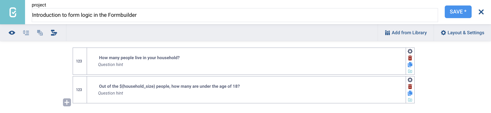
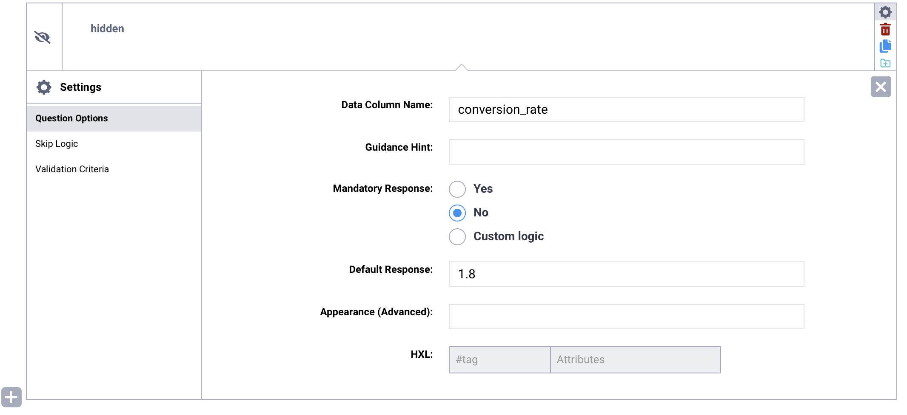
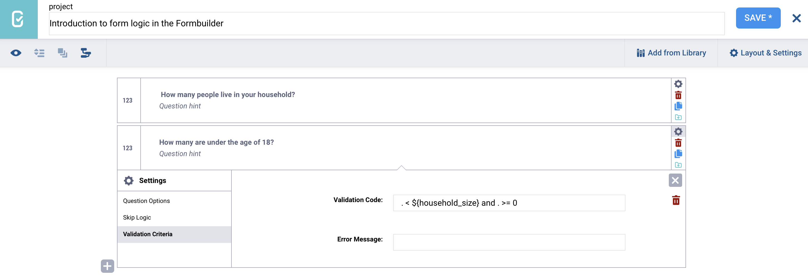

# Introduction to form logic in the Formbuilder

Form logic controls the flow and behavior of your form based on responses to previous questions. It allows you to create dynamic forms that adapt to user input. For example, you can use form logic to display specific questions only when relevant, validate responses, or perform calculations automatically.

Key types of form logic include:

- **Skip logic:** Controls when questions are shown or hidden based on previous responses.
- **Validation criteria:** Validate responses to ensure they meet defined rules or criteria.
- **Cascading selects:** Display only relevant answer options based on earlier responses.
- **Calculations:** Automatically generate values using mathematical or logical expressions.
- **Mandatory response logic:** Defines when a question must be answered.

  To learn more about each type of form logic, see support articles on <a href="https://support.kobotoolbox.org/skip_logic.html">skip logic</a>, <a href="https://support.kobotoolbox.org/https://support.kobotoolbox.org/validation_criteria.html">validation criteria</a>, <a href="https://support.kobotoolbox.org/cascading_select.html">cascading selects</a>, <a href="https://support.kobotoolbox.org/question_options.html#mandatory-response">mandatory response logic</a>, and <a href="https://support.kobotoolbox.org/calculate_questions.html">calculations</a> in KoboToolbox.

This article introduces the key concepts of form logic in the Formbuilder, including question referencing, constants, operators, functions, and regular expressions, and explains how to use them to build dynamic and responsive forms.

## Form logic in the KoboToolbox Formbuilder 

The KoboToolbox Formbuilder includes built-in tools for adding form logic, such as [skip logic](https://support.kobotoolbox.org/skip_logic.html) and [validation criteria](https://support.kobotoolbox.org/https://support.kobotoolbox.org/validation_criteria.html). These tools are suitable for most standard use cases, but they may be limiting when working with more complex conditions.

For skip logic and validation, you can use the **visual builders in the Formbuilder** or you can **manually enter XLSForm expressions**. For this second option, it is helpful to understand the basics of XLSForm syntax, including question referencing, constants, mathematical and comparison operators, logical operators for combining conditions, functions, and regular expressions.

  To learn more about form logic in XLSForm, see <a href="https://support.kobotoolbox.org/form_logic_xls.html#">Introduction to form logic in XLSForm</a>.

If your form requires complex or highly customized logic, it is recommended to [download your form as an XLSForm](https://support.kobotoolbox.org/xlsform_with_kobotoolbox.html#downloading-an-xlsform-from-kobotoolbox) and make the necessary edits directly in the Excel file.

## Question referencing 

Question referencing allows you to incorporate the answer to a previous question into the label or logic of a subsequent question. Question referencing is frequently used in advanced forms:

- **In question labels or hints:** For example, you can include a respondent’s child’s name in later questions about their child.
- **In form logic:** For example, you can show or hide a question based on a previous response, or validate an answer by comparing it with an earlier one.

Question referencing uses the format `${data_column_name}`. A question’s [data column name](https://support.kobotoolbox.org/question_options.html#data-column-name) can be found and modified in the question settings. 

To **display a previous response inside another question label**, insert `${data_column_name}` directly into the question label where you want the value to appear.

If a question reference includes a spelling error or is otherwise incorrect, an error message will appear when previewing or submitting the form.

<strong>Note:</strong> When referencing a question within its own logic (e.g., for validation criteria), a period <code>.</code> can be used as a shortcut.

## Storing constants in your form 

A **constant** is a fixed value that does not change during data collection. Constants are useful when you need to use the same value multiple times in calculations, such as a fixed conversion rate, threshold, or multiplier.

In the Formbuilder, you can store a constant using the Hidden question type. A **Hidden** question does not appear in the form and does not have a user interface element. Instead, it stores a value in the background that can be referenced in **Calculate** questions later in the form.

To store a constant in your form:

1. Add a new question to your form.
2. Select the **Hidden** question type.
3. Open the **Settings** for the question.
4. In the **Default Response** field, enter the constant value.

The value entered in the **Default Response** field will be stored as the constant. You can then reference this value using the Hidden question’s [data column name](https://support.kobotoolbox.org/question_options.html#data-column-name) in calculations and logic throughout your form.

## Mathematical and comparison operators 

**Mathematical operators** are used to perform arithmetic calculations using numerical values in the form. Mathematical operators in form logic include: 

| Operator | Description |
|:---|:---|
| <code>+</code> | Addition |
| <code>-</code> | Subtraction |
| <code>*</code> | Multiplication |
| <code>div</code> | Division |
| <code>mod</code> | Modulo (remainder of a division) |

**Comparison operators** are used to compare values. Comparison operators in form logic include: 

| Operator | Description |
|:---------|:------------|
| <code>=</code>  | Equal to |
| <code>></code>  | Greater than |
| <code><</code>  | Less than |
| <code>>=</code> | Greater than or equal to |
| <code><=</code> | Less than or equal to |
| <code>!=</code> | Not equal to |

## Combining conditions using logical operators

**Logical operators** can be used in form logic to combine multiple conditions. Logical operators include:

- **and** (all conditions must be met)
- **or** (at least one of the conditions must be met) 
- **not** (condition(s) must not be met)

## Functions

Functions are predefined operations used to perform calculations or manipulate data in form logic. Functions make calculations and form logic more efficient by automatically performing complex tasks like rounding values, calculating powers, or extracting the current date.

  For a comprehensive list of functions you can use in form logic, see <a href="https://support.kobotoolbox.org/functions_xls.html">Using functions in XLSForm</a>.

## Regex

A regular expression (regex) is a search pattern used to match specific characters within a string. It is widely used to validate, search, extract, and restrict text in most programming languages, including in KoboToolbox. 

Regex can be used in **validation criteria** to control the length and characters entered into a question (e.g., limiting phone number entry to exactly 10 digits, controlling the format of ID numbers, or verifying valid email entry). It can also be used in **calculations** and other form logic.

In KoboToolbox, regular expressions are evaluated using the function `regex(., ' ')`, where the regex is entered between apostrophes and the period `.` represents the current question.  `regex(., ' ')` returns TRUE if the regular expression is met, and FALSE otherwise.

  To learn more about using regex in KoboToolbox, see <a href="https://support.kobotoolbox.org/restrict_responses.html">Using regular expressions in XLSForm</a>.

