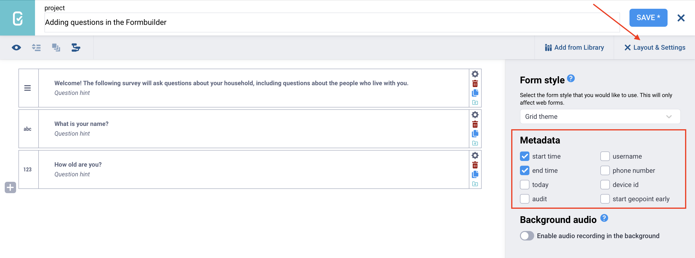
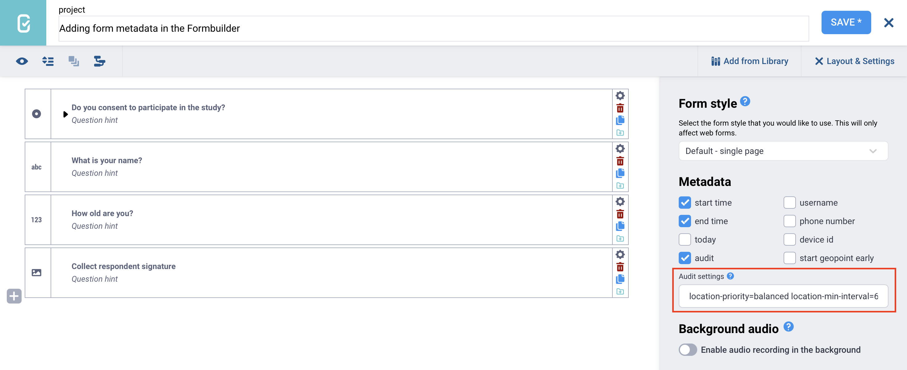
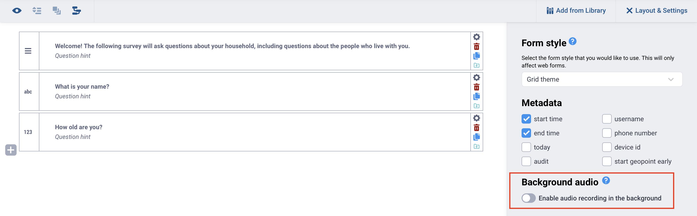

# Adding form metadata in the Formbuilder
**Last updated:** <a href="https://github.com/kobotoolbox/docs/blob/e86e7d8a6cc6528808cea9efbb18b772b0c56df4/source/form_meta.md" class="reference">19 Nov 2025</a>

Metadata questions automatically gather information about the data collection process, such as the date, time, and device used, without requiring input from the respondent. 

Metadata questions are **hidden from respondents**, and **metadata fields cannot be edited** in the KoboToolbox data table. This background information supports auditing, helps maintain data integrity, and can be used in data analysis. 

This article explains how to add and manage metadata questions in the Formbuilder, outlines the available metadata options, and describes how audit logging and background audio recording can support data quality and monitoring during data collection.

## Adding metadata questions in the Formbuilder

To add metadata questions in the Formbuilder:

1. Click **Layout & Settings** in the top right corner of the screen.
2. In the **Metadata** section, select the metadata questions you want to include in your form.

Available metadata questions in the Formbuilder include:

| Metadata | Description |
|:---|:---|
| start time | Records the exact time and date when a submission is started. |
| end time | Records the date and time when a submission is finalized. |
| today | Records the date of the submission. |
| audit | Captures a detailed log of the interview process, including start time, end time, location, and user actions during the entire data collection process. This metadata question is not supported in Enketo.  To learn more about using the audit question for audit logs and configuring settings, see <a href="https://docs.getodk.org/form-audit-log/">Form Audit Log (ODK)</a>. |
| username | In KoboCollect, records the username saved in the <a href="https://support.kobotoolbox.org/kobocollect_settings.html#user-and-device-identity-settings">KoboCollect app settings</a>. If no username is set, it records the one used to sign in to the server. In Enketo, records the account username only if <a href="https://support.kobotoolbox.org/project_sharing_settings.html#allowing-submissions-without-authentication">authentication is required</a>.  <strong>Note:</strong> Because the <code>username</code> field can be edited in KoboCollect, it may not match the account used to authenticate to the server. To see which account submitted the data, refer to the automatically generated <code>_submitted_by</code> field. |
| phone number | Records the phone number stored in the <a href="">KoboCollect app settings</a>. This metadata question is not supported in Enketo. |
| device id | Records the unique identification of the device or browser used to collect data. The device ID is automatically generated and cannot be modified by users.  <strong>Note:</strong> In KoboCollect, the device ID is updated whenever the app is reinstalled on a device. In Enketo, the <code>deviceid</code> resets any time a new browser window is used. |
| start geopoint early | Captures GPS coordinates when the form is first opened. Can be used to warm up the device GPS so that later GPS questions can reach accurate readings more quickly. |

### Audit metadata question

The audit metadata question records a detailed log of the interview process while a form is being completed in the [KoboCollect Android app](https://support.kobotoolbox.org/kobocollect_on_android_latest.html#). It captures information such as when the form was opened and saved, which questions were viewed, how long respondents spent on each screen, and other user actions during data collection.

Audit logging can help:

- Monitor enumerator behavior
- Identify questions that take longer to answer
- Understand how enumerators navigate a form
- Support data quality assurance and validation processes

Audit logs are saved as CSV files and uploaded with each submission. These files can be downloaded as media attachments and analyzed separately. Because the logs use timestamp data, additional processing is typically required for analysis.

    For more information about the exported CSV files, see the full <a href="https://docs.getodk.org/form-audit-log/">ODK audit logging documentation</a>.

The audit metadata question is not supported in [Enketo web forms](https://support.kobotoolbox.org/enketo.html). 

**Audit settings**

Additional optional settings can be configured for the audit metadata question. These include:

- Adding the GPS location of events
- Enabling change tracking to record answers that are modified after a form is saved and before it is submitted
- Prompting enumerators to provide a reason for editing a saved form
- Requiring enumerators to enter their username before filling out or editing a form

Available settings are listed in the [ODK audit logging documentation](https://docs.getodk.org/form-audit-log/) as parameters. In the Formbuilder, enter the optional parameters directly in the **Audit settings** text box.

### Configuring metadata in KoboCollect 

The user’s default phone number and username can be [configured](https://support.kobotoolbox.org/kobocollect_settings.html#user-and-device-identity-settings) and modified in the KoboCollect app.

To configure user metadata in KoboCollect:

1. Open the KoboCollect app.
2. Tap the **Project icon** in the top right corner of your screen.
3. Tap **Settings**.
4. Scroll down to **User and device identity**, then **Form metadata.**
5. Enter the username and/or phone number. You can also view the current device ID.

## Enabling background audio recording

Background audio recording allows you to capture an audio recording while a form is open and being completed. The recording is saved as part of the form submission and can later be [downloaded as an audio file](https://support.kobotoolbox.org/managing_media_responses.html#downloading-media-files).

To enable background audio recording in the Formbuilder:

1. Open the **Layout & Settings** panel. 
2. Turn on the **Enable audio recording in the background** toggle under **Background audio.**
3. Once enabled, audio will be recorded in the background in both KoboCollect and Enketo web forms while the form is being filled out.

For more information, see <a href="https://support.kobotoolbox.org/recording-interviews.html#">Recording interviews with background audio recording</a>.

This feature can support qualitative data collection by capturing detailed interview responses. It can also improve data quality assurance by allowing supervisors to review how interviews were conducted. In addition, it can serve as a backup to written or transcribed responses.

<strong>Note:</strong> Before using this feature, ensure that your device has sufficient storage space for audio files. You should also obtain <strong>informed consent</strong> from respondents before recording. Always consider ethical implications and comply with applicable data protection laws in your area of work.

