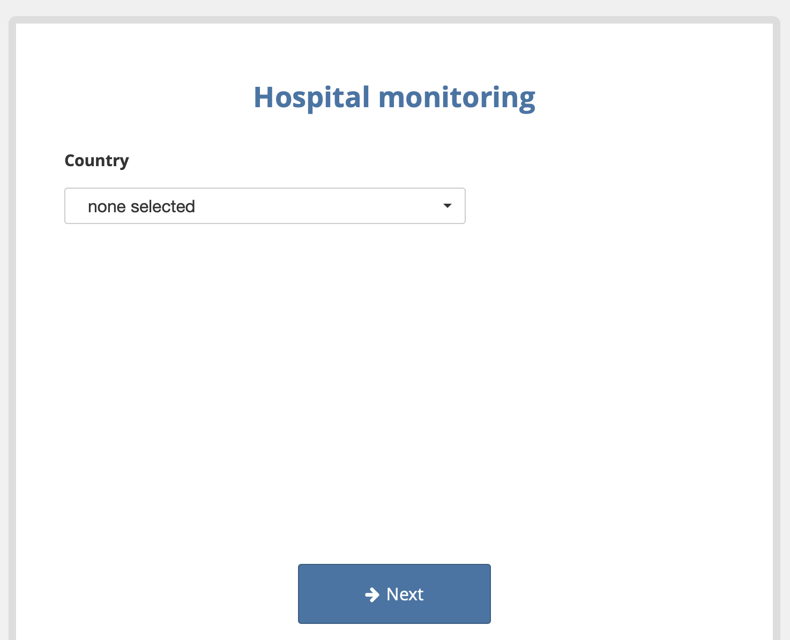
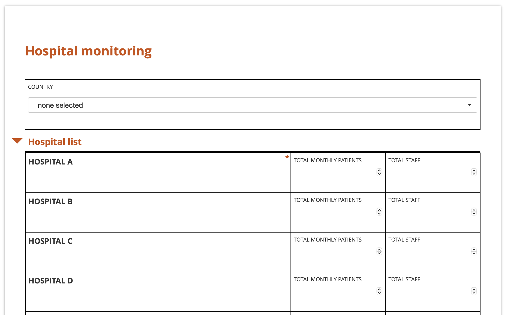
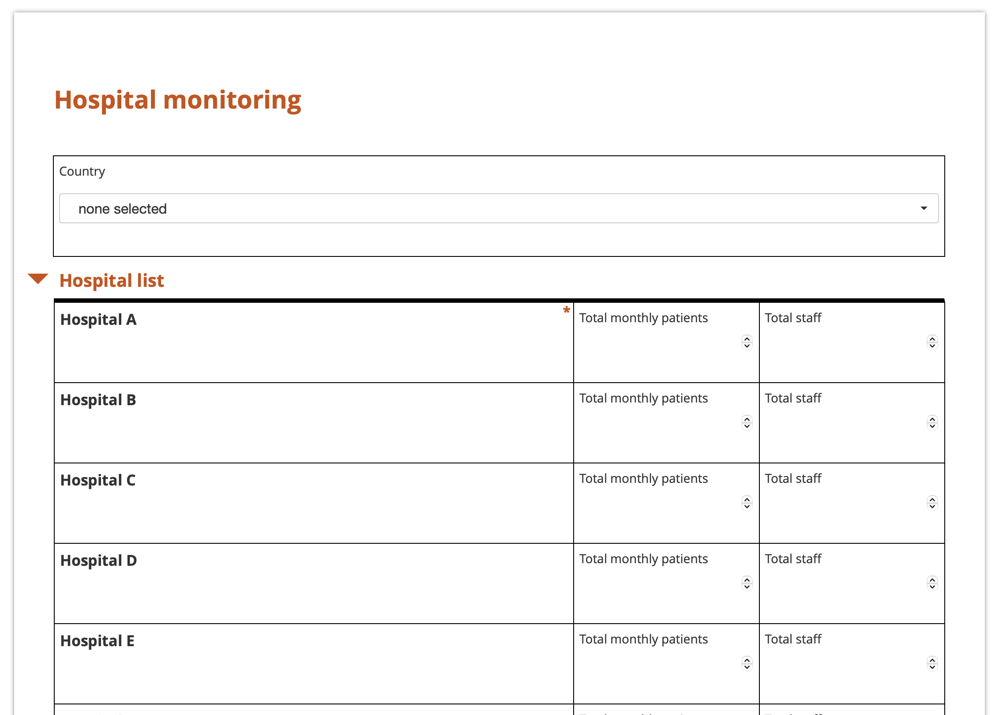

# Styling your forms using XLSForm

With KoboToolbox, you can customize the appearance of your forms and questions to highlight key information and adapt the layout to your data collection needs. This includes applying themes to Enketo web forms, adding headers and lists in note questions, and using color or bold formatting for emphasis.

This article covers themes for Enketo web forms as well as styling options for notes and questions within a form.

<strong>Note:</strong> This article focuses on styling forms in <a href="https://support.kobotoolbox.org/getting_started_xlsform.html">XLSForm</a>. To learn about setting Enketo themes in the KoboToolbox Formbuilder, see <a href="https://support.kobotoolbox.org/alternative_enketo.html">Using alternative Enketo web form styles</a>.

## Themes for Enketo web forms

Enketo themes allow you to customize the appearance and layout of [Enketo web forms](https://support.kobotoolbox.org/enketo.html). Themes apply only to Enketo web forms and are not visible in KoboCollect.

To add a theme in XLSForm:
1. Add a **style** column in your `settings` worksheet.
2. Specify the theme you want to use, using the exact name shown in the table below.

**settings worksheet**

| style       |
|:------------|
| theme-grid  |
| settings | 

<strong>Note:</strong> Themes can be combined by entering both themes in the same cell of the <code>style</code> column, separated by a space (e.g., <code>theme-grid pages</code>).

The following themes are available to customize your forms:

| XLSForm theme                | Description                                                                 | Preview |
|:-----------------------------|:----------------------------------------------------------------------------|:--------|
| Default style                | Displays questions one after another, on a single page.                     |  |
| <code>pages</code>           | Displays one question per screen or a <a href="https://support.kobotoolbox.org/grouping_questions_xls.html">group of questions</a> together on the same screen, similar to the KoboCollect layout. |  |
| <code>theme-grid</code>      | An alternative display that is more compact, similar to paper forms, and efficiently uses space, arranging multiple questions per row. Questions are capitalized by default. Requires <a href="https://support.kobotoolbox.org/form_style_xls.html#setting-up-XLSForm-with-theme_grid">setting up your XLSForm</a>. |  |
| <code>theme-grid no-text-transform</code> | Same as theme-grid, but without automatic capitalization of questions. |  |

### Setting up XLSForm for theme_grid

In Enketo web forms, the `theme_grid` layout allows you to display questions in multiple columns, making your form more compact and visually organized. The set-up of these columns, including how many there are and how wide each one should be, is controlled by assigning `w-values` to each question inside the **appearance** column of your XLSForm.

  For a comprehensive overview of using <code>theme_grid</code> in XLSForm, see this <a href="https://ee.kobotoolbox.org/n41GqUkf">Grid Theme Tutorial</a> and <a href="https://docs.google.com/spreadsheets/d/1qKmxPTA4B0vihU6GsKgi1CJE2Db2FfE7KZpOig4nTEI/edit?gid=0#gid=0">sample XLSForm</a>.

Before assigning `w-values` to each question, start by placing all questions into [question groups](https://support.kobotoolbox.org/grouping_questions_xls.html). The default width for a group or repeat is four columns (`w4`), so a group with `w4` can hold a maximum of four `w1` questions in a single row. A question's `w-value` is relative to its group's `w-value`. 

To specify the relative width of each question within a row:
1. Add an **appearance** column in your `survey` worksheet.
2. For each question, assign appearance values (e.g., `w1`, `w2`, `w3`) to specify its relative width within a row.
3. Modify the group width if needed using the same approach.

Rows will always automatically expand to the full width of the page. For example, a row containing one question with an appearance value of `w2` and another with `w1` will divide the row into two-thirds and one-third, respectively. 

<strong>Note:</strong> Apply <code>w-values</code> only to top-level groups or repeats. Although applying them to nested groups or repeats is supported, it may not display well.

## Styling text

You can use Markdown and HTML in XLSForm to style text, add emphasis with bold or italics, create headers of different sizes, change fonts and colors, and add clickable web links. Text styling can be applied to questions, notes, and choice labels.

<strong>Note:</strong> Some styling features may not be supported in KoboCollect or Enketo. It is recommended to preview your forms in your chosen data collection method to confirm that all styling features are fully supported.

Text styling features in XLSForm include:
| Feature        | Formatting |
|:---------------|:-----------|
| Italics        | `*italics*` or `_italics_` |
| Bold           | `**bold**` or `__bold__` |
| Hyperlink      | `[name of link](url)` |
| Headers        | # Header 1 (biggest) to ###### Header 6 (smallest) |
| Bullet lists   | - This is an unordered list - in markdown |
| Numbered lists | 1. This is a numbered list 2. in markdown |
| Emojis         | For example, 🙂 😐 🙁 😦 😧 😩 😱 |
| Superscript    | `100 m2` turns into 100 m² |
| Subscript      | `H2O` turns into H₂O |
| Colored text   | `orange` `red` |
| Font           | `cursive` `red and cursive`|
| Align center   | `
Centered label
` |

<strong>Note:</strong> Use the <code>\</code> character before <code>#</code>, <code>*</code>, <code>_</code>, and <code>\</code> to prevent special styling effects from being triggered by these characters.

