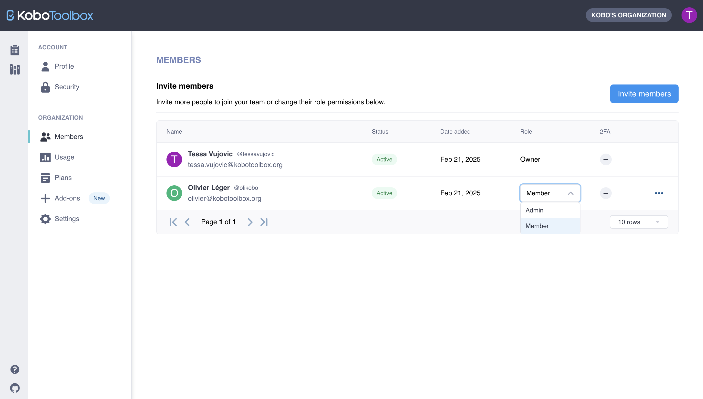

# Using the Team management feature
**Last updated:** <a href="https://github.com/kobotoolbox/docs/blob/7f800b38e7b07803e7abd456195dd5519b03240e/source/getting_started_organization_feature.md" class="reference">3 Oct 2025</a>

The new Team management feature enables you to centralize project and user management for improved oversight and collaboration across large, distributed teams. When you add users to your Team in KoboToolbox, you will have access to view and manage their projects. Users in your Team will have access to your Teams or Enterprise Plan usage quotas, and ownership of their projects will be transferred to your Team.

This article includes:

-   Project ownership, roles, and project views for Teams
-   How to invite users to join your Team and assign roles
-   How to remove users from your Team

  <b>Note:</b> This feature is currently only available to users on <a class="reference external" href="https://www.kobotoolbox.org/teams/">Teams</a> and <a class="reference external" href="https://www.kobotoolbox.org/enterprise/">Enterprise</a> Plans.

## Project ownership

A key aspect of the Team management feature is that project ownership is centralized within your Team.

-   Any new project created by a user in your Team is automatically owned by your Team.
-   When a user joins a Team in KoboToolbox, all projects owned by the user will be transferred to the Team.

By centralizing project ownership, the Team management feature gives you more oversight and effective team management.

  <b>Note:</b> This feature only affects project ownership. It does not affect project sharing permissions. Previously configured sharing permissions will not be affected when project ownership is transferred to a Team. If you have management permissions for a project, you will continue to have those permissions and will be able to share the project as usual. For more information, see <a class="reference external" href="https://support.kobotoolbox.org/managing_permissions.html">Sharing projects with user-level permissions</a>.

## Roles for Teams

There are three different roles for members in a Team, each with specific functions and capabilities.

1. **Owner:** The Owner can view and manage all projects and users in the Team as well as the Plan and Settings. Each Team in KoboToolbox can have only one Owner.
   - **Project views and management:** The Owner can view all the Team’s projects and has full project management permissions.
   - **Project ownership transfers:** The Owner can [transfer ownership](https://support.kobotoolbox.org/project_sharing_settings.html#transferring-ownership-of-a-project) of any of the Team’s projects to a user outside of the Team.
   - **User management:** The Owner can add or remove Team members and assign different roles.
   - **Plan and usage management:** The Owner can manage the Team’s Plan and Settings and view the Usage page.

2. **Admins:** Admins can view and manage all projects and users in the Team as well as the Settings. Each Team can have an unlimited number of Admins.
   - **Project views and management:** Admins can view all the Team’s projects and have full project management permissions.
   - **User management:** Admins can add or remove Team members and assign different roles.
   - **Plan and usage management:** Admins can manage the Team’s Settings and view the Usage page.

3. **Members:** Team Members continue to have full access to their KoboToolbox account with the benefit of their Team’s usage quotas. Members can create new projects and use all KoboToolbox features as before. Teams can have an unlimited number of Members.

  <b>Note:</b> Users can only belong to one Team at a time.

## Project views

The Team Owner and Admins have access to the **Team Projects** view and their own personal **My Projects** view.

-   By default, your **My Projects** view will be displayed. If you toggle the project view drop-down menu, you can switch to your **Team Projects** view.
-   The **Team Projects** view includes all the projects of all users in the Team.

Team Members only have access to their personal **My Projects** view, which includes projects they created and projects shared with them. They do not have access to the **Team Projects** view.

 

## Inviting users to join your Team

The Team Owner and Admins can invite users to join the Team, giving them access to the Team’s usage quotas and centralizing project management.

To invite users to join your Team in KoboToolbox:

1. Go to your **Account Settings**.
2. Navigate to the **Members** page under **TEAM**.
3. Click the **Invite members** button.
4. Enter the **username** or **email address** of the person you want to invite to your Team and assign them a **Role**. Click **Send invite**.
   - Invitations are not restricted to users with your organization’s email domain. You can invite users with any valid email address.
5. The user will receive an email invitation to join your Team. If the user doesn't already have a KoboToolbox account, they will be invited to create one.
6. When they accept the invitation, they will gain access to your Team based on the role assigned to them. All projects previously owned by the user will be transferred to your Team.

 

An invitation to join a Team will expire **14 days** after it is sent. You can **resend the invitation** directly in the <i class="k-icon k-icon-more"></i> **More actions** menu of the **Members** view. You can also **cancel an invitation** using the **Remove invitation** option in the <i class="k-icon k-icon-more"></i> **More actions** menu.

 

  <b>Note:</b> If you have existing projects that you do not want to transfer ownership of to your Team, we recommend that you create a separate account and transfer ownership of those projects to the new account before accepting the invitation to join the Team.

## Assigning and managing roles

The Team Owner and Admins can assign and change the roles of users in their Team in the **Members** view.

-   When you change the role of a **Member** to an **Admin**, you will grant them access to the Team Projects view as well as project and role management permissions. You will also grant them access to manage the Settings and view the Usage page.

## Removing a user from your Team

The Team Owner and Admins can remove users from the Team. When a user is removed from your Team, they will no longer have access to projects owned by the Team or the Team’s usage quotas.

To remove a user from your Team:

1. Go to your **Account Settings**.
2. Navigate to the **Members** page under **TEAM**.
3. Click the <i class="k-icon k-icon-more"></i> **More actions** icon for the user you wish to remove.
4. Select **Remove**.
5. Confirm and complete the action by clicking **Remove member**.

 

## Transferring ownership of your Team

Each Team in KoboToolbox can have only one Owner. The Owner was previously determined by your organization when they subscribed for your plan.

To transfer ownership of your Team to another user, [please contact our support team](support@kobotoolbox.org).
