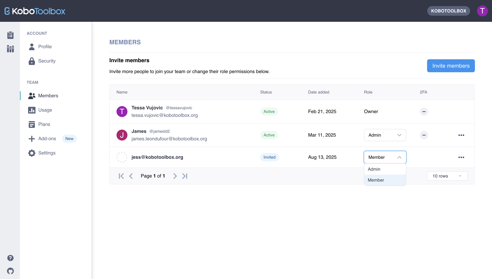

# Getting started with the Organizations feature
**Last updated:** <a href="https://github.com/kobotoolbox/docs/blob/bae58ce71e3735858a2cfa4da12605fd65364899/source/getting_started_organization_feature.md" class="reference">26 May 2025</a>

The new Organizations feature enables you to centralize project and user management for improved oversight and collaboration across teams. When you add users to an Organization in KoboToolbox, you will have access to view and manage their projects. Users in your Organization will have access to your Teams or Enterprise Plan usage quotas, and ownership of their projects will be transferred to your Organization.

This article includes:

-   Project ownership, roles, and project views for Organizations
-   How to invite users to join your Organization and assign roles
-   How to remove users from your Organization

## Project ownership

A key aspect of the Organizations feature is that project ownership is centralized within the Organization.

-   Any new project created by a user in the Organization is automatically owned by the Organization.
-   When a user joins an Organization, all projects owned by the user will be transferred to the Organization.

By centralizing project ownership, the Organizations feature gives you more oversight and effective team management.

  <b>Note:</b> This feature only affects project ownership. It does not affect project sharing permissions. Previously configured sharing permissions will not be affected when project ownership is transferred to the Organization. If you have management permissions for a project, you will continue to have those permissions and will be able to share the project as usual. (See the support article on <a class="reference external" href="https://support.kobotoolbox.org/managing_permissions.html">project sharing permissions</a>).

## Organization roles

There are three types of roles within an Organization with specific functions and capabilities.

1. **Organization Owner:** The Owner can view and manage all projects and users in the Organization as well as the Plan and Settings. Each Organization can have only one Owner.
   - **Project views and management:** The Owner can view all the Organization’s projects and has full project management permissions.
   - **Project ownership transfers:** The Owner can transfer ownership of any of the Organization’s projects to a user outside of the Organization. (See the support article on [transferring project ownership](https://support.kobotoolbox.org/managing_permissions.html#transferring-ownership-of-a-project))
   - **Organization member management:** The Owner can add or remove Organization members and assign different roles.
   - **Plan and usage management:** The Owner can manage the Organization’s Plan and Settings and view the Usage page.

2. **Organization Admins:** Admins can view and manage all projects and users in the Organization as well as the Settings. Each Organization can have an unlimited number of Admins.
   - **Project views and management:** Admins can view all the Organization’s projects and have full project management permissions.
   - **Organization member management:** Admins can add or remove Organization members and assign different roles.
   - **Plan and usage management:** Admins can manage the Organization’s Settings and view the Usage page.

3. **Organization Members:** Organization Members continue to have full access to their KoboToolbox account with the benefit of their Organization’s usage quotas. Members can create new projects and use all KoboToolbox features as before. Organizations can have an unlimited number of Members.

  <b>Note:</b> Users can only belong to one Organization at a time.

## Project views

The Organization Owner and Admins have access to the Organization Projects view and their own personal My Projects view.

-   By default, your **My Projects** view will be displayed. If you toggle the project view drop-down menu, you can switch to your **Organization Projects** view.
-   The **Organization Projects** view includes all the projects of all users in the Organization.

Organization Members only have access to their personal My Projects view, which includes projects they created and projects shared with them. They do not have access to the Organization Projects view.

 

## Inviting users to join your Organization

The Organization Owner and Admins can invite users to join the Organization, giving them access to the Organization’s usage quotas and centralizing project management.

To invite users to join your Organization:

1. Go to your **Account Settings**.
2. Navigate to the **Members** page under **ORGANIZATION**.
3. Click the **Invite members** button.
4. Enter the **username** or **email address** of the person you want to invite to your Organization and assign them a **Role**. Click **Send invite**.
   - Invitations are not restricted to users with your organization’s email domain. You can invite users with any valid email address.
5. The user will receive an email invitation to join the Organization. If the user doesn't already have a KoboToolbox account, they will be invited to create one.
6. When they accept the invitation, they will gain access to the Organization based on the role assigned to them. All projects previously owned by the user will be transferred to the Organization.

 

An invitation to join an Organization will expire **14 days** after it is sent. You can **resend the invitation** directly in the <i class="k-icon k-icon-more"></i> **More actions** menu of the **Members** view. You can also **cancel an invitation** using the **Remove invitation** option in the <i class="k-icon k-icon-more"></i> **More actions** menu.

 

  <b>Note:</b> If you have existing projects that you do not want to transfer ownership of to your Organization, we recommend that you create a separate account and transfer ownership of those projects to the new account before accepting the invitation to join the Organization.

## Assigning and managing roles

The Organization Owner and Admins can assign and change the roles of users in their Organization in the **Members** view.

-   When you change the role of a **Member** to an **Admin**, you will grant them access to the Organization Projects view as well as project and role management permissions. You will also grant them access to manage the Settings and view the Usage page.

## Removing a user from your Organization

The Organization Owner and Admins can remove users from the Organization. When a user is removed from your Organization, they will no longer have access to projects owned by the Organization or the Organization’s usage quotas.

To remove a user from your Organization:

1. Go to your **Account Settings**.
2. Navigate to the **Members** page under **ORGANIZATION**.
3. Click the <i class="k-icon k-icon-more"></i> **More actions** icon for the user you wish to remove.
4. Select **Remove**.
5. Confirm and complete the action by clicking **Remove member**.

 

## Transferring ownership of your Organization

Each Organization can have only one Owner. The Owner was previously determined by your organization when they subscribed for your plan.

To transfer ownership of your Organization to another user, [please contact our support team](support@kobotoolbox.org).
