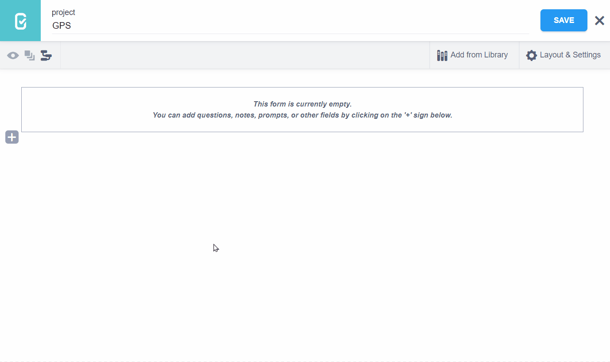
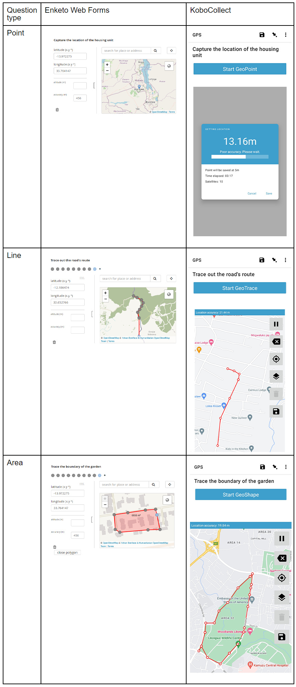
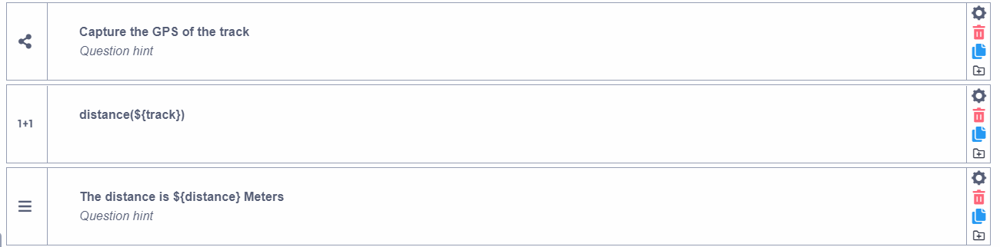
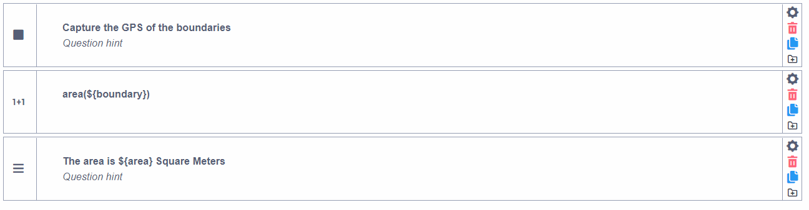

# GPS Question types

KoboToolbox allows you to collect GPS coordinates as part of your data
collection form. There are 3 GPS question types you can use, namely “Point”,
“Line” and “Area”.

Use a “Point” question type when you want to record a single GPS coordinate.
This is perfect for questions where you need to show the location of a single
feature on the earth’s surface such as a house, or a borehole.

Use a “Line” question type when you want to record multiple GPS points that form
a line. This question type is best for collecting location data on features such
as roads, tracks and rivers.

The “Area” question type is used for collecting multiple GPS points that form
the boundaries of a feature.

## How to set up the “Point”, “Line” and “Area” question types

### Setting up in FormBuilder

Adding GPS questions on the form is simple:

- In the KoboToolbox Formbuilder, click the <i class="k-icon k-icon-plus"></i>
  button to add a new question
- Type the question text, for example “Capture the GPS of the housing unit”,
  then click **ADD QUESTION** or press ENTER on your keyboard
- Choose the question type (e.g. Point)

### Setting up in xlsform

You can add point, line and area questions in XLSForm by using `geopoint`,
`geotrace` and `geoshape` question types respectively as in the following
example:

| type     | name   | label                                                       |
| :------- | :----- | :---------------------------------------------------------- |
| geopoint | point  | Collect the GPS coordinates of the house                    |
| geotrace | road   | Collect the GPS coordinates of the road                     |
| geoshape | garden | Collect the GPS coordinates of the boundaries of the garden |
| survey   |

## Appearance of “Point”, “Line” and “Area” question types in web forms and KoboCollect

### Default appearance

## Collecting GPS points in the background

Besides adding GPS questions on the form, you can also enable the ability to
collect GPS coordinates in the background as data is being collected. This is
possible by turning on the “Audit” option in the Form Builder (Layout & Settings
-> Meta questions) or by adding the `audit` meta question to your XLSForm. Learn
more about how to do this [here](audit_logging.md).

## Calculating distance and area with “Line” and “Area” question types

As you collect your GPS data, you might need to calculate the distance and area
from your “Line” and “Area” questions.

### Calculating distance from “Line” questions

To calculate the distance from a “Line” question type in the formbuilder, use
the "Calculate" question type and the `distance()` function as shown below:

<section class="note">

In the example above, the question “Capture the GPS of the track” has been added
as a “Line” question type. The “Data Column Name” in the question settings has
been changed to “track”.

The question <code>distance(${track})</code> has been added as a “Calculate”
question. Its Data Column Name has been changed to “distance”. The distance from
the calculation will be in Meters.

The “Note” question is optional and has been added with the purpose of
displaying the calculated distance on the form.

</section>

In XLSForm, you can do the same as follows:

| type      | name             | label                              | calculation        |
| :-------- | :--------------- | :--------------------------------- | :----------------- |
| geotrace  | track            | Capture the GPS of the track       |                    |
| calculate | distance         |                                    | distance(${track}) |
| note      | display_distance | The distance is ${distance} Meters |                    |
| survey    |

### Calculating area from “Area” questions

You can calculate the area from an “Area” question type using the "Calculate"
question type and the `area()` function in the formbuilder as shown below:

<section class="note">

In the example above, the question “Capture the GPS of the boundaries” has been
added as an “Area” question type. The “Data Column Name” in the question
settings has been changed to “boundary”.

The question <code>area(${boundary})</code> has been added as a “Calculate”
question type. Its Data Column Name has been changed to “area”. The area from
the calculation will be in square meters.

The “Note” question is optional and has been added with the purpose of
displaying the calculated area on the form.

</section>

In XLSForm, you can do the same, as follows:

| type      | name         | label                                 | calculation       |
| :-------- | :----------- | :------------------------------------ | :---------------- |
| geoshape  | boundary     | Capture the GPS of the boundaries     |
| calculate | area         |                                       | area(${boundary}) |
| note      | display_area | The distance is ${area} Square Meters |                   |
| survey    |

  Download an XLSForm with examples from this article
  <a
    download
    class="reference"
    href="./_static/files/gps_questions/gps_questions.xlsx"
    >here</a
  >.

