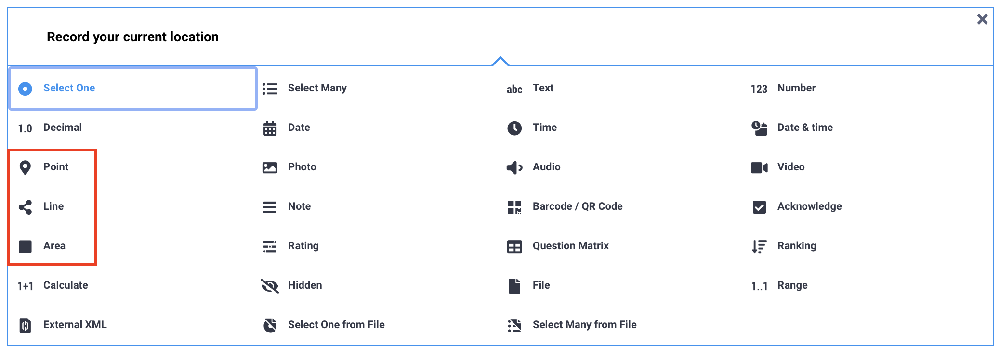
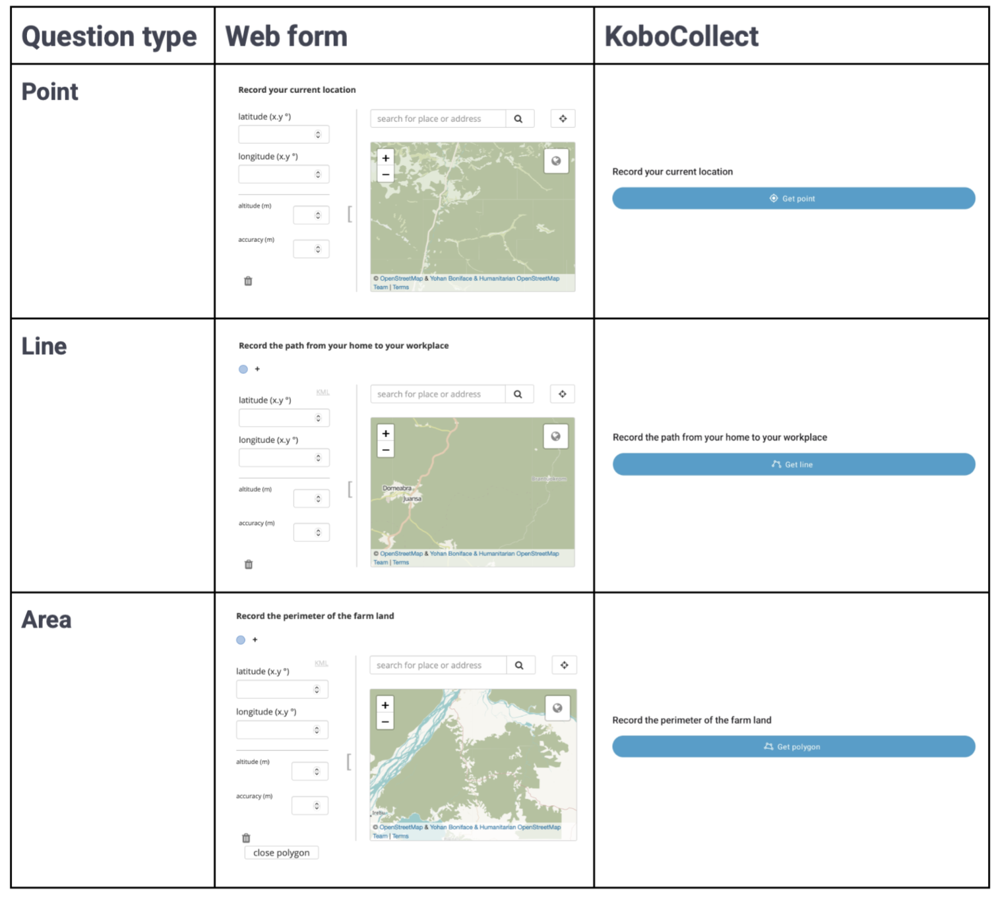
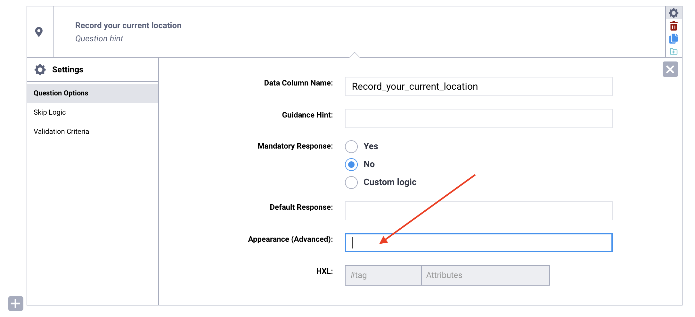
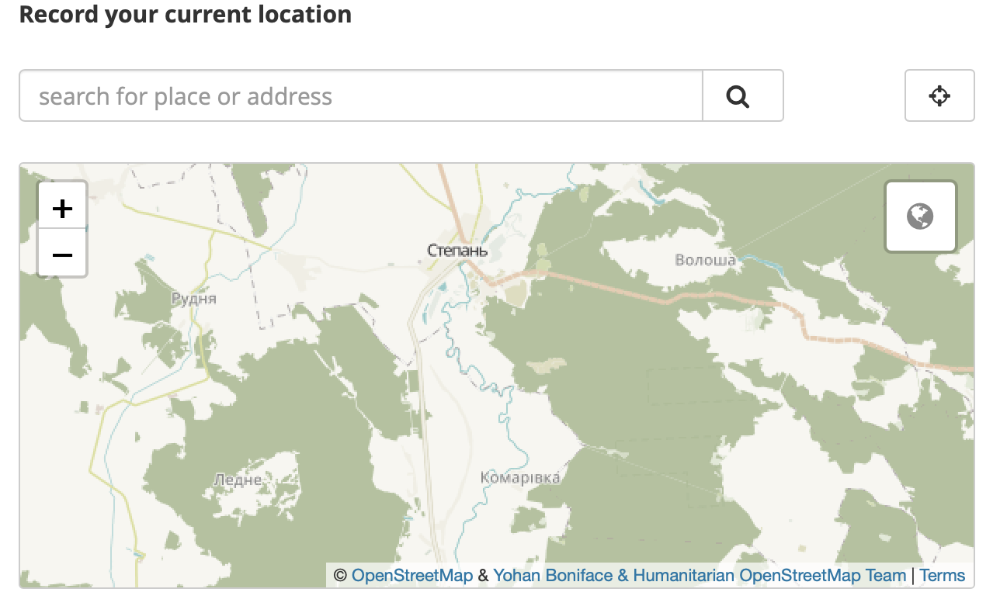

# GPS questions in KoboToolbox
**Last updated:** <a href="https://github.com/kobotoolbox/docs/blob/04d161b3ce12a8f18d4145536cbba7c2fa3149ae/source/gps_questions.md" class="reference">20 Mar 2026</a>

GPS questions are used to **collect geographic coordinates and spatial data** during data collection. They allow you to capture precise locations, map routes, or define areas directly within your form. These question types are useful for activities such as mapping infrastructure, tracking field visits, monitoring environmental sites, or recording service locations.

This article explains the available GPS question types in the Formbuilder, how to add and configure them, the differences in behavior between Enketo web forms and KoboCollect, and the advanced appearance options available for collecting location data.

<strong>Note:</strong> Recording GPS coordinates does not require an internet connection and is compatible with offline data collection.

## GPS question types

The following question types are available in the Formbuilder for respondents to record GPS data:

| Question type | Description |
|:---|:---|
| <i class="k-icon-qt-point"></i> Point | Collects a single geographic location, such as the coordinates of a specific school, clinic, or house. |
| <i class="k-icon-qt-line"></i> Line | Records multiple GPS points that form a line, for example to track a path, trace a route, or map a drain. |
| <i class="k-icon-qt-area"></i> Area | Collects points that form an enclosed area, such as a plot of land or a field. |

<strong>Note:</strong> You can also collect location automatically using <a href="https://support.kobotoolbox.org/form_meta.html">metadata questions</a>. The <strong>start geopoint early</strong> and <strong>audit</strong> options are available in the Formbuilder, while <code>background-geopoint</code> is available only when building your form <a href="https://support.kobotoolbox.org/metadata_xls.html">in XLSForm</a>.

## Adding a GPS question in the Formbuilder

To add a GPS question to your form:
1. Click the <i class="k-icon-plus"></i> button. 
2. Enter your question label.
3. Click **+ ADD QUESTION.**
4. Choose the appropriate question type.

## Appearances of GPS questions

The table below displays the default appearances for GPS questions:

In **Enketo web forms**, respondents can select a location directly on the map, search for an address, or manually enter GPS coordinates.

In **KoboCollect**, the device’s current location is recorded automatically, and manual selection or coordinate entry is not available by default.

<strong>Note:</strong> To learn more about GPS data collection behaviors in Enketo and KoboCollect, see <a href="https://support.kobotoolbox.org/collect_gps.html">Collecting GPS data</a>.

### Advanced appearances 

You can apply advanced appearances to GPS questions to modify how they display and behave in your form.

To add an advanced appearance:
1. Open the question settings by clicking <i class="k-icon-settings"></i> **Settings** to the right of the question. This will take you to the **Question Options** tab.
2. In **Appearance (Advanced)**, type the name of the appearance in the text box, exactly as written below.

The following advanced appearances are available for GPS questions:

| Appearance | Description | Compatibility |
|:---|:---|:---|
| <code>maps</code> | Displays a map for users to visualize the location that is being automatically recorded (<strong>Point</strong> only). | KoboCollect only (included in default Enketo appearance) |
| <code>placement-map</code> | Allows for manual selection of a location on a map (<strong>Point</strong> only). | KoboCollect only (included in default Enketo appearance) |
| <code>hide-input</code> | Shows a larger map and hides other input fields (latitude, longitude, altitude, accuracy).  | Enketo only |

<strong>Note:</strong> If you are using Enketo and want to record GPS location automatically without allowing respondents to manually select or enter coordinates, consider using the <code>background-geopoint</code> <a href="https://support.kobotoolbox.org/metadata_xls.html">metadata question</a>.

