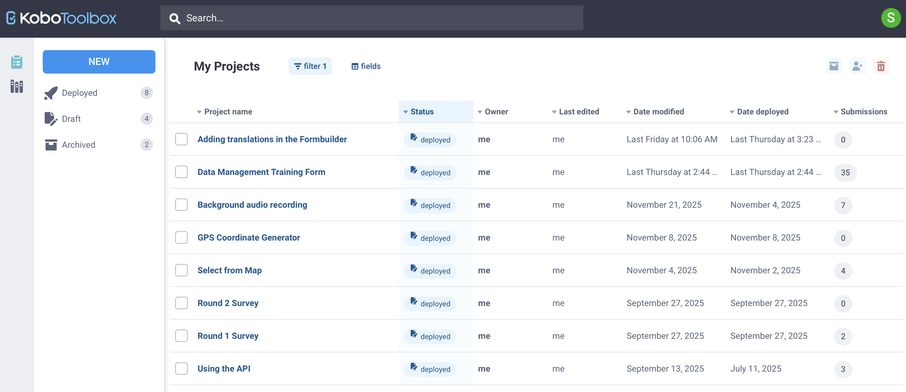
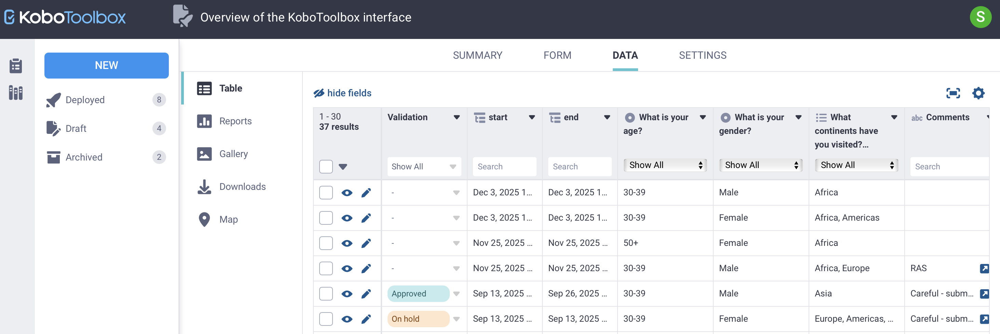
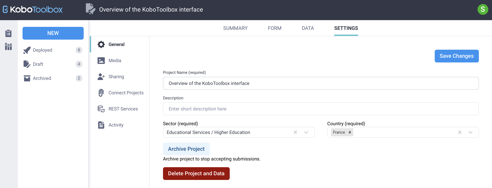

# Overview of the KoboToolbox interface
**Last updated:** <a href="https://github.com/kobotoolbox/docs/blob/d9b44de6b0f7192771a9f7bf86edf271321f398b/source/kobotoolbox_interface.md" class="reference">27 Jan 2026</a>

This article provides an overview of the KoboToolbox interface and explains how to navigate the main pages where you create forms, manage data, and configure project settings. It introduces the **Projects home page** and the four main pages within each project: **SUMMARY**, **FORM**, **DATA**, and **SETTINGS**.

## Navigating the Projects home page
When you sign in to your KoboToolbox account, you land on the **Projects home page**. The **Projects home page** displays all projects that you own or that have been shared with your account. From there, you can also access key features and account-level settings.

The **Projects home page** includes the following:
* A list of all projects owned by or shared with your account.
* Access to the <i class="k-icon-library"></i> **Library** from the left side menu.
* The **NEW** button to create a new project.
* Tabs to view <i class="k-icon-deploy"></i> **Deployed**, <i class="k-icon-drafts"></i> **Draft**, or <i class="k-icon-archived"></i> **Archived** forms.
* A <i class="k-icon-search"></i> **Search** bar to find projects in your project list.
* A **profile icon** in the top right corner to access [account settings](https://support.kobotoolbox.org/account_settings.html), change the interface language, or log out of your account.

  <strong>Note:</strong> From any page in your KoboToolbox account, click <i class="k-icon-help"></i> <strong>Help</strong> for quick links to the Help Center, Community Forum, KoboToolbox Academy, and to view in-app notifications. Click <i class="k-icon-logo-github"></i> <strong>Source</strong> to access the KoboToolbox source code.

## Working within a project
To open a project, click on its name in the **My Projects** table. Each project contains four main pages: **SUMMARY**, **FORM**, **DATA**, and **SETTINGS**.

### SUMMARY page
The **SUMMARY** page provides an overview of your project, including:
* **Project information** such as the description, status, owner, and dates last modified and deployed.
* **Submission statistics** for the past seven days, 31 days, three months, 12 months, and the total number of submissions.
* **Quick links** to key project functionalities (e.g., edit or preview form).
* **Sharing permissions** and users the project is shared with.

### FORM page
The **FORM** page contains tools for building, updating, and deploying your project. It is divided into sections.

In the **Current version** section, you can:
* <i class="k-icon-view"></i> **Preview** the current form version.
* <i class="k-icon-edit"></i> **Edit** the form in the [Formbuilder](https://support.kobotoolbox.org/formbuilder.html).
* <i class="k-icon-replace"></i> **Replace** the form with an [XLSForm](https://support.kobotoolbox.org/getting_started_xlsform.html) or [template](https://support.kobotoolbox.org/question_library.html).
* Open the <i class="k-icon-more"></i> **More actions** menu to download the XLSForm or XML file, [share the project](https://support.kobotoolbox.org/managing_permissions.html), clone the project, or create a template.
* <i class="k-icon-language"></i> **Manage translations** for forms with [multiple languages](https://support.kobotoolbox.org/language_dashboard.html).
* **DEPLOY** or **REDEPLOY** the form.

In the **Form history** section, you can:
* View past versions of the form and their deployment dates.
* Clone previous form versions.

In the **Collect data** section, you can:
* Choose a [data collection method](https://support.kobotoolbox.org/data_through_webforms.html).
* Click **Copy** to copy the link or **Open** to open the form in your browser.
* Allow submissions [without requiring a username and password](https://support.kobotoolbox.org/project_sharing_settings.html#allowing-submissions-without-authentication).

### DATA page
The **DATA** page provides access to all collected data and includes a data <i class="k-icon-table"></i> **Table**, custom <i class="k-icon-reports"></i> **Reports**, a photo <i class="k-icon-gallery"></i> **Gallery**, a <i class="k-icon-download"></i> **Download** tab to export data, and a <i class="k-icon-map-view"></i> **Map** view for GPS data.

  To learn more about managing your data in KoboToolbox, see <a href="https://support.kobotoolbox.org/viewing_validating_data.html">Viewing and validating your data</a> and <a href="https://support.kobotoolbox.org/editing_deleting_data.html">Editing and deleting your data</a>. 

### SETTINGS page
The **SETTINGS** page contains configuration options for your project. It is divided into multiple tabs:
* <i class="k-icon-settings"></i> **General:** Update the project name and description, [archive](https://support.kobotoolbox.org/managing_projects.html#archiving-and-deleting-projects) or delete the project.
* <i class="k-icon-gallery"></i> **Media:** Upload and manage [project media files](https://support.kobotoolbox.org/upload_media.html).
* <i class="k-icon-user-share"></i> **Sharing:** Update [sharing permissions](https://support.kobotoolbox.org/managing_permissions.html) for other users.
* <i class="k-icon-attach"></i> **Connect Projects:** Set up connections for [dynamic data attachments](https://support.kobotoolbox.org/dynamic_data_attachment.html).
* <i class="k-icon-data-sync"></i> **REST Services:** Configure [REST services](https://support.kobotoolbox.org/rest_services.html) to automatically send submissions to third-party applications.
* <i class="k-icon-document"></i> **Activity:** View and export the [project history logs](https://support.kobotoolbox.org/activity_logs.html#project-history-logs), including changes made by other users.

  To learn more about managing projects, see <a href="https://support.kobotoolbox.org/managing_projects.html">Managing projects in KoboToolbox</a>. 

