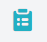
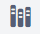
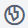

# The KoBoToolbox Interface

This article will walk you through the Kobotoolbox interface, helping you get familiar with the different elements.

## Basic elements of the KoBoToolbox interface

By default, when you log in to your Kobotoolbox account, you will be taken to the Projects screen.

You can switch between the   Projects interface and the    Library interface using the buttons on the top left of the screen.

### The search bar

Depending on whether you are on the Projects interface or the Library interface, the search bar at the top allows you to quickly filter the projects or library items being displayed.

### User profile options

On the far right of the search bar is your user account avatar. Clicking it opens up a drop-down menu with options to change your account settings (such as updating your basic information and changing your password), interface language, and to log out.

### Draft, deployed and archived projects

On the projects interface, your projects are organized into 3 categories.

1. **Draft projects** are forms that have been created but not deployed. These forms will not appear on KoboCollect for data entry until they have been deployed
2. When a form has been deployed, it will appear under **”Deployed”**. These forms are available for data collection through both KoboCollect and Enketo web forms
3. When data collection is complete, you can archive the project. These projects will appear under **“Archived”**.

### Project actions

Move your mouse pointer over the name of a project in the Projects screen to reveal the following buttons:

 **Edit**. Takes you to the formbuilder to edit the form
  
 **Add Tags to the project**. Tags help making it easier to find projects in the project list when you search using the search bar
  
 **Share**. Lets you share the project with other Kobotoolbox users and customize permissions
  
 **Clone**. Let’s you make a copy of the existing project
  
 **Opens up more project actions**
When you click the   More button, you have access to the following actions:
  
 **Replace form**. Allows you to replace the current form with an XLSForm
  
 **Manage translations**. Takes you to the **Manage Languages** screen where you can define languages and add translations for the form
  
 **Download XLS**. Generates an XLSform file from the current project. This allows you to continue editing your form using Excel and easily collaborate with others.
  
 **Download XML**. Generates an XML file from the current project. For advanced users, this let’s you explore the form structure that may be needed when integrating with other applications, or to make advanced changes to the form.

 **Archive**. Marks your deployed project as archived. This turns off the ability to send more submissions to the project

 **Create template**. Saves the form as a template in the library module
  
 **Delete**. Allows you to delete the project and the data submitted to it

### Help, legacy interface and source code

On the bottom left of the interface, you can access support options including links to the support articles site and the community forum by clicking on the    Help button.

Clicking the   Projects (legacy) button takes you to the now deprecated KoboCat Projects interface.

If you are interested in contributing to the development of Kobotoolbox or would like to deploy your own version of the software, you can click on the  source button to visit the Github page.