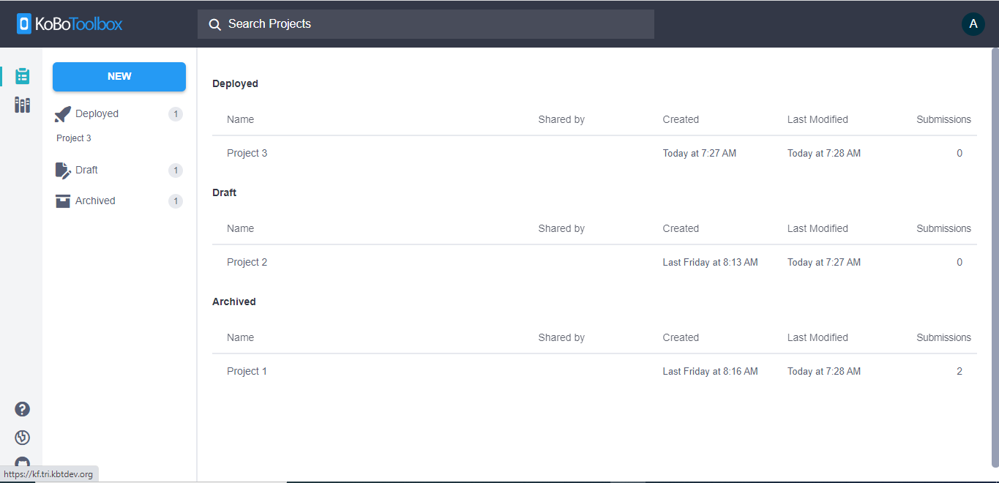
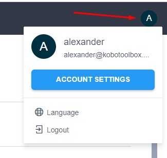

# The KoboToolbox Interface
**Last updated:** <a href="https://github.com/kobotoolbox/docs/blob/511ea4cb3c698a4b45e7c2b4efd1af4e356e811f/source/kobotoolbox_interface.md" class="reference">15 Feb 2022</a>

This article will walk you through the **KoboToolbox** interface, helping you
get familiar with the different elements.

By default, when you log in to your **KoboToolbox** account, you will be taken
to the **Projects** screen.

You can switch between the <i class="k-icon k-icon-projects"></i> **Projects**
and <i class="k-icon k-icon-library"></i> **Library** sections using the buttons
on the top left of the screen.

## Search bar

Depending on whether you are on the **Projects** or **Library** section, the
search bar at the top allows you to quickly filter the items displayed.

## User profile options

On the far right of the interface is your user account avatar. Clicking it opens
up a drop-down menu with options to change your account settings (such as
updating your basic information and changing your password), interface language,
and to log out.

## Draft, deployed and archived projects

In the **Projects** section of the interface, your individual projects are
organized into 3 categories:

1. **Draft** projects are forms that have been created but not deployed. These
   forms will not appear on **KoboCollect** for data entry until they have been
   deployed.
2. When a form has been deployed, it will appear under **Deployed**. These forms
   are available for data collection through both **KoboCollect** and **Enketo**
   web forms.
3. When data collection is complete, you can archive the project. These projects
   will appear under **Archived**.

## Project actions

Hover your mouse pointer over an item in the **Projects** screen to reveal the
following buttons:

| Button                                                        | Action                                                                                       |
| ------------------------------------------------------------- | -------------------------------------------------------------------------------------------- |
| <i class="k-icon k-icon-edit"></i> **Edit**                   | Go to the formbuilder to edit the form                                                       |
| <i class="k-icon k-icon-tag"></i> **Add Tags to the project** | Create tags to make it easier to find projects in the project list when using the search bar |
| <i class="k-icon k-icon-user-share"></i> **Share**            | Share the project with other **KoboToolbox** users and customize permissions                 |
| <i class="k-icon k-icon-clone"></i> **Clone**                 | Make a copy of the existing project                                                          |
| <i class="k-icon k-icon-more-vertical"></i> **More actions**  | Open up more project actions                                                                 |

When you click the <i class="k-icon k-icon-more-vertical"></i> **More actions**
button, you have access to the following options:

| Button                                                          | Action                                                                                                                                                                                                           |
| --------------------------------------------------------------- | ---------------------------------------------------------------------------------------------------------------------------------------------------------------------------------------------------------------- |
| <i class="k-icon k-icon-replace"></i> **Replace form**          | Replace the current form with an **XLSForm**                                                                                                                                                                     |
| <i class="k-icon k-icon-globe-alt"></i> **Manage translations** | Go to the **Manage Languages** screen where you can define languages and add translations for the form                                                                                                           |
| <i class="k-icon k-icon-xls-file"></i> **Download XLS**         | Generate an XLS file in the **XLSForm** standard from the current project. This allows you to continue editing your form using **Excel** and easily collaborate with others                                      |
| <i class="k-icon k-icon-xml-file"></i> **Download XML**         | Generate an XML file from the current project. For advanced users, this lets you explore the form structure that may be needed when integrating with other applications, or to make advanced changes to the form |
| <i class="k-icon k-icon-archived"></i> **Archive**              | Mark your deployed project as archived. This turns off the ability to send more submissions to the project                                                                                                       |
| <i class="k-icon k-icon-template"></i> **Create template**      | Save the form as a template in the library section                                                                                                                                                               |
| <i class="k-icon k-icon-trash"></i> **Delete**                  | Delete the project and the data submitted to it                                                                                                                                                                  |

## Help, legacy interface and source code

On the bottom left of the interface, you can access support options including
links to the support articles site and the community forum by clicking on the <i
class="k-icon k-icon-help"></i> **Help** button.

Clicking the <i class="k-icon k-icon-globe"></i> **Projects (legacy)** button
takes you to the **KoboToolbox** legacy interface.

If you are interested in contributing to the development of **KoboToolbox** or
in viewing the source code, you can click on the <i class="k-icon
k-icon-logo-github"></i> **Source** button to visit our GitHub page.
