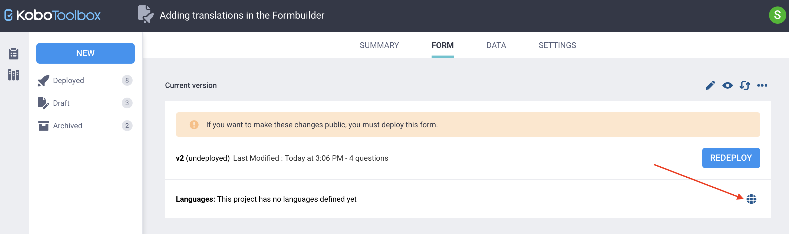
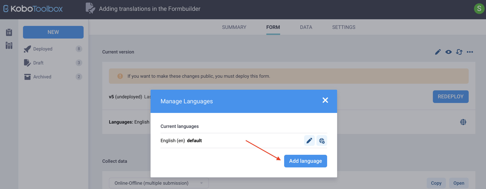

# Adding translations in KoboToolbox
**Last updated:** <a href="https://github.com/kobotoolbox/docs/blob/a412eff1342fa59da1fe2ffe1e10c1829b2e5e94/source/language_dashboard.md" class="reference">1 Nov 2022</a>

<iframe src="https://www.youtube.com/embed/3O2K78F7DCA?si=lt-ZlSRoAjFuSMl1" style="width: 100%; aspect-ratio: 16 / 9; height: auto; border: 0;" title="YouTube video player" frameborder="0" allow="accelerometer; autoplay; clipboard-write; encrypted-media; gyroscope; picture-in-picture; web-share" allowfullscreen></iframe>

Adding translations to a form allows users to **choose their preferred language** during data collection without creating separate forms. Any number of translations can be added. Both [KoboCollect](https://support.kobotoolbox.org/kobocollect_on_android_latest.html) and [Enketo web forms](https://support.kobotoolbox.org/enketo.html) support form translations.

You can add translations to your form directly in the KoboToolbox interface or by using [XLSForm](https://support.kobotoolbox.org/language_xls.html). KoboToolbox offers an **intuitive interface** that requires no technical expertise, and allows you to easily add multiple translations to your forms. This approach is useful when working with a small number of questions or when you want to make quick adjustments.

   <strong>Note:</strong> For larger or more complex multilingual forms, XLSForm is often the more efficient option. It allows you to manage translations in bulk, which can save time when working with many questions or multiple languages. To learn more about setting up translations in XLSForm, see <a href="https://support.kobotoolbox.org/language_xls.html">Adding translations in XLSForm</a>.

This article focuses on adding translations from the KoboToolbox platform, and covers the following topics:
- Setting your form’s default language
- Adding languages and translations
- Changing the default language

    To learn more about collecting and managing data from translated forms, see <a href="https://support.kobotoolbox.org/collecting_data_multiple_languages.html">Collecting data in multiple languages</a>.

## Setting the default language 

A form’s default language is usually the language the questionnaire is designed in, and the language the form opens in by default during data collection. A default language only needs to be set if additional translations are added, and is not required when the form is available in only one language.

To set the default language:

1. Create your form in the default language. 
2. Once your form has been created, go to the **FORM** page of your project.
3. Under the **DEPLOY** or **REDEPLOY** button, click <i class="k-icon-language"></i> **Manage translations.**
4. Add the language name (e.g., “English”) and language code (e.g., “en”) for your default language.

    <strong>Note:</strong> Language codes can be found in the <a href="https://www.iana.org/assignments/language-subtag-registry/language-subtag-registry">IANA language subtag registry</a>. On the IANA website, the <strong>Description</strong> refers to the language name, and the <strong>Subtag</strong> refers to the language code (e.g., <strong>Description</strong>: French, <strong>Subtag</strong>: fr).

## Adding languages and translations

Once you have set your default language, you can add more languages and translate your form text:

1. In the <i class="k-icon-language"></i> **Manage translations** window, click **Add language.**
2. Enter the language name and code, then click **Add.**
3. Next to the language you added, click <i class="k-icon-language-settings"></i> **Update translations.**
    - A table will appear with the questions, hints, and choices from your form. Each language has its own translation table.
4. Enter the translations and click **Save Changes.**
    - If you omit text for a translated element, it will appear as a blank field in the form.
5. Close the window and preview your form to verify the translations. 
6. Deploy or redeploy your form to apply the changes.

You can return to this window at any time to update existing translations or add new ones. Remember to update translations whenever you add new questions or choice options.

    <strong>Note:</strong> This method allows you to translate questions, choices, and hints. To translate guidance hints, constraint messages, required messages, and other advanced elements, use <a href="https://support.kobotoolbox.org/language_xls.html">XLSForm</a>.

## Changing the default language 

To change the form’s default language:

1. On the **FORM** page, click <i class="k-icon-language"></i> **Manage translations**.
2. Click <i class="k-icon-language-default"></i> **Make default** next to the language you want to set as the default.

## Troubleshooting

  
<strong>Error loading survey: There is an unnamed translation in your form definition</strong>

  This error means that at least one element in your form (for example, a hint or message) is not assigned to a language.
  
To fix this, two options are available:

<ul>
<li>Download your form as an <a href="https://support.kobotoolbox.org/xlsform_with_kobotoolbox.html">XLSForm</a>, review all elements, find the unassigned element, and <a href="https://support.kobotoolbox.org/language_xls.html">correct it</a>.</li>
<li>Or, go to <i class="k-icon-language"></i> <strong>Manage translations</strong> and delete the unnamed language. This removes the problematic element from your form entirely (it cannot be recovered).</li> 
</ul>
 
To help prevent this issue, always redeploy your form after adding or updating languages.

 

  
<strong>Issue displaying right-to-left scripts</strong>

  When adding a language that uses a right-to-left (RTL) script, such as Arabic, Hebrew, or Urdu, it is important to use the <strong>correct language code</strong> and to ensure the <strong>first visible text in the translation</strong> (e.g., a question label, hint, or note) is written in the RTL language. This will ensure that the form's layout does not default to left-to-right (LTR) formatting.

