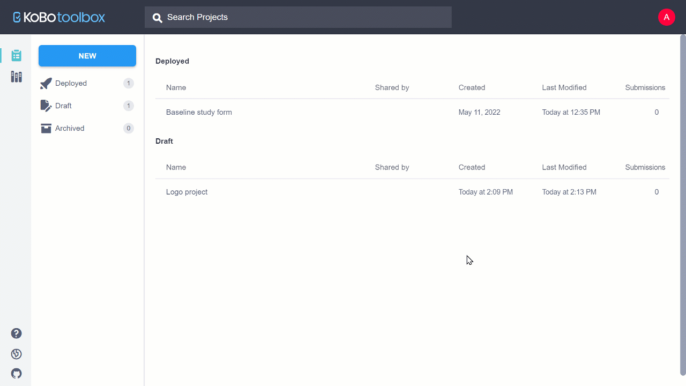

# Sharing Your Project and Managing Permissions

KoboToolbox allows you to give different levels of access to different users by
setting flexible permission levels within each project. While most users may
only need to manage a single account to access, enter and review data for a
given project, sometimes more complex scenarios require multiple users with
different levels of access.

For example, you can share a project with some users and only allow them to
submit data to the project through their account, and adjust the settings such
that others can only review the submitted data.

This article describes how you can grant permissions for other KoboToolbox users
to collaborate on your projects.

## Requiring passwords for accessing Enketo data entry forms

By default, KoboToolbox only requires a username and password for accessing data
and managing your projects. When a project has been deployed, the Enketo data
entry form can be accessed by anyone who knows its URL. In this case, any
individual with access to the form URL can send submissions to the project.

In some cases, you may wish to limit access to your data entry forms to require
that individuals be logged in to their KoboToolbox user accounts. To enable the
user login requirement to access your forms:

- Go to **ACCOUNT SETTINGS** inside your KoboToolbox account.
- Check the '**Require authentication to see forms and submit data**' box.

Currently requiring authentication can only be set globally for all the
projects in your account and not just for individual projects. ## Sharing a
project with other users and setting their permissions

The following steps show how you can share a project with other KoboToolbox
users and control which users can view, share, or otherwise edit your projects
(see full list of available permissions below).

- Go to the **Sharing** tab in the **SETTINGS** page in your data collection
  project
- Enter the username of the user who you would like to share the form with
- Select the permission level checkbox.
- Click **GRANT PERMISSIONS**.

### Available permissions:

- View form
- Edit form
- View submissions
- Add submissions
- Edit submissions
- Validate submissions
- Delete submissions
- Manage project

Some permissions automatically grant other permissions. For example, if a user
is granted 'Add submissions' they will also be able to 'View form', as they will
need to see the form in order to submit responses

To copy team permissions from a previous project to this new project, click on
**Copy team from another project** located at the bottom of the page. Clicking
the link will overwrite any existing settings already defined in the current
project.

## Assigning 'Add submissions' rights for specific users

If you have enumerators in the field collecting and submitting data, for privacy
reasons you might want to ensure they are not able to see the data that has been
submitted (which could be accessed by logging in using the username and password
in the KoboCollect app).

In this case, instead of configuring the data collection devices with your
username and password, you can instead create KoboToolbox accounts for each of
your enumerators, and share the form with them with limited permissions (“Add
Submissions” permission only, for example).

The following steps describe how you can achieve this: In KoboToolbox

- Create an account for each of the enumerators (these accounts must be on the
  same server as the account that has the data collection form)
- In your account, share the data collection project with the enumerators
  accounts using the steps described above - only giving them limited
  permissions (such as “Add Submissions).

In KoboCollect:

- On each device, configure KoboCollect using the username and password of the
  enumerator who will be using the device to collect data. You can learn more
  about how to configure KoboCollect by reading our article
  [here](kobocollect_on_android_latest)

## Advanced ‘View submissions’ permission settings

While sharing the project, you can also set permissions for a user to view only
data submitted by specific users or view data submitted only by themselves.
These are called row level permissions. This can be helpful in several
scenarios, for example the following:

- An organization implementing a project in collaboration with several partner
  organizations may want to give the partners access to only the data collected
  by them
- A researcher may want to allow each enumerator access to the data they
  collected and be able to make edits through the KoboToolbox online platform
- In an organization, there may be clear roles of data collectors who may only
  be allowed to submit data, data quality officers who may only be allowed to
  validate submissions, and data users who may be allowed to view reports and
  download the data To assign permissions based on specific users:
- Share the data collection project using the steps described above
- Choose from **View Submissions only from specific users**, **Edit Submissions
  only from specific users**, **Validate Submissions only from specific users**,
  or **Delete Submissions only from specific users**
- Type in the usernames of the account(s) the user you are sharing the project
  with can access, separated by commas (this can include themselves) You can
  read more about row level permissions [here](row_level_permissions.md).

## Removing shared projects from your account

If you wish to remove projects that were shared with your account by others,
follow these steps:

- On the project list, point your mouse on the project name and click the …
  **More action** button.
- Click **Remove shared form**.
- Click **REMOVE**.

## Making your project and data public

In addition to sharing your project with specific Kobo rs, you can also make
your form and/or form submissions public. To do this:

- Go to the **Sharing** tab in the **SETTINGS** page in your data collection
  project.
- Select the options **Anyone can view this form** and/or **Anyone can view
  submissions made to this form**.

A URL will be displayed, which you can share with anyone to provide access to
the form and/or the data without logging in. Anyone with the link may be able
to:

- Preview the form
- Download the form as XLS or XML
- View the data in the **Table** view
- View and print **Reports**
- View the **Gallery**
- Download the data
- View the data in the **Map** view

Below is a video showing what parts of the project the public will have access
to when they open the URL.

