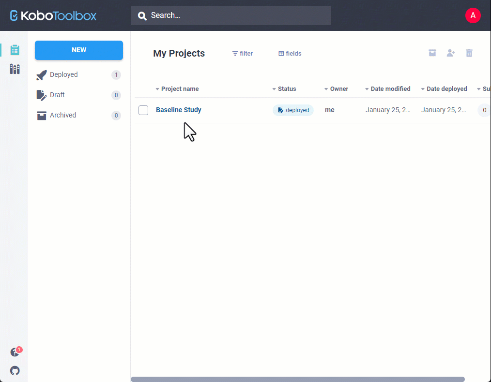
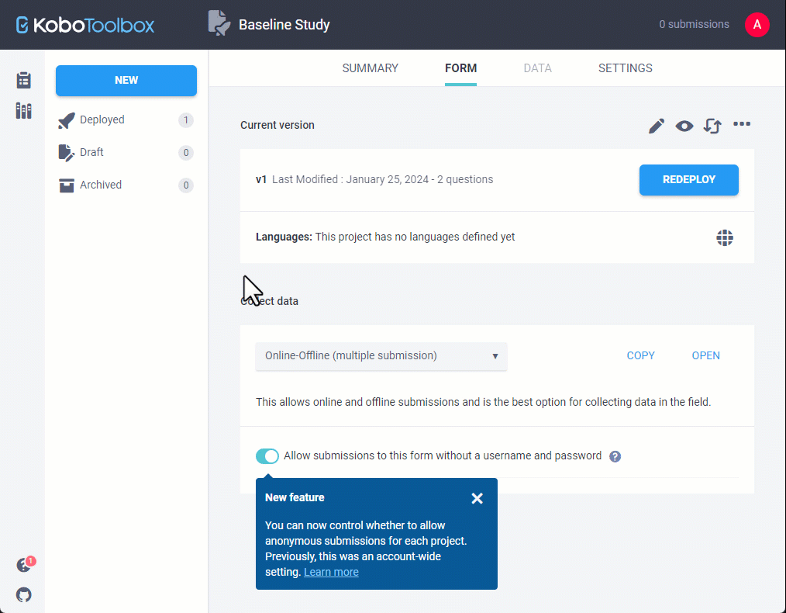
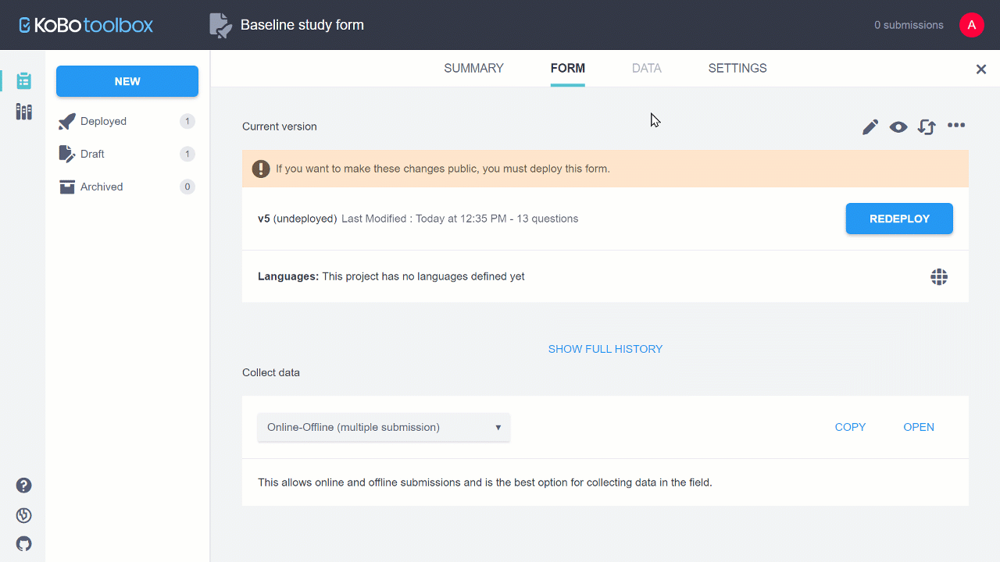
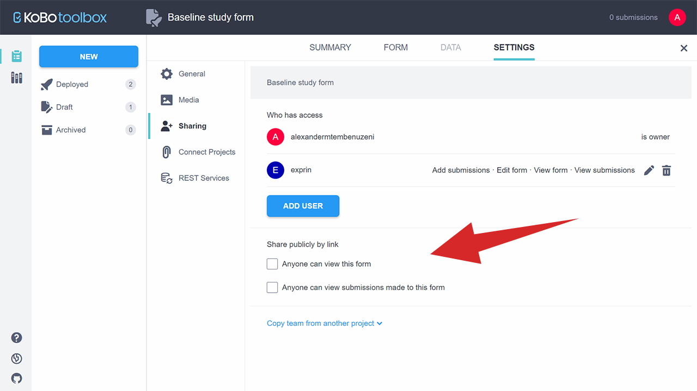
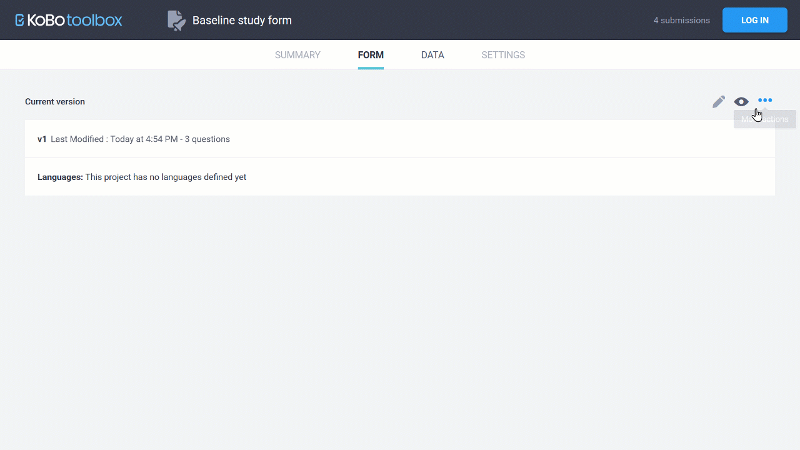

# Sharing Your Project and Managing Permissions
**Last updated:** <a href="https://github.com/kobotoolbox/docs/blob/51847e7dd985213319ff338e5dbd7075bbf64970/source/managing_permissions.md" class="reference">12 Feb 2024</a>

KoboToolbox allows you to give different levels of access to different users by
setting flexible permission levels within each project. While most users may
only need to manage a single account to access, enter and review data for a
given project, sometimes more complex scenarios require multiple users with
different levels of access.

For example, you can share a project with some users and only allow them to
submit data to the project through their account, and adjust the settings such
that others can only view or edit the submitted data.

This article describes how you can grant permissions for other KoboToolbox users
to collaborate on your projects.

## Requiring passwords for accessing Enketo web forms

By default, KoboToolbox requires a username and password for accessing data,
 managing your projects, and submitting data. When a new project has been deployed, the Enketo web
form will require authentication for an individual to be able to access the form and send submissions to the project.

In some cases, you may wish to enable data entry from anyone who knows the Enketo web form URL. In this case, any individual with access to the form URL can send submissions to the project, without them being required to be
logged into their KoboToolbox user accounts.

- Open the project in KoboToolbox, and go to the **FORM** section
- Below the Collect Data section, use the toggle button to enable "Allow submissions to this form without a username and password"

You can also make changes to this privacy feature by going to the **Sharing** tab in the **SETTINGS** page in your data collection project and toggling the default setting to enable “Allow submissions to this form without a username and password”, or when accessing your **Sharing Permissions**.

  Setting forms to require authentication is now available as a per-project setting. This privacy feature replaces the old account setting “Require authentication to see forms and submit data”. With this new update, new projects require authentication by default. Existing projects inherit your old account-level settings as they are at the time of this update. 

## Sharing a project with other users and setting their permissions

The following steps show how you can share a project with other KoboToolbox
users and control which users can view, share, or edit your form or submissions.

- Go to the **Sharing** tab in the **SETTINGS** page in your data collection
  project
- Enter the username of the user who you would like to share the form with
- Select the desired permission level
- Click **GRANT PERMISSIONS**

### Available permissions

- View form
- Edit form
- View submissions
- Add submissions
- Edit submissions
- Validate submissions
- Delete submissions
- Manage project

Some permissions automatically grant other permissions. For example, if a user
is granted "Add submissions" they will also be granted "View form."

## Assigning "Add submissions" rights for specific users

If you have enumerators in the field collecting data, you might want to ensure
they are not able to see any of the data that has been submitted.

In this case, instead of configuring KoboCollect with a single account's
username and password, you can create separate accounts for each enumerator, and
share the form with limited permissions.

In KoboToolbox:

- Create an all enumerator accounts on the same server
- Share the project with each enumerator account using the steps described
  above, only giving them limited permissions (such as "Add Submissions").

In KoboCollect:

- On each device, configure KoboCollect using the username and password of the
  enumerator who will be using it. You can learn more about how to configure
  KoboCollect [here](kobocollect_on_android_latest.md).

## Row-level permissions for users

You can also set [row-level permissions](row_level_permissions.md) for users
which can be helpful in several scenarios:

- An organization implementing a project in collaboration with several partner
  organizations may want to give the partners access to only the data collected
  by them.
- A researcher may want to allow each enumerator access to the data _only_ they
  collected and be able to make edits.
- In an organization, there may be clear roles of data collectors who may only
  be allowed to submit data, data quality officers who may only be allowed to
  view and validate submissions, and users who may be allowed to view reports
  and download the data.

Setting row-level permissions:

- Share the data collection project using the steps described above
- Choose from **View Submissions only from specific users**, **Edit Submissions
  only from specific users**, **Validate Submissions only from specific users**,
  or **Delete Submissions only from specific users**
- Add a comma-separated list of usernames with whom you want to share the
  project

## Copy permissions from another project

To copy team permissions from a another project, click on "Copy team from
another project" located at the bottom of the page and select the project to
copy from.

  This will overwrite any existing sharing settings already defined on the
  current project.

## Removing shared projects from your account

To remove projects that were shared with your account by others:

- On the project list, point your mouse on the project name and click the
  <i class="k-icon k-icon-more"></i> **More action** button
- Click **Remove shared form**
- Click **REMOVE**

## Making your project and data public

In addition to sharing your project with specific users, you can also make your
form and submissions public:

- Go to the **Sharing** tab in the **SETTINGS** page in your data collection
  project.
- Select the options **Anyone can view this form** or **Anyone can view
  submissions made to this form**.

A URL will be displayed, which you can share with anyone to provide access to
the form and/or the submission data without logging in. If the form is made
public, anyone with the link may be able to:

- Preview the form
- Download the form as XLS or XML

In addition, if the data is also public:

- View the data in the **Table** view
- View and print **Reports**
- View the **Gallery**
- **Download** the data
- View the data in the **Map** view

Here we can see what parts of the project the public will have access to when
they open the URL.

