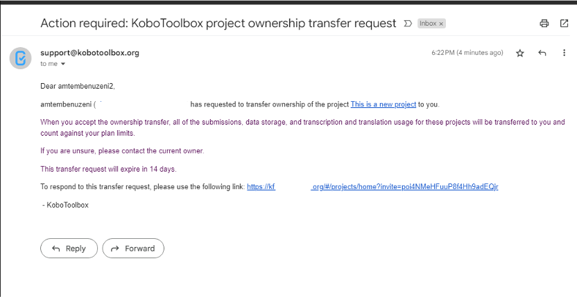
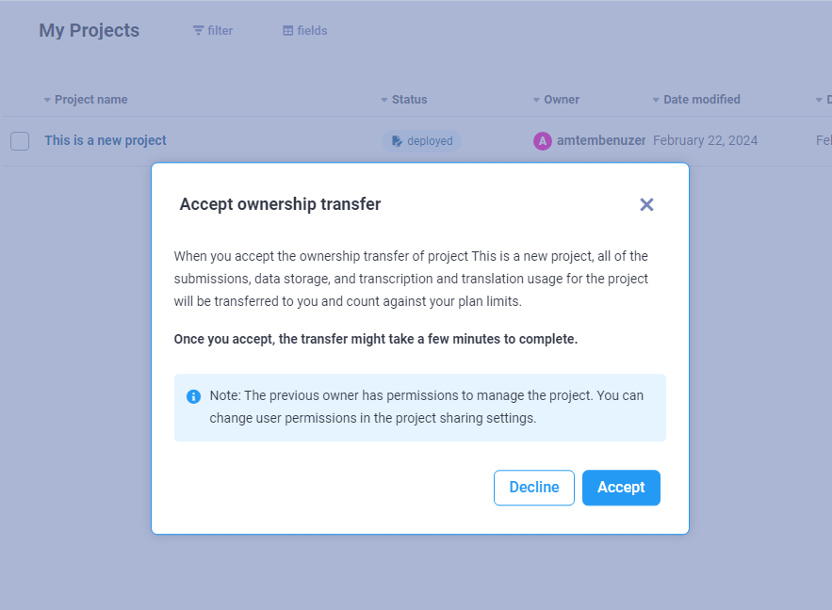

# Sharing Your Project and Managing Permissions
**Last updated:** <a href="https://github.com/kobotoolbox/docs/blob/db6ad5917874a7ca1122c24f674a02d1cbaafa87/source/managing_permissions.md" class="reference">25 Mar 2024</a>

KoboToolbox allows you to give different levels of access to different users by
setting flexible permissions for each project. While most users may
only need to access and enter or review data for a
given project, sometimes more complex scenarios require multiple users to have different levels of project access.

For example, you can share a project with some users and only allow them to
submit data to the project through their account. You can also adjust the permission settings so
that other users can only view or edit the submitted data.

This article explains how you can grant permissions for other KoboToolbox users
to collaborate on your projects.

## Requiring passwords for accessing Enketo web forms

By default, KoboToolbox requires a username and password to access data,
 manage projects, and submit data. When a new project has been deployed, the Enketo web
form will require authentication for an individual to be able to access the form and send submissions to the project.

In some cases, you may wish to enable data entry for anyone with access to the Enketo web form URL. In this case, any individual with access to the form URL can send submissions to the project without being required to sign in to their KoboToolbox account.

To allow data entry for anyone with access to the form URL:
- Open the project in KoboToolbox, and go to the **FORM** section
- Below the Collect Data section, use the toggle button to enable "Allow submissions to this form without a username and password"

You can also change this permission setting directly in your **Sharing Permissions** or by going to the **Sharing** tab in the **SETTINGS** page in your project and toggling the default setting to enable “Allow submissions to this form without a username and password”.

  Setting forms to require authentication is now available as a per-project setting. This privacy feature replaces the previous account setting “Require authentication to see forms and submit data”. With this update, new projects require authentication by default. Existing projects inherit your previous account-level settings as they were at the time of this update. 

## Sharing a project with other users and setting their permissions

The following steps explain how to share a project with other KoboToolbox
users and control which users can view, share, or edit your form or submissions.

- Go to the **Sharing** tab in the **SETTINGS** page in your data collection
  project
- Enter the username of the user who you would like to share the form with
- Select the desired permission level
- Click **GRANT PERMISSIONS**

### Available permissions

- View form
- Edit form
- View submissions
- Add submissions
- Edit submissions
- Validate submissions
- Delete submissions
- Manage project

When certain permissions are granted, other permissions are also automatically granted. For example, if a user is granted "Add submissions" permission, they will also be granted "View form" permission.

## Assigning "Add submissions" permission for specific users

In some scenarios, you may want to restrict enumerators who are collecting data in the field from being able to view the submitted data. 

In this case, instead of configuring KoboCollect with a single account's
username and password, you can create separate accounts for each enumerator, and __share the form with limited permissions.

In KoboToolbox:

- Create all enumerator accounts on the same server
- Share the project with each enumerator account using the steps described
  above, and only assign them the desired permissions, for example "Add Submissions".

In KoboCollect:

- On each device, configure KoboCollect using the username and password of the
  enumerator who will be using it. You can learn more about how to configure
  KoboCollect [here](kobocollect_on_android_latest.md).

## Row-level permissions for users

You can also set [row-level permissions](row_level_permissions.md) for users.
This can be helpful in several scenarios, for example:

- An organization implementing a project in collaboration with several partner
  organizations may want to give the partners access to only the data collected
  by them.
- A researcher may want to allow each enumerator to access and edit *only* the data they
  collected.
- In an organization, there may be different roles for data collectors who may only
  be allowed to submit data, data quality officers who may only be allowed to
  view and validate submissions, and users who may be allowed to view reports
  and download the data.

Setting row-level permissions:

- Share the data collection project using the steps described above
- Choose from **View Submissions only from specific users**, **Edit Submissions
  only from specific users**, **Validate Submissions only from specific users**,
  or **Delete Submissions only from specific users**
- Add a comma-separated list of usernames with whom you want to share the
  project

Learn more about [row-level permissions](row_level_permissions.md).

## Copy permissions from another project

To copy team permissions from a another project, open the **Sharing** tab in the **SETTINGS** page of your project. Click on "Copy team from another project", and then select the project that you with to copy permissions from.

  This will overwrite any existing sharing settings on the project you are adding the permissions to.

## Removing shared projects from your account

If you wish to remove a project that anohter user shared with you, follow these steps:

- On the project list, select the project you wish to remove
- Click on the **Sharing** button in the **Team members** section
- Click the trashcan button to delete your permissions for this project
- Click **REMOVE**

When you navigate back to the project list, the project will no longer be listed.

You can also remove a project through the **Form** tab:

- Open the project
- Click on the **Form** tab
- Click on the <i class="k-icon k-icon-more"></i> **More Actions** button
- Click **Remove Shared Project**
- Click **REMOVE**

## Making your project and data public

In addition to sharing your project with specific KoboToolbox users, you can also make your
form and/or submissions public:

- Go to the **Sharing** tab in the **SETTINGS** page in your data collection
  project
- Select the options **Anyone can view this form** and/or **Anyone can view
  submissions made to this form**

A URL will be displayed that you can share with anyone to provide access to
the form and/or the submission data without requiring them to sign in to a KoboToolbox account. If the form is made public, anyone with the link will be able to:

- Preview the form
- Download the form as XLS or XML

If the data is also made public, anyone with the link will be able to:

- View the data in the **Table** view
- View and print **Reports**
- View the **Gallery**
- **Download** the data
- View the data in the **Map** view

    When the form and the data are made public, anyone with the URL will be able to access the project as shown in the video below.

## Transferring ownership of a project

You can transfer the ownership of a project from your account to a different user account. Both user accounts must be on the same KoboToolbox server to transfer a project.

To transfer a project from your account to another user account:

- Sign in to your account and open the project you wish to transfer
- Click **Settings** and then go to the **Sharing** tab
- In the **Transfer project ownership** section, click **Transfer**
- Enter the username of the account that you wish to transfer the project to
- Click **Transfer project**

An email will be sent to the user account receiving the project. To accept the transfer, the recipient must click on the link in the email while they are signed in to their KoboToolbox account. 

When they click on the link in the email, a confirmation dialog box will be displayed. The recipient must click **Accept** for the project transfer to be completed.

After accepting the transfer, it may take a few minutes to complete. The new project owner may see the project available in their project list right away, but the data table view may take longer to be updated.

