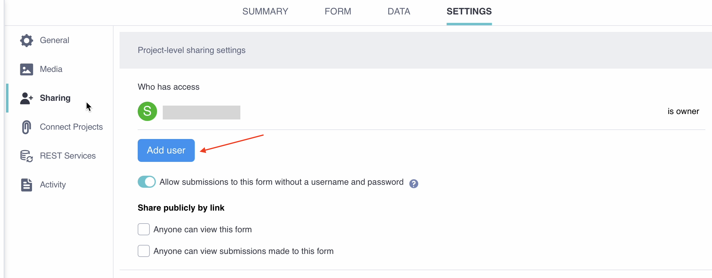

# Sharing projects with user-level permissions
**Last updated:** <a href="https://github.com/kobotoolbox/docs/blob/c8c238efa59b04f403f13c150b018e1807c66d5c/source/managing_permissions.md" class="reference">28 Oct 2025</a>

<a href="es/managing_permissions.html">Leer en español</a> | <a href="fr/managing_permissions.html">Lire en français</a> | <a href="ar/managing_permissions.html">اقرأ باللغة العربية</a>

KoboToolbox allows you to set different access levels for users on each project. Some users may only need to submit or view data, while others require more advanced access, such as editing forms, validating submissions, or editing data.

This article explains how to grant permissions to other KoboToolbox users to collaborate on your projects. It covers user-level permissions, row-level permissions, and copying permissions from another project.

To learn more about sharing your project with others for data collection, see <a href="https://support.kobotoolbox.org/data_through_webforms.html">Collecting Data through Web Forms</a>. To learn more about project-level settings for sharing your projects, see <a href="https://support.kobotoolbox.org/project_sharing_settings.html">Sharing projects with project-level settings</a>.

## Setting user-level permissions

User-level permissions allow you to share project data with other KoboToolbox users and control their access to your form or submissions. 

To set up user-level permissions:
1. Go to the **SETTINGS** page of your data collection project, and click **Sharing**.
2. Under the list of users with current access, click **Add user**.
3. Enter the username of the user you want to share the form with.
4. Select the desired permission level.
5. Click **GRANT PERMISSIONS**.

The following permissions are available:
| **Permission**    | **Description**                                |
| :----------------- | :--------------------------------------------- |
| View form               | User can preview the form.                                  |
| Edit form      | User can edit the form.                                  |
| View submissions           | User can view submitted data.           |
| Add submissions           | User can submit data using the form.         |
| Edit submissions         | User can edit submitted data.           |
| Validate submissions | User can [approve or reject](https://support.kobotoolbox.org/record_validation.html) submitted data. |
| Delete submissions         | User can delete submitted data.        |
| Manage project      | User can do all of the above and manage project settings.                  |

<strong>Note</strong>: When certain permissions are granted, other permissions are also automatically granted. For example, if a user is granted <strong>Add submissions</strong> permission, they will also be granted <strong>View form</strong> permission automatically.

## Setting row-level permissions

Row-level permissions allow you to set viewing, editing, validating, and deleting permissions for submissions based on predefined conditions. These permissions can be:

- **Only from specific users**: User-based permissions allow you to share project data with another KoboToolbox user only when submitted by specific users. This can be useful for allowing data collectors to view and edit their own submissions without accessing data from other collectors.
- **Based on a condition**: Condition-based permissions grant access to project data based on a response to a question on your form. For example, this can be used to share data collected before a certain date or for a specific region.

### User-based permissions

To add user-based permissions:

1. Open your project and navigate to the **SETTINGS** tab.
2. Go to the **Sharing** section.
3. Click **Add user** and enter the username of the user you want to share the project with.
4. Select the user-based permissions you want to allow (**View**, **Edit**, **Delete**, and/or **Validate**).
5. Below each permission, enter the username(s) for the users whose submissions you are granting the user access to. Usernames should be separated by commas.
6. Click **Grant permissions** to save your permissions settings.

Once you have saved your permissions, the user you have shared the project with will be able to view, edit, validate, or delete the project data submitted by the specified usernames, depending on the permissions selected.

### Condition-based permissions

To add condition-based permissions:

1. Open your project and navigate to the **SETTINGS** tab.
2. Go to the **Sharing** section.
3. Click **Add user** and enter the username of the user you want to share the project with.
4. Select the condition-based permissions you want to allow (**View**, **Edit**, **Delete**, and/or **Validate**).
5. Open the **Select…** drop-down menu to display the full list of form questions and select the question that should be used to filter which submissions are shared with the user.
6. On the right side of the equal sign (=), enter the response value that must be met.
7. Click **Grant permissions** to save your permissions settings.
   
Once you have saved your permissions, the user will be able to view, edit, validate, or delete project data submissions that meet the specified condition, depending on the permissions selected.

Response values must follow a specific format for the condition to work:

| **Question type**    | **Format**                                |
| :----------------- | :--------------------------------------------- |
| Date               | <code>YYYY-MM-DD</code> (e.g., <code>1974-12-31</code>)                                  |
| Select One and Select Many      | XML value/choice name (e.g., <code>first_grade</code> rather than <code>First grade</code>)                                   |
| Number and Decimal           | A specific integer or decimal number            |

## Copying permissions from another project

To copy team permissions from another project:

1. Open the **Sharing** tab in the **SETTINGS** page of your project.
2. Click on “Copy team from another project”.
3. Select the project from which you wish to copy permissions.

<strong>Note</strong>: This will overwrite any existing sharing settings on the project you are adding the permissions to.

## Troubleshooting

<strong>Tracking changes made by other users</strong>

KoboToolbox keeps <a href="https://support.kobotoolbox.org/activity_logs.html">Activity Logs</a> that show a complete timeline of account and project actions. <strong>Project History Logs</strong> record every modification inside a project—uploads, edits, deletions, and submissions—so you can trace changes, assign responsibility, and pinpoint when problems began.

 

<strong>Asked for username and password when sending data</strong>

If a sign-in pop-up appears when you try to submit, the project is set to <a href="https://support.kobotoolbox.org/project_sharing_settings.html">require authentication</a> for data collection. In this case, you can submit data only if your account has Add submissions permission. Enter your KoboToolbox username and password to continue.

 

<strong>User-based permissions do not seem to work</strong>

User-based permissions apply only when <a href="https://support.kobotoolbox.org/project_sharing_settings.html">authentication is required</a> and each submission carries a username. Open the project <strong>FORM</strong> tab and turn off “Allow submissions to this form without a username and password” under <strong>Collect data</strong>.

 

<strong>Old records ignore row-level rules</strong>

Submissions made before <a href="https://support.kobotoolbox.org/project_sharing_settings.html">authentication was required</a> may not have a username attached, so user-based rules cannot filter them. 

 

<strong>Condition-based permissions do not match partial text</strong>

The filter must include the exact response value. For example, filtering on <code>developer</code> will not match <code>software_developer</code>. Write the full value you expect, or adjust your form so the exact value is captured.

 

<strong>Condition-based permissions fail on repeat group questions</strong>

Filters cannot look inside a repeat group because one submission can hold several different answers. If you need this, see the Community Forum post <a href="https://community.kobotoolbox.org/t/condition-based-permissions-from-a-repeat-group-value/59449">Condition-Based Permissions Using a Repeat Group Value</a> for a spreadsheet workaround.

 

<strong>Multiple conditions not supported</strong>

Condition-based permissions accept only one condition. If you need to set permissions based on multiple conditions, consider creating a condition-based calculation in your form that yields a single value for filtering.

