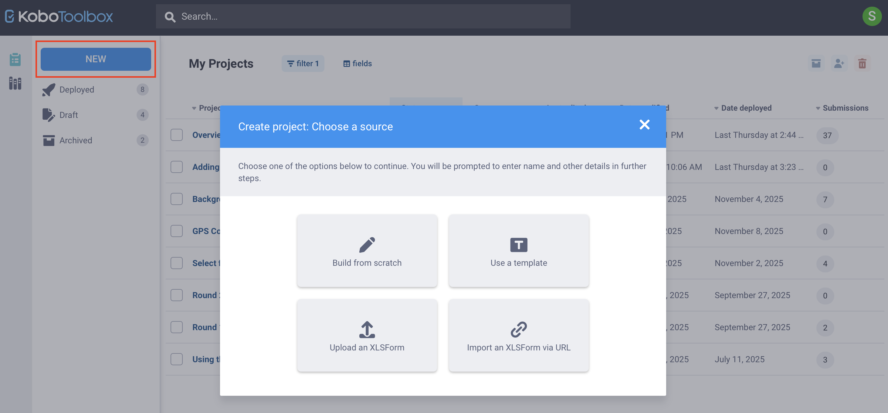
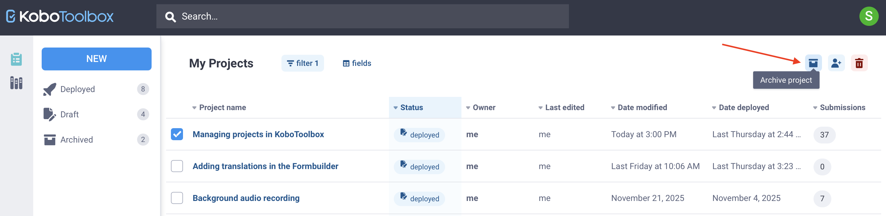
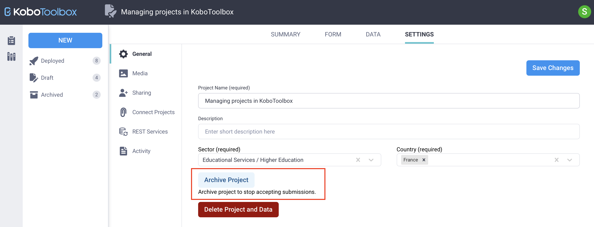
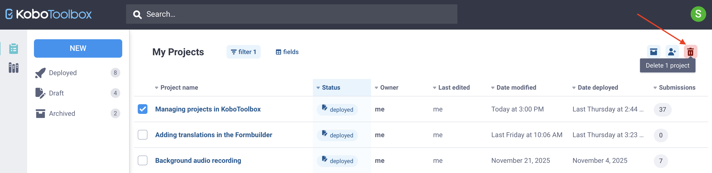
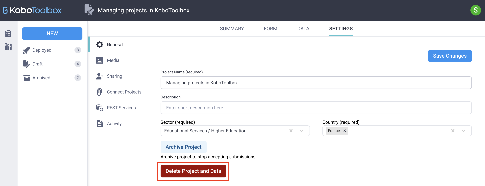

# Managing projects in KoboToolbox
**Last updated:** <a href="https://github.com/kobotoolbox/docs/blob/eb9e81165058741a037d5081a0414e28b59cc180/source/managing_projects.md" class="reference">27 Jan 2026</a>

A **project** in KoboToolbox corresponds to a form, its settings, and all data submitted to that form. Project management begins on the **Projects home page**, where you can view, sort, filter, and organize your projects. You can also create new projects, update existing ones, and manage how they are shared with collaborators.

This article explains how to view and manage projects, create new projects, work with project settings and data, and archive or delete projects that are no longer in use.

## Overview of existing projects
The **Projects home page** lists all projects you own or that have been shared with you. The **My Projects** table displays key information such as project name, owner, status, and number of submissions.

You can manage your projects using the tools in this page:
* **Filter:** Click <i class="k-icon-filter"></i> **filter** to filter projects by name, description, status, owner, date last edited, date last modified, date last deployed, sector, countries, and languages.
* **Select fields:** Click <i class="k-icon-spreadsheet"></i> **fields** to choose which fields are displayed in the **My Projects** table.
* **Sort:** Click a column header to sort by that field.
* **More actions:** Select the checkbox next to a project to take action on it.
    * In the top right corner, you can <i class="k-icon-archived"></i> **archive** a project or update its <i class="k-icon-user-share"></i> **sharing permissions**.
    * You can also <i class="k-icon-trash"></i> **delete** multiple projects at once.

## Creating a project
To create a new project in KoboToolbox:
1. Click **NEW** from the **Projects home page**.
2. Choose one of the following options:
    - <i class="k-icon-edit"></i> **Build from scratch** to create a form using the [Formbuilder](https://support.kobotoolbox.org/formbuilder.html).
    - <i class="k-icon-template"></i> **Use a template** to select a form template from the [question library](https://support.kobotoolbox.org/question_library.html).
    - <i class="k-icon-upload"></i> **Upload an XLSForm** to upload an existing [XLSForm](https://support.kobotoolbox.org/getting_started_xlsform.html).
    - <i class="k-icon-link"></i> **Import an XLSForm via URL** to link to an XLSForm [stored online](https://support.kobotoolbox.org/xlsform_with_kobotoolbox.html#importing-an-xlsform-via-url).
3. Create, test, and preview your form.
4. Click **DEPLOY** from the **FORM** page of your project to make the form live for data collection.

## Managing an existing project
When you open a project, you can manage it through the tabs at the top of the page:
* **SUMMARY:** Overview of the project metadata and submissions.
* **FORM:** Edit the form, deploy changes, and copy the form link.
* **DATA:** View submitted data in different formats, generate reports, and export data.
* **SETTINGS:** Update project settings, including [sharing permissions](https://support.kobotoolbox.org/managing_permissions.html), [form media](https://support.kobotoolbox.org/upload_media.html), and general configuration.

  To learn more about managing your data in KoboToolbox, see <a href="https://support.kobotoolbox.org/viewing_validating_data.html">Viewing and validating your data</a> and <a href="https://support.kobotoolbox.org/editing_deleting_data.html">Editing and deleting your data</a>. 

## Archiving and deleting projects
As projects become outdated or no longer needed, you can remove them from active use by **archiving** or **deleting** them. Archiving stops new submissions while keeping the form and existing data available. Deleting permanently removes the project and all of its data from your account. 

  <strong>Note:</strong> Because deleted projects cannot be recovered, delete a project only when you are certain that neither the form nor its data will be needed. Before deleting a project, we recommend <a href="https://support.kobotoolbox.org/xlsform_with_kobotoolbox.html#downloading-an-xlsform-from-kobotoolbox">downloading the form</a> as an XLSForm and <a href="https://support.kobotoolbox.org/export_download.html">exporting</a> all project data.

### Archiving projects
Archiving is recommended for forms that should no longer accept submissions but need to remain available for reference.

There are two ways to archive a project. To archive a project from the **Projects home page**:
1. In the **Projects home page**, select the project checkbox.
2. Click <i class="k-icon-archived"></i> **Archive project** in the top right corner.
3. You will be asked to confirm that your form will not accept submissions while it is archived. Click **ARCHIVE** to confirm.

To archive a project from the project **SETTINGS**:
1. Open the project and go to the **SETTINGS** page.
2. In the <i class="k-icon-settings"></i> **General** tab, click **Archive Project**.
3. You will be asked to confirm that your form will not accept submissions while it is archived. Click **ARCHIVE** to confirm.

To unarchive a project, follow the same steps and click **Unarchive Project**.

### Deleting projects
Deleting a project permanently removes the form and all associated data. This action cannot be reversed.

There are two ways to delete a project. To delete a project from the **Projects home page**:
1. In the **Projects home page**, select the checkbox next to the project.
2. Click <i class="k-icon-trash"></i> **Delete 1 project** in the top right corner.
3. A confirmation dialog will require you to acknowledge the following:
    * You are about to permanently delete this form.
    * All data gathered for this form will be deleted.
    * The form associated with this project will be deleted.

To delete a project from the project **SETTINGS**:
1. Open the project and go to the **SETTINGS** page.
2. In the <i class="k-icon-settings"></i> **General** tab, click **Delete Project and Data**.
3. A confirmation dialog will require you to acknowledge the following:
    * You are about to permanently delete this form.
    * All data gathered for this form will be deleted.
    * The form associated with this project will be deleted.

