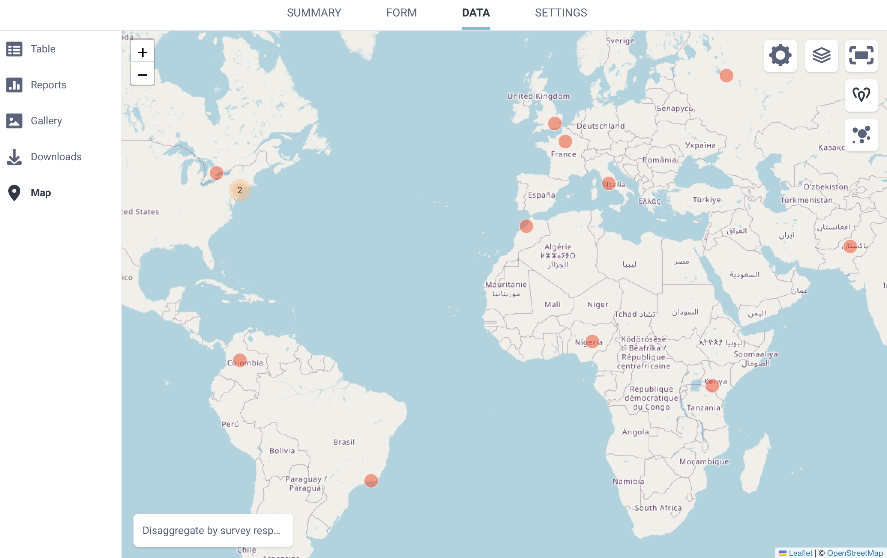
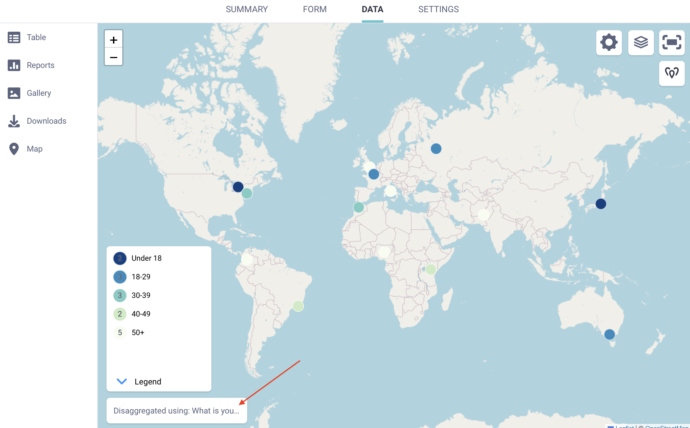

# Mapping your GPS data

<iframe src="https://www.youtube.com/embed/kefdxYOcgls?si=uY_tijozM5cpMVb3" style="width: 100%; aspect-ratio: 16 / 9; height: auto; border: 0;" title="YouTube video player" frameborder="0" allow="accelerometer; autoplay; clipboard-write; encrypted-media; gyroscope; picture-in-picture; web-share" allowfullscreen></iframe>

GPS questions in KoboToolbox allow you to collect precise geographic information as single points, or a collection of points representing a path or area during data collection. Each GPS record includes latitude, longitude, altitude, and accuracy, which you can view directly in the data table. KoboToolbox also provides a built-in <strong>Map view</strong> that helps users visualize single GPS points, explore patterns, and better understand where submissions were collected.

This article explains how to view and map GPS data in KoboToolbox and describes the available export formats for using geospatial data in other tools and workflows.

## Collecting GPS data in KoboToolbox

KoboToolbox allows you to collect three types of GPS data in your forms:

| Formbuilder question type | XLSForm question type | GPS data type                         |
|:--------------------------|:----------------------|:--------------------------------------|
| Point                     | `geopoint`            | A single point                        |
| Line                      | `geotrace`            | A path made up of multiple points     |
| Area                      | `geoshape`            | An area made up of multiple points    |

GPS data can be collected using both Enketo web forms and KoboCollect. All GPS responses appear in the data table and are included in data exports. Only single points, referred to as <strong>geopoints</strong> in the user interface, can be displayed in the KoboToolbox <strong>Map</strong> view.

To learn more about collecting GPS data in your KoboToolbox forms, see <a href="https://support.kobotoolbox.org/collect_gps.html">Collecting GPS data</a>.

## Mapping GPS data in KoboToolbox

KoboToolbox includes a built-in <strong>Map</strong> view that displays GPS points collected through your form. Any user with <strong>View submissions</strong> [permission](https://support.kobotoolbox.org/managing_permissions.html) can access the map.

To open the map:

1. Open your project and go to the <strong>DATA</strong> page.
2. In the left menu, select <i class="k-icon-map-view"></i> <strong>Map</strong>
3. If your form includes at least one geopoint question, the collected locations appear on the map.

You can zoom in or out using the <i class="k-icon-plus"></i> and <i class="k-icon-minus"></i> buttons in the top left corner of the map. To view the map in full screen, click <i class="k-icon-expand"></i> <strong>Toggle fullscreen</strong> in the top right corner.

When multiple GPS points are close together, they appear as a single clustered point with a number indicating how many submissions are grouped there. Zoom in to view individual points.

<strong>Note:</strong> Only geopoint questions are displayed on the map. Geotrace and geoshape data are not displayed.

### Selecting which question to view on the map

By default, the map displays data from the first geopoint question in your form. If your form includes multiple geopoint questions, you can choose which one to display.

To select a different question:

1. Click <i class="k-icon-settings"></i> <strong>Map display settings</strong>.
2. Select a different geopoint question from the list.

 

### Customizing the map

You can change how GPS data is displayed on the map using the available map controls.

To switch display types:

- Click <i class="k-icon-heatmap"></i> <strong>Show as a heatmap</strong> in the top right corner to view data as a heatmap.
- Click <i class="k-icon-pins"></i> <strong>Show as points</strong> to return to individual point markers.

<strong>Note:</strong> A <strong>heatmap</strong> is a visualization that shows the concentration of submissions based on their geographic coordinates. Areas with more closely clustered data points appear more intense, while areas with fewer submissions appear lighter. Heatmaps help identify geographic patterns and hotspots without displaying individual points.

To change the base map layer:

- Click <i class="k-icon-layer"></i> <strong>Toggle layers</strong> in the top right corner.
- Select a base layer, such as OpenStreetMap, OpenTopoMap, ESRI World Imagery, or Humanitarian. The default base layer is OpenStreetMap.

You can also add additional custom layers on top of your map:
1. Open <i class="k-icon-settings"></i> <strong>Map display settings</strong>.
2. Go to <strong>OVERLAYS</strong>.
3. Enter a label for the layer and upload a file in CSV, KML, KMZ, WKT, or GeoJSON format.

Uploaded files appear as optional layers that you can turn on or off from the map.

### Disaggregating points by survey responses

You can group GPS points on the map based on responses to other questions in your form. This helps you understand how different respondent groups are distributed geographically.

To disaggregate points:

1. Click <strong>Disaggregate by survey responses</strong> in the bottom left corner of the map.
2. Select the question you want to use to categorize the points. You can also change the display language.

To change the color set used for disaggregated points:

1. Open <i class="k-icon-settings"></i> <strong>Map display settings</strong>.
2. Select <strong>MARKER COLORS</strong>.
3. Choose a different color set.

To remove disaggregation:

1. Click <strong>Disaggregated using: [question label]</strong>.
2. Select <strong>-- See all data --</strong> from the list.

## Exporting GPS data 

KoboToolbox provides several options for exporting GPS data. Each format supports different workflows, including data review, mapping, and geospatial analysis.

### Exporting as CSV or XLS

When exporting data as <strong>CSV</strong> or <strong>XLS</strong>, GPS coordinates are included in multiple columns:

- One column containing the full coordinate set.
- For <strong>geopoint</strong> questions only, separate columns for latitude, longitude, altitude, and precision.

[World map displaying disaggregated geopoint markers in shades of blue](images/mapping_gps/export.png)

<strong>Note:</strong> In this context, <strong>accuracy</strong> and <strong>precision</strong> refer to the same value.

CSV and XLS exports are useful for reviewing and cleaning data in spreadsheet software. They can also be imported into many GIS tools, although additional preparation is often required. This may include specifying coordinate fields, defining a coordinate reference system, or converting the data to another geospatial format.

<strong>Note:</strong> For <strong>geotrace</strong> and <strong>geoshape</strong> questions, CSV and XLS exports include a single column containing GPS coordinates separated by semicolons. Further processing is usually required to extract individual points or convert the data into line or polygon geometries for use in GIS software.

### Exporting as GeoJSON

<strong>GeoJSON</strong> is the recommended format for preparing GPS data for use in GIS software such as ArcGIS or QGIS. It is widely supported and works well with common geospatial workflows.
When exporting to GeoJSON, KoboToolbox converts GPS question types to standard GeoJSON geometry types, as shown below: 

| Formbuilder | XLSForm     | GeoJSON     |
|:------------|:------------|:------------|
| Point       | `geopoint`  | Point       |
| Line        | `geotrace`  | LineString  |
| Area        | `geoshape`  | Polygon     |

During export, the accuracy value included in GPS coordinates is not retained, as GeoJSON does not support an accuracy field. Coordinate order also changes from `latitude longitude` in KoboToolbox to `longitude latitude` in GeoJSON.

By default, GeoJSON exports are structured by submission. For better compatibility with GIS tools, you can enable the <strong>Flatten GeoJSON</strong> option in the advanced export settings. This combines all GPS responses into a single [FeatureCollection](https://stevage.github.io/geojson-spec/#section-3.3).

<strong>Note:</strong> When GeoJSON is flattened, it can be harder to identify which GPS responses came from the same submission. This is most noticeable in forms with more than one GPS question per submission. For forms with only one GPS question per submission, this is usually not an issue.

If a submission does not include a value for a GPS question, it will not appear in the GeoJSON export. If you plan to export data as GeoJSON, ensure that at least one GPS question is completed for each submission.

If your form includes multiple GPS questions, you may want to export only the one you plan to use for mapping. Use the <strong>Select questions to be exported</strong> option in the advanced export settings to limit which GPS fields are included.

### Exporting as KML
KML is intended for visualization in tools that natively support the format, such as Google Earth. It supports basic styling for quick map display. While KML exports are still available in KoboToolbox, this format is limited and should be used only when required by a specific workflow.

<strong>KML</strong> exports in KoboToolbox support <strong>geopoint</strong> questions only. If a form includes geotrace or geoshape questions, those geometries are not included in the KML export.
If a form contains multiple geopoint questions, only the first geopoint in the form is included in the KML file. Additional geopoint questions are ignored. Additionally, KML exports include only the geopoint location and the submission ID. Other submission fields are not included. 

Finally, as with GeoJSON, coordinate order changes from `latitude longitude` in KoboToolbox to `longitude latitude` in GeoJSON.

<strong>Note:</strong> To learn more about exporting your GPS data from KoboToolbox, see <a href="https://support.kobotoolbox.org/export_download.html">Exporting and downloading your data</a>.

