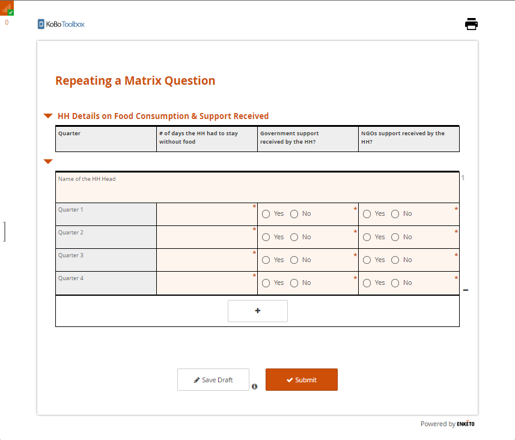
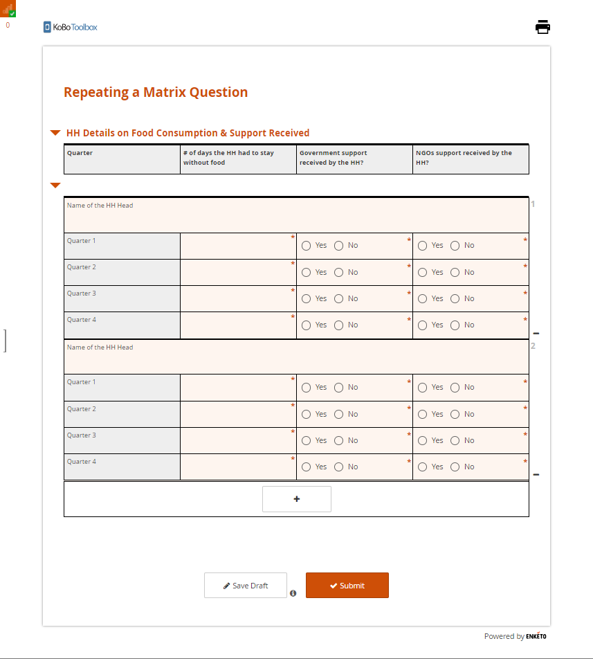

# Repeating a Matrix Question

There could be times when you wish to repeat an entire matrix question. Achieving this through the Formbuilder is not yet possible, but the same can be done using an XLSForm by exploiting the `Grid Theme` layout setting. This support article illustrates how to repeat a matrix question.

There is also a straightforward way to achieve what has been outlined in the support article. However, using the same would create the matrix header each time you repeat the matrix question (which would distort your form’s appearance). If this is not a concern, you could follow the steps below to do the same.
<ul>
  <li>Create a matrix question in the Formbuilder.</li>
  <li>Download your form as an XLSForm.</li>
  <li>Open the XLSForm and add <b>begin_repeat</b> at the beginning and <b>end_repeat</b> at the end of the matrix question you wish to repeat).</li>
</ul>

However, if you wish to design repeat group as a matrix question, you could do it as outlined in our other support article **[Designing Repeat Group as a Matrix Question](repeat_group_as_matrix.md)**.

## Prerequisite reading:

To better understand this article, it is recommended that you go through the following documents:

Support Article: [Grouping Questions and Repeating Groups](https://support.kobotoolbox.org/group_repeat.html) 
Support Article: [Question Matrix Response Type](https://support.kobotoolbox.org/matrix_response.html) 
XLSForm Site: [XLSForm.org](https://xlsform.org/en/) 
Enketo Blog: [Grid Theme](https://blog.enketo.org/gorgeous-grid/)

## Designing your survey tab:

The first sheet your XLSForm needs to include is the *survey* tab. This sheet will require five column headers (*type*, *name*, *label*, *required*, *appearance*). 

| type              | name  | label                                             | required | appearance            |
|-------------------|-------|---------------------------------------------------|----------|-----------------------|
| begin_group       | HHD   | HH Details on Food Consumption & Support Received |          | w4                    |
| note              | HHD_1 | Quarter                                           |          | w1                    |
| note              | HHD_2 | # of days the HH had to stay without food         |          | w1                    |
| note              | HHD_3 | Government support received by the HH?            |          | w1                    |
| note              | HHD_4 | NGOs support received by the HH?                  |          | w1                    |
| end_group         |       |                                                   |          |                       |
| begin_repeat      | F     | Information   |          | w4                    |
| text              | HH    | Name of the HH Head                               |          | w4                    |
| note              | Q1_C1 | Quarter 1                                         |          | w1                    |
| integer           | Q1_C2 | Days            | TRUE     | w1 no-label           |
| select_one Yes_No | Q1_C3 | Government    | TRUE     | w1 horizontal-compact |
| select_one Yes_No | Q1_C4 | NGOs            | TRUE     | w1 horizontal-compact |
| note              | Q2_C1 | Quarter 2                                         |          | w1                    |
| integer           | Q2_C2 | Days            | TRUE     | w1 no-label           |
| select_one Yes_No | Q2_C3 | Government    | TRUE     | w1 horizontal-compact |
| select_one Yes_No | Q2_C4 | NGOs            | TRUE     | w1 horizontal-compact |
| note              | Q3_C1 | Quarter 3                                         |          | w1                    |
| integer           | Q3_C2 | Days            | TRUE     | w1 no-label           |
| select_one Yes_No | Q3_C3 | Government    | TRUE     | w1 horizontal-compact |
| select_one Yes_No | Q3_C4 | NGOs            | TRUE     | w1 horizontal-compact |
| note              | Q4_C1 | Quarter 4                                         |          | w1                    |
| integer           | Q4_C2 | Days            | TRUE     | w1 no-label           |
| select_one Yes_No | Q4_C3 | Government    | TRUE     | w1 horizontal-compact |
| select_one Yes_No | Q4_C4 | NGOs            | TRUE     | w1 horizontal-compact |
| end_repeat        |       |                                                   |          |                       |
| survey            |       |                                                   |          |                       |

*Row 2 to 7*, are here to display the variables as a matrix header. *Row 8 to 26*, are here to display the repeat group variables as a matrix layout. 

## Designing your choices tab:

The second sheet your XLSForm needs to include is the *choices* tab. This sheet will require three column headers (*list_name*, *name*, *label*). 

| list_name | name | label |
|-----------|------|-------|
| Yes_No    | 1    | Yes   |
| Yes_No    | 2    | No    |
| choices   |      |       |

All these column headers are mandatory *(which depends on the question type used in the survey tab)*. 

## Designing your settings tab:

The third sheet your XLSForm needs to include is the *settings* tab. This sheet will require two column headers (*form_title*, *style*). 

| form_title                  | style                        |
|-----------------------------|------------------------------|
| Repeating a Matrix Question | theme-grid no-text-transform |
| settings                    |                              |

The first column header *(form_title)* is optional,but it is still good to include. The second column header *(style)* is mandatory. 

## Data entry screen as seen in Enketo:

*This is the screen you should see when you want to include a single matrix repeat.*

*This is the screen you should see when you want to include 2 matrix repeats.*

You can access the XLSForm that was used in this article <a download href="./_static/files/matrix_question_repeat/repeating_matrix_question.xls"><b>here</b></a>.

## Troubleshooting:

* The matrix question only works with **Enketo**, also known as **web forms**. It is not supported with the `KoboCollect Android App`.
* The matrix table may get distorted if you do not set the layout to **Grid-theme**. For more details, you can go to our support article **[Using Alternative Enketo Web Form Styles](alternative_enketo.md)**.